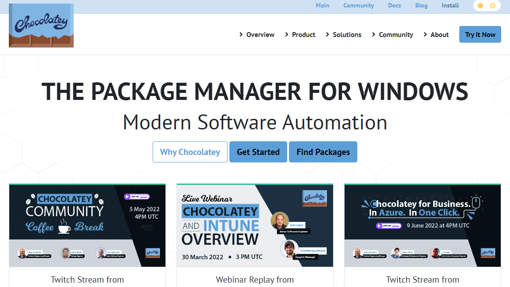

## 강의 내용

- 블로그
    - 티스토리 블로그 / 네이버 블로그 / medium
    - 깃허브 블로그
     : hugo, hexo(오늘 할 것), jekyll
     : html, css, git & github, 터미널 명령어
     : 마크다운

- IT / 기획자(제안서) → 티스토리 블로그
- 개발자(코딩) → 깃허브 블로그

- 패키지 관리자 설치(chocolatey, hugo)
    
    
    
     - 우측 상단 install 클릭
    
    
    
    - 링크 복사
    
    
    
    - 우클릭하면 해당 화면이 뜸
    
    
    
    - choco 또는 choco -? 를 입력하여 실행
    

- node.js(hexo 설치)
    
    
    
    - 16.15.1 LTS 클릭해서 다운로드
    
    - 사진이 없어서 글로 설명
    - 설치 과정에서 add to pass 클릭 후 다음으로 진행
    - Automatically install the ~~ 부분 체크하고 다음으로 진행 프롬프트를 관리자 권한으로 실행
    - 설치가 완료되면 명령 프롬프트를 관리자 권한으로 실행
    - node.js가 정상적으로 설치되어 있는지 node -v를 통해 확인
        
        
        
    - npm install -g hexo-cli → 이걸 입력해야 hexo 명령어를 쓸 수 있음
    

## 블로그를 만들어 보자

- github와 gitbush를 통해 blog 폴더 생성
    - hexo init blog 명령어 입력하면 바탕화면에 blog 폴더 생성
        
        
        
    - 이후는 전과 동일한 방법으로 진행(git add . 입력해야 한다는 점 명심할 것★)

- 블로그 제작의 핵심 명령어
    - 하단 3개의 명령어를 pycharm Terminal(git bash)에 입력하여 설치(항상 입력할 필요x)
    - 오타 수정 → npm install hexo-server - -save

- 설치가 완료되고 hexo server를 입력하면  테스트 주소: [localhost:4000](http://localhost:4000) 가 생성
- 테스트 주소: [localhost:4000](http://localhost:4000) (로컬 컴퓨터에서만 확인 가능, 해당 주소에서 테스트 후 완료)
- 테스트가 완료되면 배포

### 사이트 만들기

- 새로운 레포 만들기에서 아이디.github.io로 레포 생성(add [README.MD](http://README.MD) 클릭x)

- *congfig*.yml(양식, 임의로 수정하지 않을 것) 더블클릭 후 URL 파트의 url을 
https://아이디.github.io로 수정

- Deployment 파트의 type을 git으로 입력 / repo와 branch에 각각 해당하는 형식으로 입력

- Ctrl+C를 눌러 hexo를 멈춰준 후, hexo generate와 hexo deploy를 각각 입력
    
    
    

- 다시 github를 새로고침 하면 해당 화면이 뜸

- 아이디.github.io를 주소창에 입력해서 해당 화면이 뜨면 배포가 완료된 것

## 분석가 희망

- R이 매우중요
    
    → R은 ★통계★
    
    → t.test, anova, 회귀분석, 로지스틱회귀: 한 학기
    
    → 여기서 배우는 양으로는 택도 없고, 따로 또 열심히 공부해야 함
    
    → 챗봇 서비스: 설문조사, 만족도조사 → 통계 분석
    

## Rstudio 실행

- 글로벌 옵션 → code → Editing → Soft-wrap R soucre files 체크
- Saving → Default text encoding → UTF-8로 변경

- github에서 R 레포 생성 후 Rstudio에서 새 프로젝트 클릭
- Existing Directory 클릭
    
    
    
- 경로 설정

- 저장한 프로젝트 실행
    - 새 폴더 생성 및 저장 경로 설정
    
    
    
    New Folder 클릭하면 새 폴더 생성
    
    
    

- 새 스크립트 실행
    
    
    
- 저장하기
    
    
    

### 패키지..

- 패키지 속 함수들에 대한 설명이 문서로 되어 있다..
→ R이든, 자바든, 파이썬이든 마찬가지
→ 문서 속 함수를 찾아가며 공부해야 체득 가능….. ← 제일 힘들어 보이는 일
     고통스럽지만 꾸준히 하다 보면 결과가 달라진다
- 설치 방법
    - install.packages(””) 함수 입력 후 ctrl+엔터
    
    
    
    ## 교재 수업 (한글)
    
- R마크다운 교재 정리 및 코드 실행
- 추가 공부
    - Rmd 파일을 마크다운으로 변환
    - 변환된 파일 → 블로그에 저장
    - 테스트 및 배포

⇒ 다음 주 내내 해야 할 일

- R마크다운의 필수 양식

이 밑으로는 내가 작성하는 내용으로 구성하면 됨(ex. 교재 정리 내용이나 코드 실행)

- 우측 하단의 Knit를 클릭하여 Rmd 파일을 md 파일로 변환(파일명 맨앞은 문자로 할 것)

- github에 올리기
    - Gstudio의 Terminal에서 세 가지 명령어 입력

