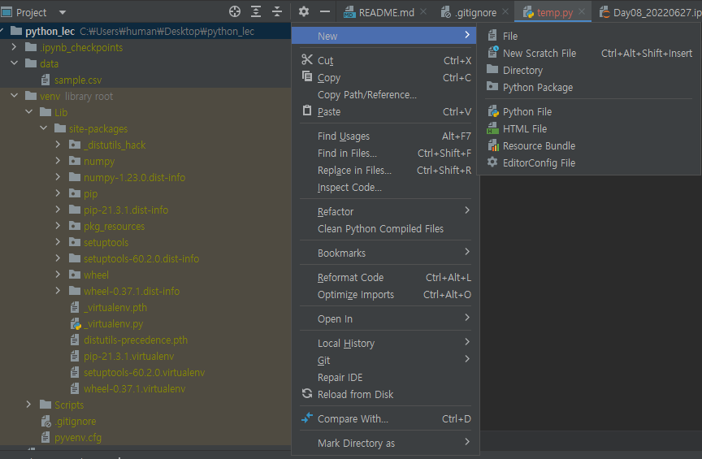

## for Loop 복습


```python
for i in range(1000) :
  print("No : ", i+1)         # range()는 0부터 시작하기에 +1을 붙여줘야 1부터 시작
  if i == 10 :
    break
  print("Hello World")
  print("안녕하세여")
```

    No :  1
    Hello World
    안녕하세여
    No :  2
    Hello World
    안녕하세여
    No :  3
    Hello World
    안녕하세여
    No :  4
    Hello World
    안녕하세여
    No :  5
    Hello World
    안녕하세여
    No :  6
    Hello World
    안녕하세여
    No :  7
    Hello World
    안녕하세여
    No :  8
    Hello World
    안녕하세여
    No :  9
    Hello World
    안녕하세여
    No :  10
    Hello World
    안녕하세여
    No :  11
    


```python
# "K" in "Kaggle"
if "K" == "a" :
  print("Can we print?")
else :
  print("we cannot print!")
```

    we cannot print!
    


```python
a = "kaggle"

for i in a :
  print("character : ", i)
  if i == "a" :
    break
```

    character :  k
    character :  a
    


```python
number = [1, 2, 3, 4, 5]
sum = 0

for num in number:
  print("numbers : ", num)
  sum = sum + num
  print("total: ", sum)

print("-----최종 결과값------")
print(sum)
```

    numbers :  1
    total:  1
    numbers :  2
    total:  3
    numbers :  3
    total:  6
    numbers :  4
    total:  10
    numbers :  5
    total:  15
    -----최종 결과값------
    15
    


```python
fruits = ["apple", "banana", "kiwi", "mango"]
newlist = []

for fruit in fruits :
  print("조건문 밖 : ", fruit)              # 이런 식으로 중간중간 print()를 입력해서 확인해야 함
  if "a" in fruit :
    print("조건문 안쪽 : ", fruit)
    newlist.append(fruit)
print(newlist)
```

    조건문 밖 :  apple
    조건문 안쪽 :  apple
    조건문 밖 :  banana
    조건문 안쪽 :  banana
    조건문 밖 :  kiwi
    조건문 밖 :  mango
    조건문 안쪽 :  mango
    ['apple', 'banana', 'mango']
    

## While Loop
- while문 : 분석할 때는 거의 쓸 일이 없음


```python
# while 조건식
i = 0
while i < 10 :      # 참일때만 반복문 코드가 돔
  # 코드
    # i += 1    # 1씩 증가
    # i -= 1    # 1씩 감소
  i = i + 1
  print(i)
```

    1
    2
    3
    4
    5
    6
    7
    8
    9
    10
    

## 사용자 정의 함수
- 내가 필요에 의해 함수를 작성


```python
def 함수명(param1, param2) :
  # 코드
  return None
```


```python
def plus(a = 1, b = 4) : 
  c = a + b
  return c

print(plus(a = 4, b = 5))
print(plus())
```

    9
    5
    

- 사칙연산 사용자 정의 함수 만들기
- 함수 문서화
  + 키워드 : Docstring


```python
def subtract(a, b) :
  """a, b를 빼는 함수

  Parameters:
  a (int): int형 숫자 a가 입력
  b (int): int형 숫자 b가 입력

  Returns:
  int형 반환값

  """
  return a - b

print(subtract(11, 7))

```

    4
    


```python
def p(a = 3, b = 9) :
  return a + b
print(p())
print(type(p()))

def m(a = 5, b = 6) :
  return a - b
print(m(a = 4, b = 7))
print(m())
print(type(m()))

def mul(a = 4, b = 9) :
  return a * b
print(mul(a = 14, b = 4))
print(mul())
print(type(mul()))

def dev(a = 121, b = 11) :
  return a/b
print(dev(a = 144, b = 10))
print(dev())
print(type(dev()))

def hong(a, b) :
  return a * b - 4
print(hong(1, 4))
print(hong(7, 6))
print(type(hong(7, 2)))
print(type(hong(14.1, 2)))

def seung(a, b) :
  return a/b + 5
print(seung(142, 10))
print(seung(144, 12))
print(type(seung(142, 10)))
print(type(seung(144, 12)))
```

    12
    <class 'int'>
    -3
    -1
    <class 'int'>
    56
    36
    <class 'int'>
    14.4
    11.0
    <class 'float'>
    0
    38
    <class 'int'>
    <class 'float'>
    19.2
    17.0
    <class 'float'>
    <class 'float'>
    

## NumPy
- 내장 모듈(=라이브러리=패키지) -> X
- 별도 라이브러리 설치
- 리스트는 최댓값, 최솟값 구하기 힘듦
- 반면, Numpy는 최댓값, 최솟값을 구하기 용이


```python
import numpy as np        # numpy를 약어 np로 줄이는 과정
print(np.__version__)
```


## 가상 환경 설정

- Pycharm 실행
    - 새 파이썬 파일 생성
    
    
    
    - Numpy 라이브러리 설치
    
    
    
    - python [temp.py](http://temp.py) —> Numpy 버전 확인
    - which python —> 현재 내 파이썬이 참조하는 경로 확인
    
    
    
    - 해당 경로에서는 파이썬 버전이 1.21.5인 것을 알 수 있음
    

- 경로를 바꿔 버전 높이기
    - File → Settings 실행


- Project: python_lec 클릭 → python interpreter 클릭


- 우측 상단 톱니바퀴 모양 버튼 클릭 → Add… 클릭


- Virtualenv Environment에서 우측 하단 OK를 클릭하면 다음 화면으로 진행


- virtualenv Environment만 중요하고 나머지는 무시해도 됨

- 설치 화면


- 설치가 다 된 화면
    - 패키지가 3개 있는 것을 확인할 수 있음


- 이 상태에서 Apply와 OK 클릭

- venv 접속 : source venv/Scripts/activate
- which python 명령어로 변경된 경로 확인
- python [temp.py](http://temp.py) —> 변경된 Numpy 버전 확인


    1.21.6
    


```python
temp = [1, 2, 3]
temp_array = np.array(temp)      # 리스트에서 배열로 변환

print(type(temp))
print(type(temp_array))
```

    <class 'list'>
    <class 'numpy.ndarray'>
    

### 사칙연산


```python
obp = [0.355, 0.272, 0.411, 0.211]
slg = [0.422, 0.521, 0.320, 0.347]

obp_array = np.array(obp)
slg_array = np.array(slg)

ops = obp_array + slg_array
print(ops)
print(type(ops))
```

    [0.777 0.793 0.731 0.558]
    <class 'numpy.ndarray'>
    

### 집계함수


```python
print(np.min(ops))
print(np.max(ops))
print(np.sum(ops))
```

    0.5579999999999999
    0.793
    2.8589999999999995
    

## 차원 확인
- 배열의 차원 확인 필요


```python
# 1차원 배열 생성
temp_arr = np.array([1, 2, 3])      # 해당 함수는 차원 확인이 힘듦
print(temp_arr.shape)               # 구조 확인
print(temp_arr.ndim)                # 차원 확인 -> print(객체.ndim)
print(temp_arr)
```

    (3,)
    1
    [1 2 3]
    


```python
# 2차원 배열 생성
temp_arr = np.array([[1, 2, 3], [4, 5, 6]])
print(temp_arr.shape)
print(temp_arr.ndim)
print(temp_arr)
```

    (2, 3)
    2
    [[1 2 3]
     [4 5 6]]
    


```python
# 3차원 배열 -> 이미지
temp_arr = np.array([[[1, 2, 3], [4, 5, 6]], [[7, 8, 9],[10, 11, 12]]])
print(temp_arr.shape)
print(temp_arr.ndim)
print(temp_arr)
```

    (2, 2, 3)
    3
    [[[ 1  2  3]
      [ 4  5  6]]
    
     [[ 7  8  9]
      [10 11 12]]]
    

# 가상환경 설정

## 파이썬 인터프리터 종류
- 파이썬 버전이 매우 많음
- 웹개발 : 파이썬 3.7버전
- 머신러닝 : 파이썬 3.8버전
- GUI : 파이썬 3.9버전

- 버전에 따라 패키지 다운로드를 더 할 필요성이 있음

- 아나콘다
  - Numpy 1.21.0 버전
- 파이썬 virualenv
  - Numpy 1.23.0 버전

## 배열 생성의 다양한 방법들
- 모두 0으로 채운다


```python
import numpy as np
print(np.__version__)
```

    1.21.6
    


```python
temp_arr = np.zeros((2, 5, 3))
temp_arr
```


    array([[[0., 0., 0.],
            [0., 0., 0.],
            [0., 0., 0.],
            [0., 0., 0.],
            [0., 0., 0.]],
    
           [[0., 0., 0.],
            [0., 0., 0.],
            [0., 0., 0.],
            [0., 0., 0.],
            [0., 0., 0.]]])


- 모두 1로 채운다


```python
temp_arr = np.ones((2,4))
temp_arr
```


    array([[1., 1., 1., 1.],
           [1., 1., 1., 1.]])


- 임의의 상수값으로 채운다


```python
temp_arr = np.full((3,5), 22)
temp_arr
```


    array([[22, 22, 22, 22, 22],
           [22, 22, 22, 22, 22],
           [22, 22, 22, 22, 22]])


- 최소, 최대 숫자의 범위를 정해두고, 각 구간별로 값을 생성


```python
temp_arr = np.linspace(5, 10, 10)
temp_arr
```


    array([ 5.        ,  5.55555556,  6.11111111,  6.66666667,  7.22222222,
            7.77777778,  8.33333333,  8.88888889,  9.44444444, 10.        ])


- 반복문 시 자주 등장하는 배열


```python
temp_arr = np.arange(1, 11, 3)
temp_arr
```


    array([ 1,  4,  7, 10])


## 난수 생성


```python
from numpy import random      # from numpy import random 형태는
x = random.rand()             # numpy를 코드에 쓸 필요가 없음 -> random.rand()만 적음
print(x)
```

    0.030168195432456746
    


```python
import numpy                  # import numpy 형태는
x = numpy.random.rand()       # numpy.random.rand() 식으로 적어야 함
print(x)
```

    0.23974190488737968
    

- 랜덤 정수값 생성


```python
from numpy import random
# x = random.randint(100, size = (5))           # 100 이하의 수를 1x5 배열 형태로 나열
x = random.randint(100, size = (7, 5))          # 100 이하의 수를 7x5 배열 형태로 나열
print(x)
print(type(x))
```

    [[ 3 13 38 28 39]
     [35 46 23 19 29]
     [86 37 71  2 25]
     [ 1 11  9 54 51]
     [85 28 65 95 14]
     [73 13 47  0 65]
     [11 37 87 88 23]]
    <class 'numpy.ndarray'>
    

- 랜덤 배열, 실수값 추출


```python
from numpy import random
x = random.rand(4, 3)
print(x)
print(type(x))
```


    ---------------------------------------------------------------------------

    TypeError                                 Traceback (most recent call last)

    <ipython-input-129-acabc2e05e91> in <module>()
          1 from numpy import random
    ----> 2 x = random.rand([4, 3], 3)
          3 print(x)
          4 print(type(x))
    

    mtrand.pyx in numpy.random.mtrand.RandomState.rand()
    

    mtrand.pyx in numpy.random.mtrand.RandomState.random_sample()
    

    _common.pyx in numpy.random._common.double_fill()
    

    TypeError: 'list' object cannot be interpreted as an integer


## Numpy 사칙연산


```python
import numpy as np
array_01 = np.array([1, 4, 7])
array_02 = np.array([11, 15, 19])
```


```python
# 덧셈
newarr = np.add(array_01, array_02)
print(newarr)

# 뺄셈
newarr = np.subtract(array_01, array_02)
print(newarr)

# 곱하기
newarr = np.multiply(array_01, array_02)
print(newarr)

# 나누기
newarr = np.divide(array_01, array_02)
print(newarr)

# 거듭제곱
array_01 = np.array([6, 4, 5])
array_02 = np.array([3, 4, 7])
newarr = np.power(array_01, array_02)
print(newarr)

```

    [12 19 26]
    [-10 -11 -12]
    [ 11  60 133]
    [0.09090909 0.26666667 0.36842105]
    [  216   256 78125]
    

## 소숫점 정렬
- 소숫점을 정렬하는 다양한 방법


```python
# 소숫점 제거
import numpy as np
temp_arr = np.trunc([-1.23, 1.23])
print(temp_arr)

temp_arr = np.fix([-1.342, 1.342])
print(temp_arr)
```

    [-1.  1.]
    [-1.  1.]
    


```python
# 임의의 소숫점 자리에서 반올림
temp_arr = np.around([-4.22353463445345, 1.2342736346346], 4)
print(temp_arr)
```

    [-4.2235  1.2343]
    


```python
# 소숫점 모두 내림
temp_arr = np.floor([-1.215235434, 1.352345435])
print(temp_arr)
```

    [-2.  1.]
    


```python
# 소숫점 모두 올림
temp_arr = np.ceil([-5.21243253523, 6.52342341434])
print(temp_arr)
```

    [-5.  7.]
    

## 조건식
- pandas 가공
- numpy
- 조건식
  + 하나의 조건식
  + 다중 조건식


```python
temp_arr = np.arange(10)
temp_arr
```


    array([0, 1, 2, 3, 4, 5, 6, 7, 8, 9])


```python
# 5보다 작으면 원래 값 유지
# 5보다 크면 곱하기 10
```


```python
# np.where(조건식, 참일 때 결과값, 거짓일 때 결과값)
np.where(temp_arr < 5, temp_arr, temp_arr * 10)
```


    array([ 0,  1,  2,  3,  4, 50, 60, 70, 80, 90])


```python
temp_arr = np.arange(10)
# temp_arr
cond_list   = [temp_arr > 5, temp_arr < 2]
choice_list = [temp_arr * 2, temp_arr + 100]

np.select(cond_list, choice_list, default = temp_arr)
# np.select(조건식 리스트, 결과값 리스트, default = )
```


    array([100, 101,   2,   3,   4,   5,  12,  14,  16,  18])


```python
temp_arr = np.arange(1, 200)
cond_list = [temp_arr < 10, temp_arr % 10 == 0 , temp_arr < 101, temp_arr < 1000]
choice_list = [temp_arr * 100, temp_arr * 5, temp_arr - 5, temp_arr - 100]

np.select(cond_list, choice_list, default = temp_arr)
```


    array([100, 200, 300, 400, 500, 600, 700, 800, 900,  50,   6,   7,   8,
             9,  10,  11,  12,  13,  14, 100,  16,  17,  18,  19,  20,  21,
            22,  23,  24, 150,  26,  27,  28,  29,  30,  31,  32,  33,  34,
           200,  36,  37,  38,  39,  40,  41,  42,  43,  44, 250,  46,  47,
            48,  49,  50,  51,  52,  53,  54, 300,  56,  57,  58,  59,  60,
            61,  62,  63,  64, 350,  66,  67,  68,  69,  70,  71,  72,  73,
            74, 400,  76,  77,  78,  79,  80,  81,  82,  83,  84, 450,  86,
            87,  88,  89,  90,  91,  92,  93,  94, 500,   1,   2,   3,   4,
             5,   6,   7,   8,   9, 550,  11,  12,  13,  14,  15,  16,  17,
            18,  19, 600,  21,  22,  23,  24,  25,  26,  27,  28,  29, 650,
            31,  32,  33,  34,  35,  36,  37,  38,  39, 700,  41,  42,  43,
            44,  45,  46,  47,  48,  49, 750,  51,  52,  53,  54,  55,  56,
            57,  58,  59, 800,  61,  62,  63,  64,  65,  66,  67,  68,  69,
           850,  71,  72,  73,  74,  75,  76,  77,  78,  79, 900,  81,  82,
            83,  84,  85,  86,  87,  88,  89, 950,  91,  92,  93,  94,  95,
            96,  97,  98,  99])


## 행렬 형태 바꾸기


```python
import numpy as np
temp_array = np.ones((3, 4))
print(temp_array.shape)
print(temp_array)
```

    (3, 4)
    [[1. 1. 1. 1.]
     [1. 1. 1. 1.]
     [1. 1. 1. 1.]]
    


```python
after_reshape = temp_array.reshape(2, 3, 2)
print(after_reshape.shape)
print(after_reshape)
```

    (2, 3, 2)
    [[[1. 1.]
      [1. 1.]
      [1. 1.]]
    
     [[1. 1.]
      [1. 1.]
      [1. 1.]]]
    


```python
after_reshape = temp_array.reshape(2, 3, 5)
print(after_reshape.shape)
print(after_reshape)
```


    ---------------------------------------------------------------------------

    ValueError                                Traceback (most recent call last)

    <ipython-input-94-6b81d8c11e6f> in <module>()
    ----> 1 after_reshape = temp_array.reshape(2, 3, 5)
          2 print(after_reshape.shape)
          3 print(after_reshape)
    

    ValueError: cannot reshape array of size 12 into shape (2,3,5)


```python
after_reshape = temp_array.reshape(2, 3, -1)     # -1을 넣으면 맞는 수를 자동으로 찾아줌
print(after_reshape.shape)
print(after_reshape)
```

    (2, 3, 2)
    [[[1. 1.]
      [1. 1.]
      [1. 1.]]
    
     [[1. 1.]
      [1. 1.]
      [1. 1.]]]
    

# 브로드캐스팅

# pandas 튜토리얼


```python
import pandas as pd
print(pd.__version__)
```

    1.3.5
    


```python
temp_dict = {
    'col1' : [1, 2],      # 콜론(:)으로 이어줘야 함
    'col2' : [3, 4]
}

df = pd.DataFrame(temp_dict)
print(df)
print(type(df))
```

       col1  col2
    0     1     3
    1     2     4
    <class 'pandas.core.frame.DataFrame'>
    

## 구글 드라이브 연동


```python
from google.colab import drive
drive.mount('/content/drive')
```

    Drive already mounted at /content/drive; to attempt to forcibly remount, call drive.mount("/content/drive", force_remount=True).
    


```python
DATA_PATH = '/content/drive/MyDrive/Colab Notebooks/human_ai/Basic/Chapter 3. pandas/data/'
lemonade = pd.read_csv(DATA_PATH + 'Lemonade2016.csv')       
           # pd.read_csv(경로 객체 + '파일이름') '+'로 연결해야 함
covid_df = pd.read_csv(DATA_PATH + 'owid-covid-data.csv')

lemonade.info()    # R의 str()과 비슷
```

    <class 'pandas.core.frame.DataFrame'>
    RangeIndex: 32 entries, 0 to 31
    Data columns (total 7 columns):
     #   Column       Non-Null Count  Dtype  
    ---  ------       --------------  -----  
     0   Date         31 non-null     object 
     1   Location     32 non-null     object 
     2   Lemon        32 non-null     int64  
     3   Orange       32 non-null     int64  
     4   Temperature  32 non-null     int64  
     5   Leaflets     31 non-null     float64
     6   Price        32 non-null     float64
    dtypes: float64(2), int64(3), object(2)
    memory usage: 1.9+ KB
    
