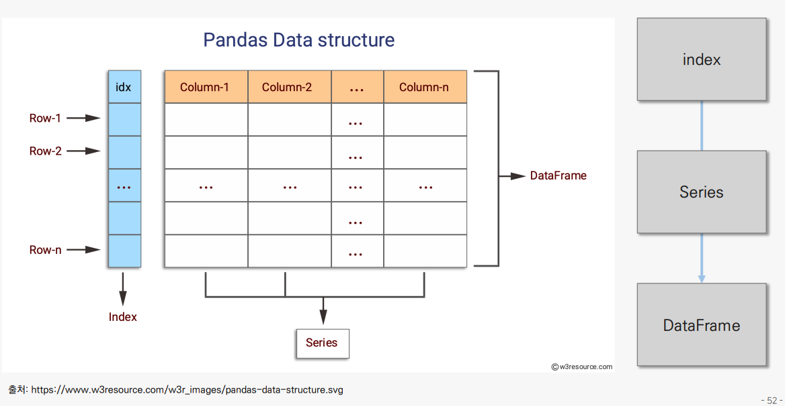

# 6.29(수) 강의



- 인덱스 : 숫자도, 문자도, 날짜도 입력할 수 있지만 중복 값을 허용하지 않음
- 시리즈 : 인덱스 + Column 하나
- 데이터프레임 : 인덱스 + Column 둘 이상
    
    
    
    - pandas.Series.method → 시리즈의 메서드
        - 시리즈와 데이터프레임은 서로 쓸 수 있는 메서드가 다름

- 데이터프레임.groupby() —> groupby 클래스
- 클래스가 모여서 패키지(라이브러리)가 생성 —> 클래스는 패키지의 하위버전
- 데이터타입
    - object = 문자열
    - int64(비트 값) = 정수
    - float64 = 실수
        - 비트 값 : 부피 공간 —> 즉, 비트 값이 높아질수록 저장할 수 있는 공간도 많아짐
        - 비트 값이 다를 때, 파생변수를 만드는 과정에서 오류가 발생

- 객체.info()를 통해 결측값을 확인할 수 있음


## 메서드

- 클래스 내부에 정의된 객체의 함수
    - ex) lemonade['Location'].value_counts
    type() 함수를 통해 클래스를 알아보면 <class 'pandas.core.series.Series'>로 나온다
    즉, 메서드 value_counts()는 시리즈 클래스 내부에 정의된 것
    - 특정 클래스 내부에 정의된 메서드는 다른 클래스에서 적용할 수 없다
    


```python
# 라이브러리 청크
import pandas as pd
import numpy as np
print("pandas version : ", pd.__version__)
print("numpy version : ", np.__version__)
```

    pandas version :  1.3.5
    numpy version :  1.21.6
    

# 데이터 불러오기
- 구글 드라이브에 데이터 존재


```python
from google.colab import drive
drive.mount('/content/drive')
```

    Drive already mounted at /content/drive; to attempt to forcibly remount, call drive.mount("/content/drive", force_remount=True).
    


```python
DATA_PATH = "/content/drive/MyDrive/Colab Notebooks/human_ai/Basic/Chapter 3. pandas/data/"
lemonade = pd.read_csv(DATA_PATH + 'Lemonade2016.csv')
lemonade.info()
```

    <class 'pandas.core.frame.DataFrame'>
    RangeIndex: 32 entries, 0 to 31
    Data columns (total 7 columns):
     #   Column       Non-Null Count  Dtype  
    ---  ------       --------------  -----  
     0   Date         31 non-null     object 
     1   Location     32 non-null     object 
     2   Lemon        32 non-null     int64  
     3   Orange       32 non-null     int64  
     4   Temperature  32 non-null     int64  
     5   Leaflets     31 non-null     float64
     6   Price        32 non-null     float64
    dtypes: float64(2), int64(3), object(2)
    memory usage: 1.9+ KB
    


```python
print(lemonade.head(7))
```

           Date Location  Lemon  Orange  Temperature  Leaflets  Price
    0  7/1/2016     Park     97      67           70      90.0   0.25
    1  7/2/2016     Park     98      67           72      90.0   0.25
    2  7/3/2016     Park    110      77           71     104.0   0.25
    3  7/4/2016    Beach    134      99           76      98.0   0.25
    4  7/5/2016    Beach    159     118           78     135.0   0.25
    5  7/6/2016    Beach    103      69           82      90.0   0.25
    6  7/6/2016    Beach    103      69           82      90.0   0.25
    


```python
print(lemonade.tail(3))
```

             Date Location  Lemon  Orange  Temperature  Leaflets  Price
    29  7/29/2016     Park    100      66           81      95.0   0.35
    30  7/30/2016    Beach     88      57           82      81.0   0.35
    31  7/31/2016    Beach     76      47           82      68.0   0.35
    

## 기술통계량 보는 함수
- describe()


```python
print(lemonade.describe())
```

                Lemon      Orange  Temperature    Leaflets      Price
    count   32.000000   32.000000    32.000000   31.000000  32.000000
    mean   116.156250   80.000000    78.968750  108.548387   0.354688
    std     25.823357   21.863211     4.067847   20.117718   0.113137
    min     71.000000   42.000000    70.000000   68.000000   0.250000
    25%     98.000000   66.750000    77.000000   90.000000   0.250000
    50%    113.500000   76.500000    80.500000  108.000000   0.350000
    75%    131.750000   95.000000    82.000000  124.000000   0.500000
    max    176.000000  129.000000    84.000000  158.000000   0.500000
    

## 범주형 데이터 빈도수 구하기


```python
print(type(lemonade['Location']))
# lemonade['Location'].value_counts()
lemonade.value_counts()
```

    <class 'pandas.core.series.Series'>
    


    Date       Location  Lemon  Orange  Temperature  Leaflets  Price
    7/6/2016   Beach     103    69      82           90.0      0.25     2
    7/1/2016   Park      97     67      70           90.0      0.25     1
    7/24/2016  Park      121    82      82           117.0     0.50     1
    7/7/2016   Beach     143    101     81           135.0     0.25     1
    7/5/2016   Beach     159    118     78           135.0     0.25     1
    7/4/2016   Beach     134    99      76           98.0      0.25     1
    7/31/2016  Beach     76     47      82           68.0      0.35     1
    7/30/2016  Beach     88     57      82           81.0      0.35     1
    7/3/2016   Park      110    77      71           104.0     0.25     1
    7/29/2016  Park      100    66      81           95.0      0.35     1
    7/28/2016  Park      96     63      82           90.0      0.35     1
    7/27/2016  Park      104    68      80           99.0      0.35     1
    7/26/2016  Park      176    129     83           158.0     0.35     1
    7/25/2016  Park      156    113     84           135.0     0.50     1
    7/23/2016  Park      120    82      81           117.0     0.50     1
    7/10/2016  Beach     140    98      82           131.0     0.25     1
    7/22/2016  Park      112    75      80           108.0     0.50     1
    7/21/2016  Park      83     50      77           90.0      0.50     1
    7/2/2016   Park      98     67      72           90.0      0.25     1
    7/19/2016  Park      122    85      78           113.0     0.50     1
    7/18/2016  Park      131    92      81           122.0     0.50     1
    7/17/2016  Beach     115    76      77           126.0     0.50     1
    7/16/2016  Beach     81     50      74           90.0      0.50     1
    7/15/2016  Beach     98     62      75           108.0     0.50     1
    7/14/2016  Beach     122    85      78           113.0     0.25     1
    7/13/2016  Beach     109    75      77           99.0      0.25     1
    7/12/2016  Beach     130    95      84           99.0      0.25     1
    7/11/2016  Beach     162    120     83           135.0     0.25     1
    7/9/2016   Beach     134    95      80           126.0     0.25     1
    dtype: int64


## 행과 열 다루기
- Sold(판매량) 컬럼(=피쳐=feature)을 추가


```python
lemonade['sold'] = 0
print(lemonade.head(3))
```

           Date Location  Lemon  Orange  Temperature  Leaflets  Price  sold
    0  7/1/2016     Park     97      67           70      90.0   0.25     0
    1  7/2/2016     Park     98      67           72      90.0   0.25     0
    2  7/3/2016     Park    110      77           71     104.0   0.25     0
    


```python
lemonade['Sold'] = lemonade['Lemon'] + lemonade['Orange']
print(lemonade.head(3))
```

           Date Location  Lemon  Orange  Temperature  Leaflets  Price  sold  Sold
    0  7/1/2016     Park     97      67           70      90.0   0.25     0   164
    1  7/2/2016     Park     98      67           72      90.0   0.25     0   165
    2  7/3/2016     Park    110      77           71     104.0   0.25     0   187
    


```python
lemonade['Revenue'] = lemonade['Sold'] * lemonade['Price']
print(lemonade.head(3))
print(lemonade[['Revenue', 'Sold']].head(4))
```

           Date Location  Lemon  Orange  Temperature  Leaflets  Price  sold  Sold  \
    0  7/1/2016     Park     97      67           70      90.0   0.25     0   164   
    1  7/2/2016     Park     98      67           72      90.0   0.25     0   165   
    2  7/3/2016     Park    110      77           71     104.0   0.25     0   187   
    
       Revenue  
    0    41.00  
    1    41.25  
    2    46.75  
       Revenue  Sold
    0    41.00   164
    1    41.25   165
    2    46.75   187
    3    58.25   233
    


```python
print(lemonade['Revenue'].head(3))
print(type(lemonade['Revenue']))
# 객체['컬럼명']의 클래스 = 시리즈

print(lemonade[['Revenue']].head(3))
print(type(lemonade[['Revenue']]))
# 객체[['컬럼명']]의 클래스 = 데이터프레임
# 중간중간 유형을 확인해야 하는 이유
## []갯수에 따라 클래스가 달라지고, 출력값도 달라질 수 있기 때문
```

    0    41.00
    1    41.25
    2    46.75
    Name: Revenue, dtype: float64
    <class 'pandas.core.series.Series'>
       Revenue
    0    41.00
    1    41.25
    2    46.75
    <class 'pandas.core.frame.DataFrame'>
    

## drop() 함수 사용해서 열 제거


```python
# 컬럼 제거
col_drop = lemonade.drop('sold', axis = 1)
print(col_drop.head(3))
```

           Date Location  Lemon  Orange  Temperature  Leaflets  Price  Sold  \
    0  7/1/2016     Park     97      67           70      90.0   0.25   164   
    1  7/2/2016     Park     98      67           72      90.0   0.25   165   
    2  7/3/2016     Park    110      77           71     104.0   0.25   187   
    
       Revenue  
    0    41.00  
    1    41.25  
    2    46.75  
    


```python
# 행 제거
row_drop = lemonade.drop([0, 1, 4], axis = 0)
print(row_drop.head(6))
```

           Date Location  Lemon  Orange  Temperature  Leaflets  Price  sold  Sold  \
    2  7/3/2016     Park    110      77           71     104.0   0.25     0   187   
    3  7/4/2016    Beach    134      99           76      98.0   0.25     0   233   
    5  7/6/2016    Beach    103      69           82      90.0   0.25     0   172   
    6  7/6/2016    Beach    103      69           82      90.0   0.25     0   172   
    7  7/7/2016    Beach    143     101           81     135.0   0.25     0   244   
    8       NaN    Beach    123      86           82     113.0   0.25     0   209   
    
       Revenue  
    2    46.75  
    3    58.25  
    5    43.00  
    6    43.00  
    7    61.00  
    8    52.25  
    

## 데이터 인덱싱


```python
lemonade = pd.read_csv(DATA_PATH + 'Lemonade2016.csv')
lemonade['Sold'] = lemonade['Lemon'] + lemonade['Orange']
lemonade['Revenue'] = lemonade['Sold'] * lemonade['Price']
print(lemonade[2:5])
```

           Date Location  Lemon  Orange  Temperature  Leaflets  Price  Sold  \
    2  7/3/2016     Park    110      77           71     104.0   0.25   187   
    3  7/4/2016    Beach    134      99           76      98.0   0.25   233   
    4  7/5/2016    Beach    159     118           78     135.0   0.25   277   
    
       Revenue  
    2    46.75  
    3    58.25  
    4    69.25  
    

- 특정 값만 추출 : filter 메서드


```python
# 데이터[데이터[컬럼] == 특정 값]
print(lemonade[lemonade['Location'] == 'Beach'])
```

             Date Location  Lemon  Orange  Temperature  Leaflets  Price  Sold  \
    3    7/4/2016    Beach    134      99           76      98.0   0.25   233   
    4    7/5/2016    Beach    159     118           78     135.0   0.25   277   
    5    7/6/2016    Beach    103      69           82      90.0   0.25   172   
    6    7/6/2016    Beach    103      69           82      90.0   0.25   172   
    7    7/7/2016    Beach    143     101           81     135.0   0.25   244   
    8         NaN    Beach    123      86           82     113.0   0.25   209   
    9    7/9/2016    Beach    134      95           80     126.0   0.25   229   
    10  7/10/2016    Beach    140      98           82     131.0   0.25   238   
    11  7/11/2016    Beach    162     120           83     135.0   0.25   282   
    12  7/12/2016    Beach    130      95           84      99.0   0.25   225   
    13  7/13/2016    Beach    109      75           77      99.0   0.25   184   
    14  7/14/2016    Beach    122      85           78     113.0   0.25   207   
    15  7/15/2016    Beach     98      62           75     108.0   0.50   160   
    16  7/16/2016    Beach     81      50           74      90.0   0.50   131   
    17  7/17/2016    Beach    115      76           77     126.0   0.50   191   
    30  7/30/2016    Beach     88      57           82      81.0   0.35   145   
    31  7/31/2016    Beach     76      47           82      68.0   0.35   123   
    
        Revenue  
    3     58.25  
    4     69.25  
    5     43.00  
    6     43.00  
    7     61.00  
    8     52.25  
    9     57.25  
    10    59.50  
    11    70.50  
    12    56.25  
    13    46.00  
    14    51.75  
    15    80.00  
    16    65.50  
    17    95.50  
    30    50.75  
    31    43.05  
    


```python
lemonade['Temperature'] >= 80
```


    0     False
    1     False
    2     False
    3     False
    4     False
    5      True
    6      True
    7      True
    8      True
    9      True
    10     True
    11     True
    12     True
    13    False
    14    False
    15    False
    16    False
    17    False
    18     True
    19    False
    20    False
    21    False
    22     True
    23     True
    24     True
    25     True
    26     True
    27     True
    28     True
    29     True
    30     True
    31     True
    Name: Temperature, dtype: bool


```python
lemonade[lemonade['Temperature'] >= 80]
```


  <div id="df-6700e238-8848-49ca-9cba-a55c7d685676">
    <div class="colab-df-container">
      <div>
<style scoped>
    .dataframe tbody tr th:only-of-type {
        vertical-align: middle;
    }

    .dataframe tbody tr th {
        vertical-align: top;
    }

    .dataframe thead th {
        text-align: right;
    }
</style>
<table border="1" class="dataframe">
  <thead>
    <tr style="text-align: right;">
      <th></th>
      <th>Date</th>
      <th>Location</th>
      <th>Lemon</th>
      <th>Orange</th>
      <th>Temperature</th>
      <th>Leaflets</th>
      <th>Price</th>
      <th>Sold</th>
      <th>Revenue</th>
    </tr>
  </thead>
  <tbody>
    <tr>
      <th>5</th>
      <td>7/6/2016</td>
      <td>Beach</td>
      <td>103</td>
      <td>69</td>
      <td>82</td>
      <td>90.0</td>
      <td>0.25</td>
      <td>172</td>
      <td>43.00</td>
    </tr>
    <tr>
      <th>6</th>
      <td>7/6/2016</td>
      <td>Beach</td>
      <td>103</td>
      <td>69</td>
      <td>82</td>
      <td>90.0</td>
      <td>0.25</td>
      <td>172</td>
      <td>43.00</td>
    </tr>
    <tr>
      <th>7</th>
      <td>7/7/2016</td>
      <td>Beach</td>
      <td>143</td>
      <td>101</td>
      <td>81</td>
      <td>135.0</td>
      <td>0.25</td>
      <td>244</td>
      <td>61.00</td>
    </tr>
    <tr>
      <th>8</th>
      <td>NaN</td>
      <td>Beach</td>
      <td>123</td>
      <td>86</td>
      <td>82</td>
      <td>113.0</td>
      <td>0.25</td>
      <td>209</td>
      <td>52.25</td>
    </tr>
    <tr>
      <th>9</th>
      <td>7/9/2016</td>
      <td>Beach</td>
      <td>134</td>
      <td>95</td>
      <td>80</td>
      <td>126.0</td>
      <td>0.25</td>
      <td>229</td>
      <td>57.25</td>
    </tr>
    <tr>
      <th>10</th>
      <td>7/10/2016</td>
      <td>Beach</td>
      <td>140</td>
      <td>98</td>
      <td>82</td>
      <td>131.0</td>
      <td>0.25</td>
      <td>238</td>
      <td>59.50</td>
    </tr>
    <tr>
      <th>11</th>
      <td>7/11/2016</td>
      <td>Beach</td>
      <td>162</td>
      <td>120</td>
      <td>83</td>
      <td>135.0</td>
      <td>0.25</td>
      <td>282</td>
      <td>70.50</td>
    </tr>
    <tr>
      <th>12</th>
      <td>7/12/2016</td>
      <td>Beach</td>
      <td>130</td>
      <td>95</td>
      <td>84</td>
      <td>99.0</td>
      <td>0.25</td>
      <td>225</td>
      <td>56.25</td>
    </tr>
    <tr>
      <th>18</th>
      <td>7/18/2016</td>
      <td>Park</td>
      <td>131</td>
      <td>92</td>
      <td>81</td>
      <td>122.0</td>
      <td>0.50</td>
      <td>223</td>
      <td>111.50</td>
    </tr>
    <tr>
      <th>22</th>
      <td>7/22/2016</td>
      <td>Park</td>
      <td>112</td>
      <td>75</td>
      <td>80</td>
      <td>108.0</td>
      <td>0.50</td>
      <td>187</td>
      <td>93.50</td>
    </tr>
    <tr>
      <th>23</th>
      <td>7/23/2016</td>
      <td>Park</td>
      <td>120</td>
      <td>82</td>
      <td>81</td>
      <td>117.0</td>
      <td>0.50</td>
      <td>202</td>
      <td>101.00</td>
    </tr>
    <tr>
      <th>24</th>
      <td>7/24/2016</td>
      <td>Park</td>
      <td>121</td>
      <td>82</td>
      <td>82</td>
      <td>117.0</td>
      <td>0.50</td>
      <td>203</td>
      <td>101.50</td>
    </tr>
    <tr>
      <th>25</th>
      <td>7/25/2016</td>
      <td>Park</td>
      <td>156</td>
      <td>113</td>
      <td>84</td>
      <td>135.0</td>
      <td>0.50</td>
      <td>269</td>
      <td>134.50</td>
    </tr>
    <tr>
      <th>26</th>
      <td>7/26/2016</td>
      <td>Park</td>
      <td>176</td>
      <td>129</td>
      <td>83</td>
      <td>158.0</td>
      <td>0.35</td>
      <td>305</td>
      <td>106.75</td>
    </tr>
    <tr>
      <th>27</th>
      <td>7/27/2016</td>
      <td>Park</td>
      <td>104</td>
      <td>68</td>
      <td>80</td>
      <td>99.0</td>
      <td>0.35</td>
      <td>172</td>
      <td>60.20</td>
    </tr>
    <tr>
      <th>28</th>
      <td>7/28/2016</td>
      <td>Park</td>
      <td>96</td>
      <td>63</td>
      <td>82</td>
      <td>90.0</td>
      <td>0.35</td>
      <td>159</td>
      <td>55.65</td>
    </tr>
    <tr>
      <th>29</th>
      <td>7/29/2016</td>
      <td>Park</td>
      <td>100</td>
      <td>66</td>
      <td>81</td>
      <td>95.0</td>
      <td>0.35</td>
      <td>166</td>
      <td>58.10</td>
    </tr>
    <tr>
      <th>30</th>
      <td>7/30/2016</td>
      <td>Beach</td>
      <td>88</td>
      <td>57</td>
      <td>82</td>
      <td>81.0</td>
      <td>0.35</td>
      <td>145</td>
      <td>50.75</td>
    </tr>
    <tr>
      <th>31</th>
      <td>7/31/2016</td>
      <td>Beach</td>
      <td>76</td>
      <td>47</td>
      <td>82</td>
      <td>68.0</td>
      <td>0.35</td>
      <td>123</td>
      <td>43.05</td>
    </tr>
  </tbody>
</table>
</div>
      <button class="colab-df-convert" onclick="convertToInteractive('df-6700e238-8848-49ca-9cba-a55c7d685676')"
              title="Convert this dataframe to an interactive table."
              style="display:none;">

  <svg xmlns="http://www.w3.org/2000/svg" height="24px"viewBox="0 0 24 24"
       width="24px">
    <path d="M0 0h24v24H0V0z" fill="none"/>
    <path d="M18.56 5.44l.94 2.06.94-2.06 2.06-.94-2.06-.94-.94-2.06-.94 2.06-2.06.94zm-11 1L8.5 8.5l.94-2.06 2.06-.94-2.06-.94L8.5 2.5l-.94 2.06-2.06.94zm10 10l.94 2.06.94-2.06 2.06-.94-2.06-.94-.94-2.06-.94 2.06-2.06.94z"/><path d="M17.41 7.96l-1.37-1.37c-.4-.4-.92-.59-1.43-.59-.52 0-1.04.2-1.43.59L10.3 9.45l-7.72 7.72c-.78.78-.78 2.05 0 2.83L4 21.41c.39.39.9.59 1.41.59.51 0 1.02-.2 1.41-.59l7.78-7.78 2.81-2.81c.8-.78.8-2.07 0-2.86zM5.41 20L4 18.59l7.72-7.72 1.47 1.35L5.41 20z"/>
  </svg>
      </button>

  <style>
    .colab-df-container {
      display:flex;
      flex-wrap:wrap;
      gap: 12px;
    }

    .colab-df-convert {
      background-color: #E8F0FE;
      border: none;
      border-radius: 50%;
      cursor: pointer;
      display: none;
      fill: #1967D2;
      height: 32px;
      padding: 0 0 0 0;
      width: 32px;
    }

    .colab-df-convert:hover {
      background-color: #E2EBFA;
      box-shadow: 0px 1px 2px rgba(60, 64, 67, 0.3), 0px 1px 3px 1px rgba(60, 64, 67, 0.15);
      fill: #174EA6;
    }

    [theme=dark] .colab-df-convert {
      background-color: #3B4455;
      fill: #D2E3FC;
    }

    [theme=dark] .colab-df-convert:hover {
      background-color: #434B5C;
      box-shadow: 0px 1px 3px 1px rgba(0, 0, 0, 0.15);
      filter: drop-shadow(0px 1px 2px rgba(0, 0, 0, 0.3));
      fill: #FFFFFF;
    }
  </style>

      <script>
        const buttonEl =
          document.querySelector('#df-6700e238-8848-49ca-9cba-a55c7d685676 button.colab-df-convert');
        buttonEl.style.display =
          google.colab.kernel.accessAllowed ? 'block' : 'none';

        async function convertToInteractive(key) {
          const element = document.querySelector('#df-6700e238-8848-49ca-9cba-a55c7d685676');
          const dataTable =
            await google.colab.kernel.invokeFunction('convertToInteractive',
                                                     [key], {});
          if (!dataTable) return;

          const docLinkHtml = 'Like what you see? Visit the ' +
            '<a target="_blank" href=https://colab.research.google.com/notebooks/data_table.ipynb>data table notebook</a>'
            + ' to learn more about interactive tables.';
          element.innerHTML = '';
          dataTable['output_type'] = 'display_data';
          await google.colab.output.renderOutput(dataTable, element);
          const docLink = document.createElement('div');
          docLink.innerHTML = docLinkHtml;
          element.appendChild(docLink);
        }
      </script>
    </div>
  </div>


```python
lemonade[(lemonade['Temperature'] >= 80) & (lemonade['Orange'] >= 100) & (lemonade['Revenue'] >= 80)]
# 복수의 조건문은 ()로 하나씩 조건을 묶은 후 비교 연산자를 이용하면 됨
```


  <div id="df-99be2d45-f71f-484d-8528-17d7714b49e7">
    <div class="colab-df-container">
      <div>
<style scoped>
    .dataframe tbody tr th:only-of-type {
        vertical-align: middle;
    }

    .dataframe tbody tr th {
        vertical-align: top;
    }

    .dataframe thead th {
        text-align: right;
    }
</style>
<table border="1" class="dataframe">
  <thead>
    <tr style="text-align: right;">
      <th></th>
      <th>Date</th>
      <th>Location</th>
      <th>Lemon</th>
      <th>Orange</th>
      <th>Temperature</th>
      <th>Leaflets</th>
      <th>Price</th>
      <th>Sold</th>
      <th>Revenue</th>
    </tr>
  </thead>
  <tbody>
    <tr>
      <th>25</th>
      <td>7/25/2016</td>
      <td>Park</td>
      <td>156</td>
      <td>113</td>
      <td>84</td>
      <td>135.0</td>
      <td>0.50</td>
      <td>269</td>
      <td>134.50</td>
    </tr>
    <tr>
      <th>26</th>
      <td>7/26/2016</td>
      <td>Park</td>
      <td>176</td>
      <td>129</td>
      <td>83</td>
      <td>158.0</td>
      <td>0.35</td>
      <td>305</td>
      <td>106.75</td>
    </tr>
  </tbody>
</table>
</div>
      <button class="colab-df-convert" onclick="convertToInteractive('df-99be2d45-f71f-484d-8528-17d7714b49e7')"
              title="Convert this dataframe to an interactive table."
              style="display:none;">

  <svg xmlns="http://www.w3.org/2000/svg" height="24px"viewBox="0 0 24 24"
       width="24px">
    <path d="M0 0h24v24H0V0z" fill="none"/>
    <path d="M18.56 5.44l.94 2.06.94-2.06 2.06-.94-2.06-.94-.94-2.06-.94 2.06-2.06.94zm-11 1L8.5 8.5l.94-2.06 2.06-.94-2.06-.94L8.5 2.5l-.94 2.06-2.06.94zm10 10l.94 2.06.94-2.06 2.06-.94-2.06-.94-.94-2.06-.94 2.06-2.06.94z"/><path d="M17.41 7.96l-1.37-1.37c-.4-.4-.92-.59-1.43-.59-.52 0-1.04.2-1.43.59L10.3 9.45l-7.72 7.72c-.78.78-.78 2.05 0 2.83L4 21.41c.39.39.9.59 1.41.59.51 0 1.02-.2 1.41-.59l7.78-7.78 2.81-2.81c.8-.78.8-2.07 0-2.86zM5.41 20L4 18.59l7.72-7.72 1.47 1.35L5.41 20z"/>
  </svg>
      </button>

  <style>
    .colab-df-container {
      display:flex;
      flex-wrap:wrap;
      gap: 12px;
    }

    .colab-df-convert {
      background-color: #E8F0FE;
      border: none;
      border-radius: 50%;
      cursor: pointer;
      display: none;
      fill: #1967D2;
      height: 32px;
      padding: 0 0 0 0;
      width: 32px;
    }

    .colab-df-convert:hover {
      background-color: #E2EBFA;
      box-shadow: 0px 1px 2px rgba(60, 64, 67, 0.3), 0px 1px 3px 1px rgba(60, 64, 67, 0.15);
      fill: #174EA6;
    }

    [theme=dark] .colab-df-convert {
      background-color: #3B4455;
      fill: #D2E3FC;
    }

    [theme=dark] .colab-df-convert:hover {
      background-color: #434B5C;
      box-shadow: 0px 1px 3px 1px rgba(0, 0, 0, 0.15);
      filter: drop-shadow(0px 1px 2px rgba(0, 0, 0, 0.3));
      fill: #FFFFFF;
    }
  </style>

      <script>
        const buttonEl =
          document.querySelector('#df-99be2d45-f71f-484d-8528-17d7714b49e7 button.colab-df-convert');
        buttonEl.style.display =
          google.colab.kernel.accessAllowed ? 'block' : 'none';

        async function convertToInteractive(key) {
          const element = document.querySelector('#df-99be2d45-f71f-484d-8528-17d7714b49e7');
          const dataTable =
            await google.colab.kernel.invokeFunction('convertToInteractive',
                                                     [key], {});
          if (!dataTable) return;

          const docLinkHtml = 'Like what you see? Visit the ' +
            '<a target="_blank" href=https://colab.research.google.com/notebooks/data_table.ipynb>data table notebook</a>'
            + ' to learn more about interactive tables.';
          element.innerHTML = '';
          dataTable['output_type'] = 'display_data';
          await google.colab.output.renderOutput(dataTable, element);
          const docLink = document.createElement('div');
          docLink.innerHTML = docLinkHtml;
          element.appendChild(docLink);
        }
      </script>
    </div>
  </div>


```python
Analytics = lemonade[(lemonade['Location'] == 'Beach') & 
         (lemonade['Temperature'] >= 80) &
         (lemonade['Sold'] >= 200) &
         (lemonade['Revenue'] >= 60)]

print(Analytics)
```

             Date Location  Lemon  Orange  Temperature  Leaflets  Price  Sold  \
    7    7/7/2016    Beach    143     101           81     135.0   0.25   244   
    11  7/11/2016    Beach    162     120           83     135.0   0.25   282   
    
        Revenue  
    7      61.0  
    11     70.5  
    


```python
# lemonade[(조건식1) &/| (조건식2)]
```


```python
print(lemonade.loc[lemonade['Temperature'] >= 80, ['Date', 'Location']])
```

             Date Location
    5    7/6/2016    Beach
    6    7/6/2016    Beach
    7    7/7/2016    Beach
    8         NaN    Beach
    9    7/9/2016    Beach
    10  7/10/2016    Beach
    11  7/11/2016    Beach
    12  7/12/2016    Beach
    18  7/18/2016     Park
    22  7/22/2016     Park
    23  7/23/2016     Park
    24  7/24/2016     Park
    25  7/25/2016     Park
    26  7/26/2016     Park
    27  7/27/2016     Park
    28  7/28/2016     Park
    29  7/29/2016     Park
    30  7/30/2016    Beach
    31  7/31/2016    Beach
    


```python
print(lemonade.loc[(lemonade['Temperature'] >= 80) & (lemonade['Sold'] >= 230), ['Location', 'Lemon', 'Orange']])
```

       Location  Lemon  Orange
    7     Beach    143     101
    10    Beach    140      98
    11    Beach    162     120
    25     Park    156     113
    26     Park    176     129
    

## iloc vs loc
- 문법 상의 차이 확인


```python
lemonade.head()
```


  <div id="df-ac0334ca-6fe6-490b-8fb6-2dee2066fbff">
    <div class="colab-df-container">
      <div>
<style scoped>
    .dataframe tbody tr th:only-of-type {
        vertical-align: middle;
    }

    .dataframe tbody tr th {
        vertical-align: top;
    }

    .dataframe thead th {
        text-align: right;
    }
</style>
<table border="1" class="dataframe">
  <thead>
    <tr style="text-align: right;">
      <th></th>
      <th>Date</th>
      <th>Location</th>
      <th>Lemon</th>
      <th>Orange</th>
      <th>Temperature</th>
      <th>Leaflets</th>
      <th>Price</th>
      <th>Sold</th>
      <th>Revenue</th>
    </tr>
  </thead>
  <tbody>
    <tr>
      <th>0</th>
      <td>7/1/2016</td>
      <td>Park</td>
      <td>97</td>
      <td>67</td>
      <td>70</td>
      <td>90.0</td>
      <td>0.25</td>
      <td>164</td>
      <td>41.00</td>
    </tr>
    <tr>
      <th>1</th>
      <td>7/2/2016</td>
      <td>Park</td>
      <td>98</td>
      <td>67</td>
      <td>72</td>
      <td>90.0</td>
      <td>0.25</td>
      <td>165</td>
      <td>41.25</td>
    </tr>
    <tr>
      <th>2</th>
      <td>7/3/2016</td>
      <td>Park</td>
      <td>110</td>
      <td>77</td>
      <td>71</td>
      <td>104.0</td>
      <td>0.25</td>
      <td>187</td>
      <td>46.75</td>
    </tr>
    <tr>
      <th>3</th>
      <td>7/4/2016</td>
      <td>Beach</td>
      <td>134</td>
      <td>99</td>
      <td>76</td>
      <td>98.0</td>
      <td>0.25</td>
      <td>233</td>
      <td>58.25</td>
    </tr>
    <tr>
      <th>4</th>
      <td>7/5/2016</td>
      <td>Beach</td>
      <td>159</td>
      <td>118</td>
      <td>78</td>
      <td>135.0</td>
      <td>0.25</td>
      <td>277</td>
      <td>69.25</td>
    </tr>
  </tbody>
</table>
</div>
      <button class="colab-df-convert" onclick="convertToInteractive('df-ac0334ca-6fe6-490b-8fb6-2dee2066fbff')"
              title="Convert this dataframe to an interactive table."
              style="display:none;">

  <svg xmlns="http://www.w3.org/2000/svg" height="24px"viewBox="0 0 24 24"
       width="24px">
    <path d="M0 0h24v24H0V0z" fill="none"/>
    <path d="M18.56 5.44l.94 2.06.94-2.06 2.06-.94-2.06-.94-.94-2.06-.94 2.06-2.06.94zm-11 1L8.5 8.5l.94-2.06 2.06-.94-2.06-.94L8.5 2.5l-.94 2.06-2.06.94zm10 10l.94 2.06.94-2.06 2.06-.94-2.06-.94-.94-2.06-.94 2.06-2.06.94z"/><path d="M17.41 7.96l-1.37-1.37c-.4-.4-.92-.59-1.43-.59-.52 0-1.04.2-1.43.59L10.3 9.45l-7.72 7.72c-.78.78-.78 2.05 0 2.83L4 21.41c.39.39.9.59 1.41.59.51 0 1.02-.2 1.41-.59l7.78-7.78 2.81-2.81c.8-.78.8-2.07 0-2.86zM5.41 20L4 18.59l7.72-7.72 1.47 1.35L5.41 20z"/>
  </svg>
      </button>

  <style>
    .colab-df-container {
      display:flex;
      flex-wrap:wrap;
      gap: 12px;
    }

    .colab-df-convert {
      background-color: #E8F0FE;
      border: none;
      border-radius: 50%;
      cursor: pointer;
      display: none;
      fill: #1967D2;
      height: 32px;
      padding: 0 0 0 0;
      width: 32px;
    }

    .colab-df-convert:hover {
      background-color: #E2EBFA;
      box-shadow: 0px 1px 2px rgba(60, 64, 67, 0.3), 0px 1px 3px 1px rgba(60, 64, 67, 0.15);
      fill: #174EA6;
    }

    [theme=dark] .colab-df-convert {
      background-color: #3B4455;
      fill: #D2E3FC;
    }

    [theme=dark] .colab-df-convert:hover {
      background-color: #434B5C;
      box-shadow: 0px 1px 3px 1px rgba(0, 0, 0, 0.15);
      filter: drop-shadow(0px 1px 2px rgba(0, 0, 0, 0.3));
      fill: #FFFFFF;
    }
  </style>

      <script>
        const buttonEl =
          document.querySelector('#df-ac0334ca-6fe6-490b-8fb6-2dee2066fbff button.colab-df-convert');
        buttonEl.style.display =
          google.colab.kernel.accessAllowed ? 'block' : 'none';

        async function convertToInteractive(key) {
          const element = document.querySelector('#df-ac0334ca-6fe6-490b-8fb6-2dee2066fbff');
          const dataTable =
            await google.colab.kernel.invokeFunction('convertToInteractive',
                                                     [key], {});
          if (!dataTable) return;

          const docLinkHtml = 'Like what you see? Visit the ' +
            '<a target="_blank" href=https://colab.research.google.com/notebooks/data_table.ipynb>data table notebook</a>'
            + ' to learn more about interactive tables.';
          element.innerHTML = '';
          dataTable['output_type'] = 'display_data';
          await google.colab.output.renderOutput(dataTable, element);
          const docLink = document.createElement('div');
          docLink.innerHTML = docLinkHtml;
          element.appendChild(docLink);
        }
      </script>
    </div>
  </div>


- iloc(인덱스 기반)
- 숫자만 들어감


```python
print(lemonade.iloc[0:3, 0:2])
```

           Date Location
    0  7/1/2016     Park
    1  7/2/2016     Park
    2  7/3/2016     Park
    

- loc(라벨 기반)
- 숫자(x), 라벨 = 글자(숫자, 문자 동시)


```python
print(lemonade.loc[0:5, ['Lemon', 'Orange']])      # 0:5 -> 인덱스가 아닌 숫자 라벨
```

       Lemon  Orange
    0     97      67
    1     98      67
    2    110      77
    3    134      99
    4    159     118
    5    103      69
    


```python

print(lemonade.loc[(lemonade['Temperature'] >= 80) & (lemonade['Sold'] >= 230), ['Location', 'Lemon', 'Orange']])
```

       Location  Lemon  Orange
    7     Beach    143     101
    10    Beach    140      98
    11    Beach    162     120
    25     Park    156     113
    26     Park    176     129
    

## 데이터 정렬
- sort_values()


```python
# lemonadehead()
print(lemonade.sort_values(by=['Revenue']).head(10))
```

             Date Location  Lemon  Orange  Temperature  Leaflets  Price  Sold  \
    0    7/1/2016     Park     97      67           70      90.0   0.25   164   
    1    7/2/2016     Park     98      67           72      90.0   0.25   165   
    6    7/6/2016    Beach    103      69           82      90.0   0.25   172   
    5    7/6/2016    Beach    103      69           82      90.0   0.25   172   
    31  7/31/2016    Beach     76      47           82      68.0   0.35   123   
    13  7/13/2016    Beach    109      75           77      99.0   0.25   184   
    2    7/3/2016     Park    110      77           71     104.0   0.25   187   
    30  7/30/2016    Beach     88      57           82      81.0   0.35   145   
    14  7/14/2016    Beach    122      85           78     113.0   0.25   207   
    8         NaN    Beach    123      86           82     113.0   0.25   209   
    
        Revenue  
    0     41.00  
    1     41.25  
    6     43.00  
    5     43.00  
    31    43.05  
    13    46.00  
    2     46.75  
    30    50.75  
    14    51.75  
    8     52.25  
    


```python
print(lemonade[['Date', 'Temperature', 'Revenue']].sort_values(by=['Revenue']).head(10))
```

             Date  Temperature  Revenue
    0    7/1/2016           70    41.00
    1    7/2/2016           72    41.25
    6    7/6/2016           82    43.00
    5    7/6/2016           82    43.00
    31  7/31/2016           82    43.05
    13  7/13/2016           77    46.00
    2    7/3/2016           71    46.75
    30  7/30/2016           82    50.75
    14  7/14/2016           78    51.75
    8         NaN           82    52.25
    


```python
print(lemonade[['Date', 'Temperature', 'Revenue', 'Sold']].sort_values(by=['Temperature', 'Revenue', 'Sold']).head(10))
```

             Date  Temperature  Revenue  Sold
    0    7/1/2016           70    41.00   164
    20  7/20/2016           70    56.50   113
    2    7/3/2016           71    46.75   187
    1    7/2/2016           72    41.25   165
    16  7/16/2016           74    65.50   131
    15  7/15/2016           75    80.00   160
    3    7/4/2016           76    58.25   233
    13  7/13/2016           77    46.00   184
    21  7/21/2016           77    66.50   133
    17  7/17/2016           77    95.50   191
    


```python
print(lemonade[['Date', 'Temperature', 'Revenue', 'Price']].sort_values(by=['Temperature', 'Price', 'Revenue'], ascending = [True, True, False] ).head(20))
```

             Date  Temperature  Revenue  Price
    0    7/1/2016           70    41.00   0.25
    20  7/20/2016           70    56.50   0.50
    2    7/3/2016           71    46.75   0.25
    1    7/2/2016           72    41.25   0.25
    16  7/16/2016           74    65.50   0.50
    15  7/15/2016           75    80.00   0.50
    3    7/4/2016           76    58.25   0.25
    13  7/13/2016           77    46.00   0.25
    17  7/17/2016           77    95.50   0.50
    21  7/21/2016           77    66.50   0.50
    4    7/5/2016           78    69.25   0.25
    14  7/14/2016           78    51.75   0.25
    19  7/19/2016           78   103.50   0.50
    9    7/9/2016           80    57.25   0.25
    27  7/27/2016           80    60.20   0.35
    22  7/22/2016           80    93.50   0.50
    7    7/7/2016           81    61.00   0.25
    29  7/29/2016           81    58.10   0.35
    18  7/18/2016           81   111.50   0.50
    23  7/23/2016           81   101.00   0.50
    


```python
print(lemonade[['Date', 'Temperature', 'Revenue']].sort_values(by=['Temperature', 'Revenue'], ascending = [True, False]).head(20))
```

             Date  Temperature  Revenue
    20  7/20/2016           70    56.50
    0    7/1/2016           70    41.00
    2    7/3/2016           71    46.75
    1    7/2/2016           72    41.25
    16  7/16/2016           74    65.50
    15  7/15/2016           75    80.00
    3    7/4/2016           76    58.25
    17  7/17/2016           77    95.50
    21  7/21/2016           77    66.50
    13  7/13/2016           77    46.00
    19  7/19/2016           78   103.50
    4    7/5/2016           78    69.25
    14  7/14/2016           78    51.75
    22  7/22/2016           80    93.50
    27  7/27/2016           80    60.20
    9    7/9/2016           80    57.25
    18  7/18/2016           81   111.50
    23  7/23/2016           81   101.00
    7    7/7/2016           81    61.00
    29  7/29/2016           81    58.10
    

## Groupby


```python
df = lemonade.groupby(by='Location').count()     # by ='컬럼명' -> 컬럼명이 인덱스가 됨
print(df)
print(type(df))
```

              Date  Lemon  Orange  Temperature  Leaflets  Price  Sold  Revenue
    Location                                                                  
    Beach       16     17      17           17        17     17    17       17
    Park        15     15      15           15        14     15    15       15
    <class 'pandas.core.frame.DataFrame'>
    


```python
df[['Date', 'Lemon']]       # 'Date', 'Lemon' 컬럼을 별도 이용하는 데이터프레임 만들기
print(df.iloc[0:2, 0:1])
print(df.loc['Beach', ['Date', 'Lemon']])
print(type(df.iloc[0:2, 0:1]))
print(type(df.loc['Beach', ['Date', 'Lemon']]))
```

              Date
    Location      
    Beach       16
    Park        15
    Date     16
    Lemon    17
    Name: Beach, dtype: int64
    <class 'pandas.core.frame.DataFrame'>
    <class 'pandas.core.series.Series'>
    


```python

```

- 간단한 피벗 테이블 만들기


```python
lemonade.groupby('Location')[['Revenue', 'Sold', 'Price']].agg([max, min, sum, np.mean])
```


  <div id="df-fc519e2c-d37a-4953-aafc-d64783cb0ccf">
    <div class="colab-df-container">
      <div>
<style scoped>
    .dataframe tbody tr th:only-of-type {
        vertical-align: middle;
    }

    .dataframe tbody tr th {
        vertical-align: top;
    }

    .dataframe thead tr th {
        text-align: left;
    }

    .dataframe thead tr:last-of-type th {
        text-align: right;
    }
</style>
<table border="1" class="dataframe">
  <thead>
    <tr>
      <th></th>
      <th colspan="4" halign="left">Revenue</th>
      <th colspan="4" halign="left">Sold</th>
      <th colspan="4" halign="left">Price</th>
    </tr>
    <tr>
      <th></th>
      <th>max</th>
      <th>min</th>
      <th>sum</th>
      <th>mean</th>
      <th>max</th>
      <th>min</th>
      <th>sum</th>
      <th>mean</th>
      <th>max</th>
      <th>min</th>
      <th>sum</th>
      <th>mean</th>
    </tr>
    <tr>
      <th>Location</th>
      <th></th>
      <th></th>
      <th></th>
      <th></th>
      <th></th>
      <th></th>
      <th></th>
      <th></th>
      <th></th>
      <th></th>
      <th></th>
      <th></th>
    </tr>
  </thead>
  <tbody>
    <tr>
      <th>Beach</th>
      <td>95.5</td>
      <td>43.0</td>
      <td>1002.8</td>
      <td>58.988235</td>
      <td>282</td>
      <td>123</td>
      <td>3422</td>
      <td>201.294118</td>
      <td>0.5</td>
      <td>0.25</td>
      <td>5.20</td>
      <td>0.305882</td>
    </tr>
    <tr>
      <th>Park</th>
      <td>134.5</td>
      <td>41.0</td>
      <td>1178.2</td>
      <td>78.546667</td>
      <td>305</td>
      <td>113</td>
      <td>2855</td>
      <td>190.333333</td>
      <td>0.5</td>
      <td>0.25</td>
      <td>6.15</td>
      <td>0.410000</td>
    </tr>
  </tbody>
</table>
</div>
      <button class="colab-df-convert" onclick="convertToInteractive('df-fc519e2c-d37a-4953-aafc-d64783cb0ccf')"
              title="Convert this dataframe to an interactive table."
              style="display:none;">

  <svg xmlns="http://www.w3.org/2000/svg" height="24px"viewBox="0 0 24 24"
       width="24px">
    <path d="M0 0h24v24H0V0z" fill="none"/>
    <path d="M18.56 5.44l.94 2.06.94-2.06 2.06-.94-2.06-.94-.94-2.06-.94 2.06-2.06.94zm-11 1L8.5 8.5l.94-2.06 2.06-.94-2.06-.94L8.5 2.5l-.94 2.06-2.06.94zm10 10l.94 2.06.94-2.06 2.06-.94-2.06-.94-.94-2.06-.94 2.06-2.06.94z"/><path d="M17.41 7.96l-1.37-1.37c-.4-.4-.92-.59-1.43-.59-.52 0-1.04.2-1.43.59L10.3 9.45l-7.72 7.72c-.78.78-.78 2.05 0 2.83L4 21.41c.39.39.9.59 1.41.59.51 0 1.02-.2 1.41-.59l7.78-7.78 2.81-2.81c.8-.78.8-2.07 0-2.86zM5.41 20L4 18.59l7.72-7.72 1.47 1.35L5.41 20z"/>
  </svg>
      </button>

  <style>
    .colab-df-container {
      display:flex;
      flex-wrap:wrap;
      gap: 12px;
    }

    .colab-df-convert {
      background-color: #E8F0FE;
      border: none;
      border-radius: 50%;
      cursor: pointer;
      display: none;
      fill: #1967D2;
      height: 32px;
      padding: 0 0 0 0;
      width: 32px;
    }

    .colab-df-convert:hover {
      background-color: #E2EBFA;
      box-shadow: 0px 1px 2px rgba(60, 64, 67, 0.3), 0px 1px 3px 1px rgba(60, 64, 67, 0.15);
      fill: #174EA6;
    }

    [theme=dark] .colab-df-convert {
      background-color: #3B4455;
      fill: #D2E3FC;
    }

    [theme=dark] .colab-df-convert:hover {
      background-color: #434B5C;
      box-shadow: 0px 1px 3px 1px rgba(0, 0, 0, 0.15);
      filter: drop-shadow(0px 1px 2px rgba(0, 0, 0, 0.3));
      fill: #FFFFFF;
    }
  </style>

      <script>
        const buttonEl =
          document.querySelector('#df-fc519e2c-d37a-4953-aafc-d64783cb0ccf button.colab-df-convert');
        buttonEl.style.display =
          google.colab.kernel.accessAllowed ? 'block' : 'none';

        async function convertToInteractive(key) {
          const element = document.querySelector('#df-fc519e2c-d37a-4953-aafc-d64783cb0ccf');
          const dataTable =
            await google.colab.kernel.invokeFunction('convertToInteractive',
                                                     [key], {});
          if (!dataTable) return;

          const docLinkHtml = 'Like what you see? Visit the ' +
            '<a target="_blank" href=https://colab.research.google.com/notebooks/data_table.ipynb>data table notebook</a>'
            + ' to learn more about interactive tables.';
          element.innerHTML = '';
          dataTable['output_type'] = 'display_data';
          await google.colab.output.renderOutput(dataTable, element);
          const docLink = document.createElement('div');
          docLink.innerHTML = docLinkHtml;
          element.appendChild(docLink);
        }
      </script>
    </div>
  </div>


