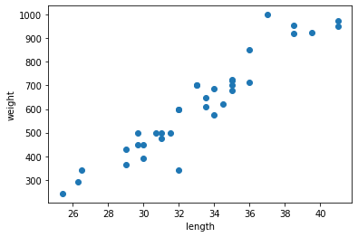

# Python 데이터 과학
- Numpy가 기본 -> array 형태
  - Pandas 데이터 가공 -> dataframe 형태 (= R의 deplyr)
  - Scipy 과학, 수학, 통계
  - statsmodels 통계
  - sklearn 머신러닝
  - tensorflow, pytorch

# 인공지능 > 머신러닝 > 딥러닝
- 머신러닝 알고리즘
  + 선형회귀, 결정트리
  + 결과에 대한 해석 요구
  + 통계 분석 동반
  + 정형데이터(= 엑셀 데이터, 테이블)

- 딥러닝 알고리즘
  + 인공신경망 알고리즘
  + 이미지(=영상인식), 자연어(=음성인식)
  + 성능이 좋나요?

# 분석의 흐름

1. 데이터 수집
2. 데이터 가공
3. 데이터 시각화
4. 데이터 (예측) 모델링 
  - 예측 평가지표
  - ** 알고리즘 공부 ** --> 알고리즘 종류 수백가지
    - 따라서 선택적으로 접근
  
  ※ R : 데이터 (통계) 모델링 --> 해석에 포커스
      - 변수(=피쳐=컬럼) 간의 관계
      - 가설 검정이 중요
  
  - 공통점 : 결과 해석

5. 보고서 작성(to. 상사/甲/의사결정자)
  - 현재 내 위치 : 면접 자료
  - 면접자료 : 소스코드 & PPT


# Chapter 1. 머신러닝

## 파이썬 주요 라이브러리
- Machine Learning
  + 정형 데이터
  + 사이킷런(scikit-Learn)

- Deep Learning
  + 비정형 데이터
  + Tensorflow(구글) vs Pytorch(페이스북)
  + 혼공머(교재) : Tensorflow
  + 실제 상용서비스 -> Tensorflow
  + R&D -> Pytorch

## 생선분류
- p.45
- '도미', '곤들매기', '농어', '강꼬치고기', '로치', '빙어', '송어'
- 이 생선들을 분류하라

- p.47
- 도미 데이터

## 데이터 수집


```python
# 도미의 길이
bream_length = [25.4, 26.3, 26.5, 29.0, 29.0, 29.7, 29.7, 30.0, 30.0, 30.7, 31.0, 31.0, 31.5, 32.0, 32.0, 32.0, 33.0, 33.0, 33.5, 33.5, 34.0, 34.0, 34.5, 35.0, 35.0, 35.0, 35.0, 36.0, 36.0, 37.0, 38.5, 38.5, 39.5, 41.0, 41.0]
# 도미의 무게
bream_weight = [242.0, 290.0, 340.0, 363.0, 430.0, 450.0, 500.0, 390.0, 450.0, 500.0, 475.0, 500.0, 500.0, 340.0, 600.0, 600.0, 700.0, 700.0, 610.0, 650.0, 575.0, 685.0, 620.0, 680.0, 700.0, 725.0, 720.0, 714.0, 850.0, 1000.0, 920.0, 955.0, 925.0, 975.0, 950.0]
```

## 데이터 가공
- 여기서는 생략

## 데이터 시각화
- 여러 인사이트 확인 위해 시각화, 통계 수치 계산
- 탐색적 자료 분석(EDA: Exploratory Data Analysis)


```python
import matplotlib.pyplot as plt

plt.scatter(bream_length, bream_weight)
plt.xlabel("length")
plt.ylabel("weight")
plt.show()
```


    

    


- 파이썬 시각화는 객체지향으로 한다
- 이유 : 좀 더 예쁘고, 아름답게 다듬기 위해
- 캐글 시각화 참고할 때, 아래와 같이 하는 분들이 많음


```python
import matplotlib.pyplot as plt

fig, ax = plt.subplots()
ax.scatter(bream_length, bream_weight)
ax.set_xlabel('length')
ax.set_ylabel('weight')
plt.show()
```


    

    


```python
smelt_length = [9.8, 10.5, 10.6, 11.0, 11.2, 11.3, 11.8, 11.8, 12.0, 12.2, 12.4, 13.0, 14.3, 15.0]
smelt_weight = [6.7, 7.5, 7.0, 9.7, 9.8, 8.7, 10.0, 9.9, 9.8, 12.2, 13.4, 12.2, 19.7, 19.9]
```


```python
fig, ax = plt.subplots()
ax.scatter(smelt_length, smelt_weight)
ax.set_xlabel("length")
ax.set_ylabel("weight")
plt.show()
```


    

    


```python
fig, ax = plt.subplots()
ax.scatter(bream_length, bream_weight)
ax.scatter(smelt_length, smelt_weight)
ax.set_xlabel("length")
ax.set_ylabel("weight")
plt.show()
```


    

    


- 두 개의 리스트 합치기


```python
length = bream_length + smelt_length
weight = bream_weight + smelt_weight
```

- 2차원 리스트로 만든다


```python
fish_data = [[l, w] for l, w in zip(length, weight)]
fish_data[0:5]
```


    [[25.4, 242.0], [26.3, 290.0], [26.5, 340.0], [29.0, 363.0], [29.0, 430.0]]


- 라벨링을 해준다 = 지도해준다 --> 지도학습


```python
fish_target = [1] * 35 + [0] * 14     
# 머신러닝 : 수식(수학), 문자를 숫자로 바꿔주는 것 : 인코딩 변환 
print(fish_target)
```

    [1, 1, 1, 1, 1, 1, 1, 1, 1, 1, 1, 1, 1, 1, 1, 1, 1, 1, 1, 1, 1, 1, 1, 1, 1, 1, 1, 1, 1, 1, 1, 1, 1, 1, 1, 0, 0, 0, 0, 0, 0, 0, 0, 0, 0, 0, 0, 0, 0]
    

## 모델링


```python
from sklearn.neighbors import KNeighborsClassifier

# 클래스 인스턴스화
kn = KNeighborsClassifier()

# 모형 학습
#      독립 변수,  종속 변수
kn.fit(fish_data, fish_target)

```


    KNeighborsClassifier()


```python
# 예측 정확도
kn.score(fish_data, fish_target)
```


    1.0


- 실제 예측을 해보자
- 새로운 물고기가 도착했다
  + 길이 : 30, 몸무게 : 600


```python
kn.predict([[30, 600]])
```


    array([1])


```python
ac_length = int(input("물고기 길이를 입력하라"))
ac_weight = int(input("물고기 무게를 입력하라"))

preds = int(kn.predict([[ac_length, ac_weight]]))
print(preds)

if preds == 1 :
  print("도미")
else :
  print("빙어")
```

    물고기 길이를 입력하라10
    물고기 무게를 입력하라200
    1
    도미
    

## 새로운 모델 제안
- Default 모델 : 정확도 100%
- 제안 모델 : 정확도 71%

  ---> 실험 단계

- 하이퍼 파라미터 세팅
  - default : 100%
  - n_neighbors = 49 (튜닝)
    - 그룹을 49개로 나눈다
  - 머신러닝을 처음 접하면 하이퍼 파라미터 세팅을 하지 마라
    - 반복적으로 실험하면서 최적의 모델을 찾아야 하기 때문...


```python
kn49 = KNeighborsClassifier(n_neighbors = 49)
kn49.fit(fish_data, fish_target)
kn49.score(fish_data, fish_target)
```


    0.7142857142857143


## 머신러닝 알고리즘 두 개의 흐름
- 선형 모델 : 선형회귀, 로지스틱회귀, 서포트 벡터 머신(SVM)
- 의사결정트리 모델 : 1975년 의사결정트리 모델, KNN
  + 랜덤포레스트
  + 부스팅계열 : LightGBM(2017), XGBoost(2016)

- 알고리즘을 열심히 공부한다고 하면?
  + 선형회귀, 로지스틱회귀, 랜덤포레스트, LightGBM(=XGBoost)
  + 다른 것은 슥 보고 넘겨라

# Chapter 2.  데이터 다루기


## 훈련 세트와 테스트 세트


```python
fish_length = [25.4, 26.3, 26.5, 29.0, 29.0, 29.7, 29.7, 30.0, 30.0, 30.7, 31.0, 31.0, 
                31.5, 32.0, 32.0, 32.0, 33.0, 33.0, 33.5, 33.5, 34.0, 34.0, 34.5, 35.0, 
                35.0, 35.0, 35.0, 36.0, 36.0, 37.0, 38.5, 38.5, 39.5, 41.0, 41.0, 9.8, 
                10.5, 10.6, 11.0, 11.2, 11.3, 11.8, 11.8, 12.0, 12.2, 12.4, 13.0, 14.3, 15.0]
fish_weight = [242.0, 290.0, 340.0, 363.0, 430.0, 450.0, 500.0, 390.0, 450.0, 500.0, 475.0, 500.0, 
                500.0, 340.0, 600.0, 600.0, 700.0, 700.0, 610.0, 650.0, 575.0, 685.0, 620.0, 680.0, 
                700.0, 725.0, 720.0, 714.0, 850.0, 1000.0, 920.0, 955.0, 925.0, 975.0, 950.0, 6.7, 
                7.5, 7.0, 9.7, 9.8, 8.7, 10.0, 9.9, 9.8, 12.2, 13.4, 12.2, 19.7, 19.9]
```

- 2차원 파이썬 리스트
- 라벨


```python
fish_data = [[l, w] for l, w in zip(fish_length, fish_weight)]
fish_target = [1] * 35 + [0] * 14
print(fish_target[0:40:5])
print(fish_data[0:40:5])
```

    [1, 1, 1, 1, 1, 1, 1, 0]
    [[25.4, 242.0], [29.7, 450.0], [31.0, 475.0], [32.0, 600.0], [34.0, 575.0], [35.0, 725.0], [38.5, 920.0], [9.8, 6.7]]
    

- sample
- 도미 35마리, 빙어 14마리
- 49개의 샘플 존재
- 처음 35개를 훈련 / 나머지 14개를 테스트


```python
from sklearn.neighbors import KNeighborsClassifier

# 클래스 인스턴스화
kn = KNeighborsClassifier()

# 훈련 세트로 0:34 인덱스 활용
train_input = fish_data[:35]
train_target = fish_target[:35]

# 테스트 세트로 35:마지막 인덱스 활용
test_input = fish_data[35:]
test_target = fish_target[35:]

# 모형 학습
kn = kn.fit(train_input, train_target)
print(kn.score(test_input, test_target))
```

    0.0
    

- 샘플링 편향
  + 훈련 세트와 테스트 세트가 골고루 섞이지 않음

## 샘플링 작업


```python
import numpy as np

input_arr = np.array(fish_data)
target_arr = np.array(fish_target)
print(input_arr[0:40:7])
print(target_arr[0:40:7])
print(input_arr.shape, target_arr.shape)

# (49, 2) (49,) --> 라벨링이 끝난 상태 / 만약 앞 숫자가 다르다면 라벨링이 안 끝난 상태
```

    [[ 25.4 242. ]
     [ 30.  390. ]
     [ 32.  600. ]
     [ 34.  685. ]
     [ 36.  850. ]
     [  9.8   6.7]]
    [1 1 1 1 1 0]
    (49, 2) (49,)
    


```python
# random으로 무작위 배열을 만들거나 설정...
np.random.seed(42)
index = np.arange(49)
np.random.shuffle(index)
```


```python
print(index)
```

    [13 45 47 44 17 27 26 25 31 19 12  4 34  8  3  6 40 41 46 15  9 16 24 33
     30  0 43 32  5 29 11 36  1 21  2 37 35 23 39 10 22 18 48 20  7 42 14 28
     38]
    


```python
print(input_arr[[0, 4, 8, 12, 16]])     # 인덱스 값을 일일이 부를 때는 []를 하나 더 씌워주고
print(input_arr[0:17:4])                # 범위로 부를 때는 []를 더 씌우지 않는다
```

    [[ 25.4 242. ]
     [ 29.  430. ]
     [ 30.  450. ]
     [ 31.5 500. ]
     [ 33.  700. ]]
    [[ 25.4 242. ]
     [ 29.  430. ]
     [ 30.  450. ]
     [ 31.5 500. ]
     [ 33.  700. ]]
    


```python
train_input = input_arr[index[:35]]
train_target = target_arr[index[:35]]

test_input = input_arr[index[35:]]
test_target = target_arr[index[35:]]
```


```python
print(input_arr[27], train_input[5], train_target[5])
```

    [ 36. 714.] [ 36. 714.] 1
    

## 시각화


```python
train_input[:, 0]
```


    array([32. , 12.4, 14.3, 12.2, 33. , 36. , 35. , 35. , 38.5, 33.5, 31.5,
           29. , 41. , 30. , 29. , 29.7, 11.3, 11.8, 13. , 32. , 30.7, 33. ,
           35. , 41. , 38.5, 25.4, 12. , 39.5, 29.7, 37. , 31. , 10.5, 26.3,
           34. , 26.5])


```python
train_input[:, 1]
```


    array([ 340. ,   13.4,   19.7,   12.2,  700. ,  714. ,  720. ,  725. ,
            955. ,  650. ,  500. ,  430. ,  950. ,  450. ,  363. ,  500. ,
              8.7,   10. ,   12.2,  600. ,  500. ,  700. ,  700. ,  975. ,
            920. ,  242. ,    9.8,  925. ,  450. , 1000. ,  500. ,    7.5,
            290. ,  685. ,  340. ])


```python
test_input[:, 0]
```


    array([10.6,  9.8, 35. , 11.2, 31. , 34.5, 33.5, 15. , 34. , 30. , 11.8,
           32. , 36. , 11. ])


```python
test_input[:, 1]
```


    array([  7. ,   6.7, 680. ,   9.8, 475. , 620. , 610. ,  19.9, 575. ,
           390. ,   9.9, 600. , 850. ,   9.7])


```python
import matplotlib.pyplot as plt
fig, ax = plt.subplots()
ax.scatter(train_input[:, 0], train_input[:, 1])
ax.scatter(test_input[:, 0], test_input[:, 1])
ax.set_xlabel('length')
ax.set_ylabel('weight')
plt.show()
```


    

    


## 두 번째 머신러닝 프로그램


```python
kn = kn.fit(train_input, train_target)
kn.score(test_input, test_target)
```


    1.0


```python
kn.predict(test_input)     # 예측 데이터
```


    array([0, 0, 1, 0, 1, 1, 1, 0, 1, 1, 0, 1, 1, 0])


```python
test_target     # 실제 데이터
```


    array([0, 0, 1, 0, 1, 1, 1, 0, 1, 1, 0, 1, 1, 0])


## 데이터 전처리
- 머신러닝 시
-


```python
fish_length = [25.4, 26.3, 26.5, 29.0, 29.0, 29.7, 29.7, 30.0, 30.0, 30.7, 31.0, 31.0, 
                31.5, 32.0, 32.0, 32.0, 33.0, 33.0, 33.5, 33.5, 34.0, 34.0, 34.5, 35.0, 
                35.0, 35.0, 35.0, 36.0, 36.0, 37.0, 38.5, 38.5, 39.5, 41.0, 41.0, 9.8, 
                10.5, 10.6, 11.0, 11.2, 11.3, 11.8, 11.8, 12.0, 12.2, 12.4, 13.0, 14.3, 15.0]
fish_weight = [242.0, 290.0, 340.0, 363.0, 430.0, 450.0, 500.0, 390.0, 450.0, 500.0, 475.0, 500.0, 
                500.0, 340.0, 600.0, 600.0, 700.0, 700.0, 610.0, 650.0, 575.0, 685.0, 620.0, 680.0, 
                700.0, 725.0, 720.0, 714.0, 850.0, 1000.0, 920.0, 955.0, 925.0, 975.0, 950.0, 6.7, 
                7.5, 7.0, 9.7, 9.8, 8.7, 10.0, 9.9, 9.8, 12.2, 13.4, 12.2, 19.7, 19.9]
```


```python
## column_stack() 활용
np.column_stack(([1, 2, 3],[4, 5, 6]))
```


    array([[1, 4],
           [2, 5],
           [3, 6]])


```python
fish_data = np.column_stack((fish_length, fish_weight))
print(fish_data[:10])
```

    [[ 25.4 242. ]
     [ 26.3 290. ]
     [ 26.5 340. ]
     [ 29.  363. ]
     [ 29.  430. ]
     [ 29.7 450. ]
     [ 29.7 500. ]
     [ 30.  390. ]
     [ 30.  450. ]
     [ 30.7 500. ]]
    

- 종속변수 = Y = 타깃 데이터 = Target


```python
fish_target = np.concatenate((np.ones(35), np.zeros(14)))
print(fish_target)
```

    [1. 1. 1. 1. 1. 1. 1. 1. 1. 1. 1. 1. 1. 1. 1. 1. 1. 1. 1. 1. 1. 1. 1. 1.
     1. 1. 1. 1. 1. 1. 1. 1. 1. 1. 1. 0. 0. 0. 0. 0. 0. 0. 0. 0. 0. 0. 0. 0.
     0.]
    

### scikit-learn 훈련 세트와 데이터 세트 나누기
- 자주 쓰는 것이므로 외워서 쓰자!


```python
from sklearn.model_selection import train_test_split
train_input, test_input, train_target, test_target = train_test_split(
    # 독립변수,  종속변수
    fish_data, fish_target, random_state = 42)

train_input.shape, test_input.shape, train_target.shape, test_target.shape
# 중간중간 데이터들의 행과 열 개수가 일치하는지 체크!
```


    ((36, 2), (13, 2), (36,), (13,))


p.92 도미와 빙어가 잘 섞여 있냐?


```python
print(test_target)
```

    [1. 0. 0. 0. 1. 1. 1. 1. 1. 1. 1. 1. 1.]
    

- 35(도미) : 14(빙어)
  + 2.5 : 1
- 테스트 세트의 비율
  + 3.3 : 1


층화 샘플링
- 확률적 샘플링(무작위 샘플링)
- 모집단을 몇 개의 그룹으로 나누어 각 그룹에서 무작위로 n개씩 추출하는 방식
  - 기초 통계, 설문조사
  - 비율
  - 여론조사
    + 남성 속옷을 구매하는 비율 (남자 9, 여자 1)
    + 신제품 (남자 5, 여자 5)

출처: 티스토리 블로그 - 데이터과학 삼학년 <샘플링(Sampling)>

https://dodonam.tistory.com/311


```python
train_input, test_input, train_target, test_target = train_test_split(
    # 독립변수,  종속변수
    fish_data, fish_target, stratify = fish_target, random_state = 42)

train_input.shape, test_input.shape, train_target.shape, test_target.shape
```


    ((36, 2), (13, 2), (36,), (13,))


```python
print(test_target)
```

    [0. 0. 1. 0. 1. 0. 1. 1. 1. 1. 1. 1. 1.]
    

## 수상한 도미 한마리


```python
from sklearn.neighbors import KNeighborsClassifier
kn = KNeighborsClassifier()
kn.fit(train_input, train_target)
kn.score(test_input, test_target)
```


    1.0


- 도미 사이즈 20cm 이상 = 1
- 빙어 사이즈 10cm 이하 = 0


```python
print(kn.predict([[25, 150]]))
```

    [0.]
    


```python
import matplotlib.pyplot as plt
fig, ax = plt.subplots()
ax.scatter(train_input[:, 0], train_input[:, 1])
ax.scatter(25, 150, marker='^')
ax.set_xlabel('length')
ax.set_ylabel('weight')
plt.show()
```


    

    


```python
distances, indexes = kn.kneighbors([[25, 150]])
plt.scatter(train_input[:,0], train_input[:,1])
plt.scatter(25, 150, marker='^')
plt.scatter(train_input[indexes,0], train_input[indexes,1], marker='D')
plt.xlabel('length')
plt.ylabel('weight')
plt.show()
```


    

    


```python
print(train_input[indexes])
```

    [[[ 25.4 242. ]
      [ 15.   19.9]
      [ 14.3  19.7]
      [ 13.   12.2]
      [ 12.2  12.2]]]
    


```python
print(train_target[indexes])
```

    [[1. 0. 0. 0. 0.]]
    


```python
print(distances)
```

    [[ 92.00086956 130.48375378 130.73859415 138.32150953 138.39320793]]
    


```python
plt.scatter(train_input[:,0], train_input[:,1])
plt.scatter(25, 150, marker='^')
plt.scatter(train_input[indexes,0], train_input[indexes,1], marker='D')
plt.xlim((0, 1000))
plt.xlabel('length')
plt.ylabel('weight')
plt.show()
```


    

    


- p.98
- 두 특성(길이와 무게)의 값이 놓인 범위가 매우 다름
- 두 특성의 스케일이 다름
  + 스케일이 같도록 통계 처리 필요
  + Feature Engineering (피처 엔지니어링)
- 머신러닝
  + 전체 데이터 전처리 (결측치 처리, 이상치 처리)
  + 데이터 분리(임의 샘플링, 층화 샘플링)
  + Feature Engineering

### 표준 점수
- 각 특성값이 평균에서 표준편차의 몇 배만큼 떨어져 있는지를 나타냄
- 실제 특성값의 크기와 상관없이 동일한 조건으로 비교할 수 있음
- z 점수


```python
mean = np.mean(train_input, axis = 0)
std = np.std(train_input, axis = 0)

print(mean, std)
```

    [ 27.29722222 454.09722222] [  9.98244253 323.29893931]
    


```python
mean2 = np.mean(test_input, axis = 0)
std2 = np.std(test_input, axis = 0)

print(mean2, std2)
```

    [ 26.38461538 417.92307692] [ 10.52687741 327.37247465]
    

- 표준 점수 구하기


```python
train_scaled = (train_input - mean) / std
```


```python
plt.scatter(train_scaled[:,0], train_scaled[:,1])
plt.scatter(25, 150, marker='^')
plt.xlabel('length')
plt.ylabel('weight')
plt.show()
```


    

    


```python
new = ([25, 150] - mean) / std
plt.scatter(train_scaled[:,0], train_scaled[:,1])
plt.scatter(new[0], new[1], marker='^')
plt.xlabel('length')
plt.ylabel('weight')
plt.show()
```


    

    


- 통계처리 전 : KNN -> 예측이 틀림
- 통계처리 후 : KNN -> 예측이 정확하게 맞음
  - 통계처리 --> Feature Engineering

- 모형학습


```python
kn.fit(train_scaled, train_target)
```


    KNeighborsClassifier()


```python
# kn.score(test_input, test_target)
test_scaled = (test_input - mean) / std
# 훈련 세트를 기준으로 테스트 세트를 변환해야 함
## 그래야 같은 스케일로 산점도를 그릴 수 있음
kn.score(test_scaled, test_target)
```


    1.0


```python
distances, indexes = kn.kneighbors([new])
plt.scatter(train_scaled[:,0], train_scaled[:,1])
plt.scatter(new[0], new[1], marker='^')
plt.scatter(train_scaled[indexes,0], train_scaled[indexes,1], marker='D')
plt.xlabel('length')
plt.ylabel('weight')
plt.show()
```


    

    


# Chapter 3. 회귀 알고리즘과 모델 규제

## K-최근접 이웃 회귀
- 지도 학습 알고리즘은 크게 분류와 회귀
- 지도 학습 : 종속변수 존재
  + 분류 : 도미와 빙어 분류 문제 해결
  + 회귀 : 통계 회귀분석 y = ax + b / 수치 예측

## 데이터 불러오기


```python
import numpy as np
print(np.__version__)
```

    1.21.6
    


```python
perch_length = np.array(
    [8.4, 13.7, 15.0, 16.2, 17.4, 18.0, 18.7, 19.0, 19.6, 20.0, 
     21.0, 21.0, 21.0, 21.3, 22.0, 22.0, 22.0, 22.0, 22.0, 22.5, 
     22.5, 22.7, 23.0, 23.5, 24.0, 24.0, 24.6, 25.0, 25.6, 26.5, 
     27.3, 27.5, 27.5, 27.5, 28.0, 28.7, 30.0, 32.8, 34.5, 35.0, 
     36.5, 36.0, 37.0, 37.0, 39.0, 39.0, 39.0, 40.0, 40.0, 40.0, 
     40.0, 42.0, 43.0, 43.0, 43.5, 44.0]
     )
perch_weight = np.array(
    [5.9, 32.0, 40.0, 51.5, 70.0, 100.0, 78.0, 80.0, 85.0, 85.0, 
     110.0, 115.0, 125.0, 130.0, 120.0, 120.0, 130.0, 135.0, 110.0, 
     130.0, 150.0, 145.0, 150.0, 170.0, 225.0, 145.0, 188.0, 180.0, 
     197.0, 218.0, 300.0, 260.0, 265.0, 250.0, 250.0, 300.0, 320.0, 
     514.0, 556.0, 840.0, 685.0, 700.0, 700.0, 690.0, 900.0, 650.0, 
     820.0, 850.0, 900.0, 1015.0, 820.0, 1100.0, 1000.0, 1100.0, 
     1000.0, 1000.0]
     )
```


```python
import matplotlib.pyplot as plt
fix, ax = plt.subplots()   # 객체지향의 시작
ax.scatter(perch_length, perch_weight)
ax.set_xlabel('length')
ax.set_ylabel('weight')
plt.show()
```


    

    


```python
from sklearn.model_selection import train_test_split
train_input, test_input, train_target, test_target = train_test_split(
    perch_length, perch_weight, random_state = 42
)

print(train_input.shape, test_input.shape, train_target.shape, test_target.shape)
# 1차원 배열
print(train_input.ndim)
```

    (42,) (14,) (42,) (14,)
    1
    

- 1차원 배열 --> 2차원 배열


```python
train_input = train_input.reshape(-1, 1)
test_input = test_input.reshape(-1, 1)
print(train_input.shape, test_input.shape)
print(train_input.ndim)
```

    (42, 1) (14, 1)
    2
    

## 결정계수
- 정확한 지표
- 0 ~ 1 사이의 지표
- 1에 가까울수록, 예측 모형이 잘 맞춤


```python
from sklearn.neighbors import KNeighborsRegressor

knr = KNeighborsRegressor()

# 모형 학습
knr.fit(train_input, train_target)

# 테스트 세트의 점수 확인
print(knr.score(test_input, test_target))
```

    0.992809406101064
    


```python
from sklearn.metrics import mean_absolute_error

# 예측 데이터
test_prediction = knr.predict(test_input)

# 테스트 세트에 대한 평균 절댓값 오차 계산
mae = mean_absolute_error(test_target, test_prediction)
print(mae)
```

    19.157142857142862
    

- 예측이 평균적으로 19g 정도 다르다
  + 즉, 확실히 오차가 존재한다
  + 19g 정도가 의미하는 것이 무엇인가?
  + 오차를 줄이기 위한 방법은 무엇인가?
    - 더 많은 데이터를 수집하라
    - 예측 모형을 바꿔라
    - ex) 17g -> 개선 -> 15g -> 개선 -> 오차가 만족할만큼 줄어들 때까지

## 과대적합 vs 과소적합
- 매우 힘듦, 도망갈까? 후....
- 과대적합 : 훈련세트 좋음, 테스트 점수 겁나 안 좋음
- 과소적합 : 테스트 세트 점수가 매우 좋음
- 결론 : 제대로 모형 훈련이 안된 것
  + 모형을 서비스에 탑재시킬 수 없음


```python
print("훈련 평가: ", knr.score(train_input,train_target))
print("테스트 평가: ", knr.score(test_input,test_target))
```


    ---------------------------------------------------------------------------

    NameError                                 Traceback (most recent call last)

    <ipython-input-1-ae2c54df76cd> in <module>()
    ----> 1 print("훈련 평가: ", knr.score(train_input,train_target))
          2 print("테스트 평가: ", knr.score(test_input,test_target))
    

    NameError: name 'knr' is not defined


- 모형 개선


```python
# 이웃의 개수를 3으로 재지정
knr.n_neighbors = 3

# 모형 다시 확인
knr.fit(train_input, train_target)
print(knr.score(train_input, train_target))
print(knr.score(test_input,test_target))
```
