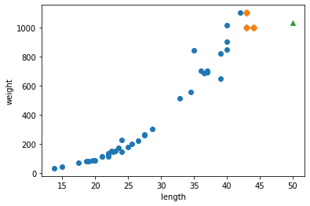
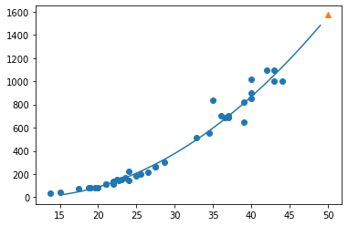

# Chapter 3. 회귀 알고리즘과 모델 규제

## 데이터 불러오기


```python
import numpy as np
```


```python
perch_length = np.array(
    [8.4, 13.7, 15.0, 16.2, 17.4, 18.0, 18.7, 19.0, 19.6, 20.0, 
     21.0, 21.0, 21.0, 21.3, 22.0, 22.0, 22.0, 22.0, 22.0, 22.5, 
     22.5, 22.7, 23.0, 23.5, 24.0, 24.0, 24.6, 25.0, 25.6, 26.5, 
     27.3, 27.5, 27.5, 27.5, 28.0, 28.7, 30.0, 32.8, 34.5, 35.0, 
     36.5, 36.0, 37.0, 37.0, 39.0, 39.0, 39.0, 40.0, 40.0, 40.0, 
     40.0, 42.0, 43.0, 43.0, 43.5, 44.0]
     )
perch_weight = np.array(
    [5.9, 32.0, 40.0, 51.5, 70.0, 100.0, 78.0, 80.0, 85.0, 85.0, 
     110.0, 115.0, 125.0, 130.0, 120.0, 120.0, 130.0, 135.0, 110.0, 
     130.0, 150.0, 145.0, 150.0, 170.0, 225.0, 145.0, 188.0, 180.0, 
     197.0, 218.0, 300.0, 260.0, 265.0, 250.0, 250.0, 300.0, 320.0, 
     514.0, 556.0, 840.0, 685.0, 700.0, 700.0, 690.0, 900.0, 650.0, 
     820.0, 850.0, 900.0, 1015.0, 820.0, 1100.0, 1000.0, 1100.0, 
     1000.0, 1000.0]
     )
print(perch_length.shape, perch_weight.shape)
```

    (56,) (56,)
    

## 데이터 가공


```python
# 훈련 세트와 데이터 세트로 나눈 후, 1차원 배열을 2차원 배열로 전환
from sklearn.model_selection import train_test_split
train_input, test_input, train_target, test_target = train_test_split(
    perch_length, perch_weight, random_state = 42
)
print(train_input.shape, test_input.shape, train_target.shape, test_target.shape)

# 1차원 배열 -> 2차원 배열
train_input = train_input.reshape(-1,1)
test_input = test_input.reshape(-1,1)
train_input.shape, test_input.shape
```

    (42,) (14,) (42,) (14,)
    


    ((42, 1), (14, 1))


## 데이터 시각화 -> 데이터 재가공
- 데이터 시각화 : matplotlib.pyplot

## 모델링


```python
from sklearn.neighbors import KNeighborsRegressor
knr = KNeighborsRegressor(n_neighbors=3)

# 모형 훈련
knr.fit(train_input, train_target)
```


    KNeighborsRegressor(n_neighbors=3)


## 모델 평가

## 모델 예측
- 서비스를 함


```python
# 농어의 50cm -> 농어의 무게
print(knr.predict([[50]]))      # 독립변수를 입력
```

    [1033.33333333]
    


```python
import matplotlib.pyplot as plt

# 50cm 농어의 이웃을 3개 반환
distances, indexes = knr.kneighbors([[50]])      # 독립변수를 입력

print(distances, indexes)

# 훈련 세트의 산점도를 그린다
fig, ax = plt.subplots()
ax.scatter(train_input, train_target)

# 훈련 세트 중 이웃 샘플만 다시 그린다
ax.scatter(train_input[indexes], train_target[indexes], marker = 'D')

# 50cm 농어 데이터
ax.scatter(50, 1033, marker = '^')
ax.set_xlabel("length")
ax.set_ylabel("weight")
plt.show()
```

    [[6. 7. 7.]] [[34  8 14]]
    


    

    


```python
print(np.mean(train_target[indexes]))
```

    1033.3333333333333
    

### 머신러닝 = 알고리즘
- 머신러닝/딥러닝 = 실험
- 실험을 한다 --> 다양한 방법을 써보는 것, 다양한 알고리즘을 써보는 것
- 모든 알고리즘을 다 써보는 것은 한계가 있다

 --> 대중적인 몇 개의 알고리즘만 기억
 
 --> 어떻게 해서 몇 개의 알고리즘이 선택 받았을까?

## 선형 회귀
- 오차들의 제곱합이 최소가 되는 게 좋은 것
- 오차가 최소가 되는 기울기를 찾아서 반환해주는 것


```python
# Python 
from sklearn.linear_model import LinearRegression
lr = LinearRegression()

# 선형 회귀 모델 훈련
lr. fit(train_input, train_target)
```


    LinearRegression()


## 예측


```python
# 50cm 농어에 대해 예측
print(lr.predict([[50]]))
```

    [1241.83860323]
    

### 선형 회귀의 모형


```python
print(lr.coef_, lr.intercept_)
```

    [39.01714496] -709.0186449535477
    

## 다항 회귀
- 선형 회귀시
  + 농어 1cm = 약 -670g
- 직선의 기울기 대신 ,곡선의 기울기를 쓰자
- 직선 : 1차 방정식 / 곡선 : 2차 방정식
- $y = ax^2 + bx +c$
  + $$ : 식 양 옆에 붙여주면 마크다운이 됨
  + 교재 예시 : $무게 = a길이^2 + b길이 + 절편$


```python
# p.140 
train_poly = np.column_stack((train_input ** 2, train_input))
test_poly = np.column_stack((test_input ** 2, test_input))

print(train_poly.shape, test_poly.shape)
print("-----train_poly-----")
print(train_poly[0:5])
print("-----test_poly-----")
print(test_poly[0:5])
```

    (42, 2) (14, 2)
    -----train_poly-----
    [[ 384.16   19.6 ]
     [ 484.     22.  ]
     [ 349.69   18.7 ]
     [ 302.76   17.4 ]
     [1296.     36.  ]]
    -----test_poly-----
    [[ 70.56   8.4 ]
     [324.    18.  ]
     [756.25  27.5 ]
     [453.69  21.3 ]
     [506.25  22.5 ]]
    


```python
lr = LinearRegression()
lr.fit(train_poly, train_target)
```


    LinearRegression()


```python
print(lr.predict([[50 ** 2, 50]]))
```

    [1573.98423528]
    


```python
print(lr.coef_, lr.intercept_)
```

    [  1.01433211 -21.55792498] 116.0502107827827
    


```python
# 구간별 직선을 그리기 위해 15에서 49까지 정수 배열 생성
point = np.arange(15, 50)

# 훈련 세트의 산점도를 그리기
fig, ax = plt.subplots()
ax.scatter(train_input, train_target)

# 15, 49까지 2차 방정식 그래프 그리기
ax.plot(point, 1.01*point**2 - 21.6*point + 116.05)

# 50cm 농어 데이터
ax.scatter(50, 1573.98, marker = '^')
ax.set_xlabel = 'length'
ax.set_ylabel = 'weight'
plt.show()
```


    

    


```python
print(lr.score(train_poly, train_target))
print(lr.score(test_poly, test_target))
```

    0.9706807451768623
    0.9775935108325122
    

# Chapter 4. 다양한 분류 알고리즘 <로지스틱 회귀>
- 선형 회귀에서 출발
- 이진 분류 문제 해결
- 클래스 확률 예측
- 딥러닝에서도 사용됨

## 교재 p.177
- x가 사각형일 확률 30%
- x가 삼각형일 확률 50%
- x가 원일 확률 20%

## 데이터 불러오기
- Species (종속변수 = Y)
- Weight, Length, Diagonal, Height, Width (독립변수 = X)


```python
import pandas as pd

fish = pd.read_csv('https://bit.ly/fish_csv_data')
fish.head()
```


  <div id="df-fdd0ae1f-1fec-4111-9fd3-9f7b5edcd7b8">
    <div class="colab-df-container">
      <div>
<style scoped>
    .dataframe tbody tr th:only-of-type {
        vertical-align: middle;
    }

    .dataframe tbody tr th {
        vertical-align: top;
    }

    .dataframe thead th {
        text-align: right;
    }
</style>
<table border="1" class="dataframe">
  <thead>
    <tr style="text-align: right;">
      <th></th>
      <th>Species</th>
      <th>Weight</th>
      <th>Length</th>
      <th>Diagonal</th>
      <th>Height</th>
      <th>Width</th>
    </tr>
  </thead>
  <tbody>
    <tr>
      <th>0</th>
      <td>Bream</td>
      <td>242.0</td>
      <td>25.4</td>
      <td>30.0</td>
      <td>11.5200</td>
      <td>4.0200</td>
    </tr>
    <tr>
      <th>1</th>
      <td>Bream</td>
      <td>290.0</td>
      <td>26.3</td>
      <td>31.2</td>
      <td>12.4800</td>
      <td>4.3056</td>
    </tr>
    <tr>
      <th>2</th>
      <td>Bream</td>
      <td>340.0</td>
      <td>26.5</td>
      <td>31.1</td>
      <td>12.3778</td>
      <td>4.6961</td>
    </tr>
    <tr>
      <th>3</th>
      <td>Bream</td>
      <td>363.0</td>
      <td>29.0</td>
      <td>33.5</td>
      <td>12.7300</td>
      <td>4.4555</td>
    </tr>
    <tr>
      <th>4</th>
      <td>Bream</td>
      <td>430.0</td>
      <td>29.0</td>
      <td>34.0</td>
      <td>12.4440</td>
      <td>5.1340</td>
    </tr>
  </tbody>
</table>
</div>
      <button class="colab-df-convert" onclick="convertToInteractive('df-fdd0ae1f-1fec-4111-9fd3-9f7b5edcd7b8')"
              title="Convert this dataframe to an interactive table."
              style="display:none;">

  <svg xmlns="http://www.w3.org/2000/svg" height="24px"viewBox="0 0 24 24"
       width="24px">
    <path d="M0 0h24v24H0V0z" fill="none"/>
    <path d="M18.56 5.44l.94 2.06.94-2.06 2.06-.94-2.06-.94-.94-2.06-.94 2.06-2.06.94zm-11 1L8.5 8.5l.94-2.06 2.06-.94-2.06-.94L8.5 2.5l-.94 2.06-2.06.94zm10 10l.94 2.06.94-2.06 2.06-.94-2.06-.94-.94-2.06-.94 2.06-2.06.94z"/><path d="M17.41 7.96l-1.37-1.37c-.4-.4-.92-.59-1.43-.59-.52 0-1.04.2-1.43.59L10.3 9.45l-7.72 7.72c-.78.78-.78 2.05 0 2.83L4 21.41c.39.39.9.59 1.41.59.51 0 1.02-.2 1.41-.59l7.78-7.78 2.81-2.81c.8-.78.8-2.07 0-2.86zM5.41 20L4 18.59l7.72-7.72 1.47 1.35L5.41 20z"/>
  </svg>
      </button>

  <style>
    .colab-df-container {
      display:flex;
      flex-wrap:wrap;
      gap: 12px;
    }

    .colab-df-convert {
      background-color: #E8F0FE;
      border: none;
      border-radius: 50%;
      cursor: pointer;
      display: none;
      fill: #1967D2;
      height: 32px;
      padding: 0 0 0 0;
      width: 32px;
    }

    .colab-df-convert:hover {
      background-color: #E2EBFA;
      box-shadow: 0px 1px 2px rgba(60, 64, 67, 0.3), 0px 1px 3px 1px rgba(60, 64, 67, 0.15);
      fill: #174EA6;
    }

    [theme=dark] .colab-df-convert {
      background-color: #3B4455;
      fill: #D2E3FC;
    }

    [theme=dark] .colab-df-convert:hover {
      background-color: #434B5C;
      box-shadow: 0px 1px 3px 1px rgba(0, 0, 0, 0.15);
      filter: drop-shadow(0px 1px 2px rgba(0, 0, 0, 0.3));
      fill: #FFFFFF;
    }
  </style>

      <script>
        const buttonEl =
          document.querySelector('#df-fdd0ae1f-1fec-4111-9fd3-9f7b5edcd7b8 button.colab-df-convert');
        buttonEl.style.display =
          google.colab.kernel.accessAllowed ? 'block' : 'none';

        async function convertToInteractive(key) {
          const element = document.querySelector('#df-fdd0ae1f-1fec-4111-9fd3-9f7b5edcd7b8');
          const dataTable =
            await google.colab.kernel.invokeFunction('convertToInteractive',
                                                     [key], {});
          if (!dataTable) return;

          const docLinkHtml = 'Like what you see? Visit the ' +
            '<a target="_blank" href=https://colab.research.google.com/notebooks/data_table.ipynb>data table notebook</a>'
            + ' to learn more about interactive tables.';
          element.innerHTML = '';
          dataTable['../images/Day12_20220701_ML/output_type'] = 'display_data';
          await google.colab.../images/Day12_20220701_ML/output.render../images/Day12_20220701_ML/output(dataTable, element);
          const docLink = document.createElement('div');
          docLink.innerHTML = docLinkHtml;
          element.appendChild(docLink);
        }
      </script>
    </div>
  </div>


## 데이터 탐색


```python
# 종속변수
print(pd.unique(fish['Species']))
print(fish['Species'].value_counts())
```

    ['Bream' 'Roach' 'Whitefish' 'Parkki' 'Perch' 'Pike' 'Smelt']
    Perch        56
    Bream        35
    Roach        20
    Pike         17
    Smelt        14
    Parkki       11
    Whitefish     6
    Name: Species, dtype: int64
    


```python
# pandas 데이터 프레임에서 numpy 배열로 변환
fish_input = fish[['Weight', 'Length', 'Diagonal', 'Height', "Width"]].to_numpy()
print(type(fish_input))
print(fish_input.shape)
```

    <class 'numpy.ndarray'>
    (159, 5)
    


```python
print(fish_input[0:5])
```

    [[242.      25.4     30.      11.52     4.02  ]
     [290.      26.3     31.2     12.48     4.3056]
     [340.      26.5     31.1     12.3778   4.6961]
     [363.      29.      33.5     12.73     4.4555]
     [430.      29.      34.      12.444    5.134 ]]
    

- 타깃데이터(종속변수 = Y)


```python
fish_target = fish['Species'].to_numpy()
print(fish_target.shape)
print(fish_target[0:5])
```

    (159,)
    ['Bream' 'Bream' 'Bream' 'Bream' 'Bream']
    

## 데이터 분리
- 훈련 데이터/테스트 데이터 분리


```python
from sklearn.model_selection import train_test_split

# 임의 샘플링
train_input, test_input, train_target, test_target = train_test_split(
    fish_input, fish_target, random_state = 42
)

# 층화 샘플링
```

## 표준화 전처리
- ★ 여기서도 훈련 세트의 통계 값으로 테스트 세트를 변환해야 한다 ★
- 테스트 데이터의 통계치는 모르는 상태라고 봐야 함
  + 만약 테스트 데이터의 통계치로 전처리를 해버리면 예측 결과가 이상해짐
  + ex) 시험을 보는데 답지를 통해 정답을 다 알고 시험 보는 것
- 데이터 가공
  + 숫자 결측치 존재 -> 평균값으로 대체
  + 원본 데이터 평균 대치(X)
    + 원본 데이터로 평균을 대치 해버리면 훈련 데이터와 테스트 데이터 분리 시 심각한 통계 오류가 생길 수 있음
- 데이터 누수(Data Leakage)
  + 훈련데이터 평균값 70을 대치 (O)
  + 테스트데이터 평균값 75를 대치(X)
  + 모든 데이터 평균값 72.5를대치 (X)


- 교재 p.87
  +
  


```python
from sklearn.preprocessing import StandardScaler
ss = StandardScaler()
ss.fit(train_input)
# ss.fit(test_input) (X)

train_scaled = ss.transform(train_input)
test_scaled = ss.transform(test_input)
```

## 모형 만들기
- k-최근접 이웃


```python
from sklearn.neighbors import KNeighborsClassifier 
kn = KNeighborsClassifier(n_neighbors = 3)
kn.fit(train_scaled, train_target)

print(kn.score(train_scaled, train_target))
print(kn.score(test_scaled, test_target))
```

    0.8907563025210085
    0.85
    


```python
print(kn.classes_)
```

    ['Bream' 'Parkki' 'Perch' 'Pike' 'Roach' 'Smelt' 'Whitefish']
    


```python
print(kn.predict(test_scaled[:5]))
```

    ['Perch' 'Smelt' 'Pike' 'Perch' 'Perch']
    


```python
import numpy as np
proba = kn.predict_proba(test_scaled[0:5])
print(kn.classes_)
print(np.round(proba, decimals = 4))
```

    ['Bream' 'Parkki' 'Perch' 'Pike' 'Roach' 'Smelt' 'Whitefish']
    [[0.     0.     1.     0.     0.     0.     0.    ]
     [0.     0.     0.     0.     0.     1.     0.    ]
     [0.     0.     0.     1.     0.     0.     0.    ]
     [0.     0.     0.6667 0.     0.3333 0.     0.    ]
     [0.     0.     0.6667 0.     0.3333 0.     0.    ]]
    

- 첫번째 클래스 Perch
  + 100% 확률로 Perch 예측
- 네번째 클래스
  + 66.7% 확률로 Perch 예측
  + 33.3% 확률로 Roach 예측


```python
distances, indexes = kn.kneighbors(test_scaled[3:4])
print(train_target[indexes])
```

    [['Roach' 'Perch' 'Perch']]
    

## 회귀식
- y = ax + b
- 로짓 변환을 하면 y가 확률로 변환됨
- 양변에 로그를 취함


## 로지스틱 회귀로 이진 분류 수행


```python
char_arr = np.array(['A', 'B', 'C', 'D', 'E'])
print(char_arr[[True, False, True, False, False]])
```

    ['A' 'C']
    


```python
bream_smelt_indexes = (train_target == 'Bream') | (train_target == 'Smelt')
print(bream_smelt_indexes)
train_bream_smelt = train_scaled[bream_smelt_indexes]
target_bream_smelt = train_target[bream_smelt_indexes]

train_scaled.shape, train_bream_smelt.shape
```

    [ True False  True False False False False  True False False False  True
     False False False  True  True False False  True False  True False False
     False  True False False  True False False False False  True False False
      True  True False False False False False  True False False False False
     False  True False  True False False  True False False False  True False
     False False False False False  True False  True False False False False
     False False False False False  True False  True False False  True  True
     False False False  True False False False False False  True False False
     False  True False  True False False  True  True False False False False
     False False False False  True  True False False  True False False]
    


    ((119, 5), (33, 5))


```python
from sklearn.linear_model import LogisticRegression
lr = LogisticRegression()
lr.fit(train_bream_smelt, target_bream_smelt)
```


    LogisticRegression()


- 확률 값 구하기


```python
print(lr.predict(train_bream_smelt[:5]))
```

    ['Bream' 'Smelt' 'Bream' 'Bream' 'Bream']
    


```python
print(lr.predict_proba(train_bream_smelt[:5]))
```

    [[0.99759855 0.00240145]
     [0.02735183 0.97264817]
     [0.99486072 0.00513928]
     [0.98584202 0.01415798]
     [0.99767269 0.00232731]]
    


```python
print(lr.classes_)
```

    ['Bream' 'Smelt']
    

- 분류기준 : threshold 임계값 설정
- 도미 vs 빙어
  [0.49  0.51]
  [0.70  0.30]
  [0.90  0.10]

## 계수와 절편 구하기


```python
print(lr.coef_, lr.intercept_)
```

    [[-0.4037798  -0.57620209 -0.66280298 -1.01290277 -0.73168947]] [-2.16155132]
    


```python
decisions = lr.decision_function(train_bream_smelt[:5])
print(decisions)
```

    [-6.02927744  3.57123907 -5.26568906 -4.24321775 -6.0607117 ]
    

- z값을 확률값으로 변환


```python
from scipy.special import expit
print(expit(decisions))
```

    [0.00240145 0.97264817 0.00513928 0.01415798 0.00232731]
    

## 다중 분류 수행하기
- 이진 분류의 확장판


```python
# 하이퍼 파라미터 세팅
# 모형을 튜닝
# 순정 써라..
# 모형 결과의 과대적합 또는 과소적합을 방지하기 위한 것
lr = LogisticRegression(C=20, max_iter = 1000)
lr.fit(train_scaled, train_target)
print(lr.score(train_scaled, train_target))
print(lr.score(test_scaled, test_target))
```

    0.9327731092436975
    0.925
    


```python
print(lr.predict(test_scaled[0:5]))
```

    ['Perch' 'Smelt' 'Pike' 'Roach' 'Perch']
    


```python
proba = lr.predict_proba(test_scaled[0:5])
print(np.round(proba, decimals = 3))
print(lr.classes_)
```

    [[0.    0.014 0.841 0.    0.136 0.007 0.003]
     [0.    0.003 0.044 0.    0.007 0.946 0.   ]
     [0.    0.    0.034 0.935 0.015 0.016 0.   ]
     [0.011 0.034 0.306 0.007 0.567 0.    0.076]
     [0.    0.    0.904 0.002 0.089 0.002 0.001]]
    ['Bream' 'Parkki' 'Perch' 'Pike' 'Roach' 'Smelt' 'Whitefish']
    

- 다중 분류일 경우 선형 방정식은 어떤 모습일까?
  - 분류 7개, 컬럼 값5개


```python
print(lr.coef_.shape, lr.intercept_.shape)
```

    (7, 5) (7,)
    

## 평가지표


### 회귀 평가지표
- 결정계수 (교재 p.121)
  + 1 - (타깃-예측)^2의 합 / (타깃-평균)^2의 합
- MAE, MSE, RMSE
  + (실제-예측) = 오차
  + MAE(Mean Absolute Error): 오차의 절댓값의 평균
  + MSE(Mean Squared Error) : 오차의 제곱의 평균
  + RMSE(Root Mean Squared Error) : MSE의 제곱근

- 좋은 모델이란?
  + 결정계수 : 1에 수렴하면 좋은 모델
  + MAE, MSE, RMSE : 0에 수렴하면 좋은 모델


```python
import numpy as np
from sklearn.metrics import mean_absolute_error, mean_squared_error, r2_score

true = np.array([1, 2, 3, 2, 3, 5, 4, 6, 5, 6, 7, 8, 8]) # 실제값
preds = np.array([1, 1, 2, 2, 3, 4, 4, 5, 5, 7, 7, 6, 8]) # 예측값

# 절댓값 오차의 평균
mae = mean_absolute_error(true, preds)
print(mae)

# 제곱 오차의 평균
mse = mean_squared_error(true, preds)
print(mse)

# MSE의 제곱근
rmse = np.sqrt(mse)
print(rmse)

# 결정계수
r2 = r2_score(true, preds)
print(r2)
```

    0.5384615384615384
    0.6923076923076923
    0.8320502943378437
    0.8617021276595744
    

### 분류 평가지표
- 혼동(오차) 행렬로부터 시작
- 실제 값
  + [빙어, 도미, 도미, 빙어, 도미]
- 예측 값
  + [빙어, 빙어, 도미, 빙어, 빙어]

- TP : 빙어를 빙어로 예측 --> 2개
- TN : 도미를 도미로 예측 --> 1개
- FN : 실제는 도미, 예측은 빙어 --> 2개
- FP : 실제는 빙어, 예측인 도미 --> 0개

- TP, TN, FP, FN
  + 정확도 산출 : (TP + TN) / (TP + TN + FP + FN)
  + 정밀도 산출(Precision) : TP / (TP + FP)
    + 양성이라고 예측한 값에서 실제 양성인 값의 비율
    + ex) 스팸메일 필터링
  + 재현율 산출 : TP / (TP + FN)
    + 실제 양성 값 중에서 양성이라고 정확히 예측한 값의 비율
    + ex) 암 진단

- 코로나 검사
  + 양성(1) / 음성(99)
  + 머신러닝 모형 : 98% / 정밀도 99
  + 인간 음성진단 : 99% / 정밀도 95
  + 검사자가 실제는 양성, 진단은 음성으로 내린 경우 --> 심각한 문제
  
  + 로그손실 산출 : 산술식이 따로 존재
  + ★ ROC Curve (= AUC)

- 이 모형의 정확도 : 3/5 --> 60%


```python

```
