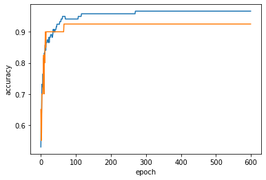
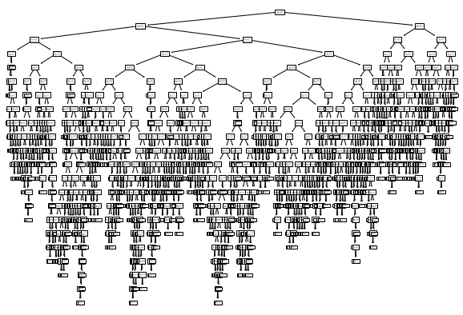
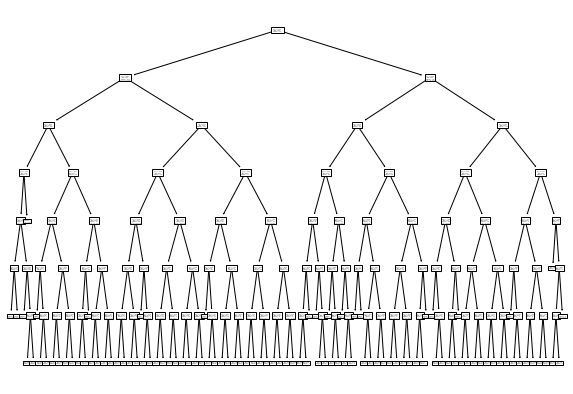
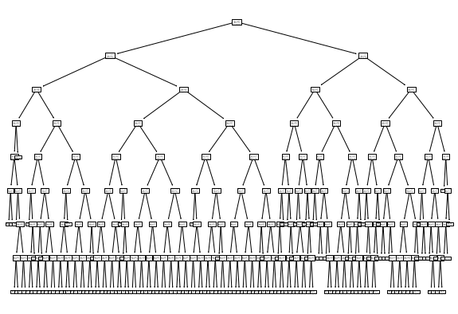
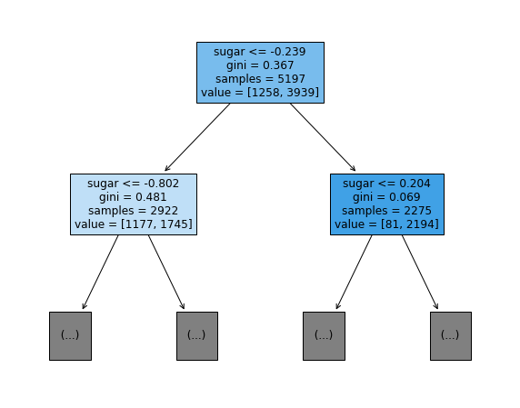
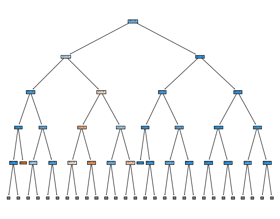

# Chapter 4. 다양한 분류 알고리즘 <확률적 경사 하강법>
- 점진적 학습 (Step, 보폭)
  + 큰 개념 : 학습 속도가 빠르면 빠를수록 데이터는 좁게 보게 되고 정확도가 떨어진다
- 학습률
- XGBoost, LgihtGBM, 딥러닝(이미지 분류, 자연어 처리, 옵티마이저)

## 확률적 경사 하강법
- 신경망 : 이미지 데이터, 자연어
- 자율주행 하루 데이터 1TB --> 학습
- 모델을 한꺼번에 다 학습하기 힘듦
  + 샘플링, 배치, 에포크 / '오차(=손실=loss)가 가장 작은 지점을 찾아야함
- 결론적으로 확률적 경사 하강법 이용
- 알고리즘은 시간과 손실의 싸움
  + 시간은 빠르면서 손실이 적은 지점을 찾아내는 것
  

### 손실함수
- 로지스틱 손실 함수


```python
import pandas as pd
fish = pd.read_csv('https://bit.ly/fish_csv_data')
fish.info()
```

    <class 'pandas.core.frame.DataFrame'>
    RangeIndex: 159 entries, 0 to 158
    Data columns (total 6 columns):
     #   Column    Non-Null Count  Dtype  
    ---  ------    --------------  -----  
     0   Species   159 non-null    object 
     1   Weight    159 non-null    float64
     2   Length    159 non-null    float64
     3   Diagonal  159 non-null    float64
     4   Height    159 non-null    float64
     5   Width     159 non-null    float64
    dtypes: float64(5), object(1)
    memory usage: 7.6+ KB
    

- 입력 데이터와 타깃 데이터 분리


```python
fish_input = fish[["Weight", "Length", "Diagonal", "Height", "Width"]].to_numpy()
fish_target = fish["Species"].to_numpy()

fish_input.shape, fish_target.shape
```


    ((159, 5), (159,))


```python
from sklearn.model_selection import train_test_split
train_input, test_input, train_target, test_target = train_test_split(
    fish_input, fish_target, random_state = 42
)

train_input.shape, test_input.shape, train_target.shape, test_target.shape
```


    ((119, 5), (40, 5), (119,), (40,))


- 훈련 세트와 테스트 세트의 특성 표준화
  + 무게, 길이, 대각선 길이, 높이, 너비
- 표준화 처리 진행
  


```python
from sklearn.preprocessing import StandardScaler
ss = StandardScaler()
ss.fit(train_input)
train_scaled = ss.transform(train_input)
test_scaled = ss.transform(test_input)

train_scaled[:5]
```


    array([[ 0.91965782,  0.60943175,  0.81041221,  1.85194896,  1.00075672],
           [ 0.30041219,  1.54653445,  1.45316551, -0.46981663,  0.27291745],
           [-1.0858536 , -1.68646987, -1.70848587, -1.70159849, -2.0044758 ],
           [-0.79734143, -0.60880176, -0.67486907, -0.82480589, -0.27631471],
           [-0.71289885, -0.73062511, -0.70092664, -0.0802298 , -0.7033869 ]])


### 모델링
- 확률적 경사 하강법


```python
from scipy.sparse.construct import random
from sklearn.linear_model import SGDClassifier
sc = SGDClassifier(loss = 'log', max_iter = 10, random_state = 42)

sc.fit(train_scaled, train_target)
print(sc.score(train_scaled, train_target))
print(sc.score(test_scaled, test_target))
```

    0.773109243697479
    0.775
    

    /usr/local/lib/python3.7/dist-packages/sklearn/linear_model/_stochastic_gradient.py:700: ConvergenceWarning: Maximum number of iteration reached before convergence. Consider increasing max_iter to improve the fit.
      ConvergenceWarning,
    

- partial_fit()에서도 추가 학습


```python
sc.partial_fit(train_scaled, train_target)
print(sc.score(train_scaled, train_target))
print(sc.score(test_scaled, test_target))
```

    0.8571428571428571
    0.9
    

### 에포크와 과대/과소적합
- 에포크 숫자가 적으면 --> 덜 학습
- early_stopping
  + 에포크 숫자 1000, 손실 10, 9, 8,..., 3
  + 3에 도달한 시점이 150

- 비유적으로 표현하면
  + 과대적합 : 옷을 꽉 껴 입는 것
  + 과소적합 : 옷을 안맞게 너무 크게 입는 것


```python
import numpy as np
sc = SGDClassifier(loss = 'log' ,random_state = 42)
train_score = []
test_score = []
classes = np.unique(train_target)
```


```python
for _ in range(0, 300) :
  sc.partial_fit(train_scaled, train_target, classes = classes)
  train_score.append(sc.score(train_scaled, train_target))
  test_score.append(sc.score(test_scaled, test_target))
```

- 시각화


```python
import matplotlib.pyplot as plt

plt.plot(train_score)
plt.plot(test_score)
plt.xlabel('epoch')
plt.ylabel('accuracy')
plt.show()
```


    

    


```python
sc = SGDClassifier(loss = 'log', max_iter = 100, tol = None, random_state = 42)
sc.fit(train_scaled, train_target)
print(sc.score(train_scaled, train_target))
print(sc.score(test_scaled, test_target))
```

    0.957983193277311
    0.925
    

- XBBoost, LgihtGBM 코드
  + train-loss, train-accuarcy, test-loss, test-accuracy

# Chapter 5. 트리 알고리즘 <결정 트리>


## 로지스틱 회귀로 와인 분류하기
- wine --> 레드 와인 / 화이트 와인 구별하기


```python
import pandas as pd
wine = pd.read_csv('https://bit.ly/wine_csv_data')

print(wine.head())
```

       alcohol  sugar    pH  class
    0      9.4    1.9  3.51    0.0
    1      9.8    2.6  3.20    0.0
    2      9.8    2.3  3.26    0.0
    3      9.8    1.9  3.16    0.0
    4      9.4    1.9  3.51    0.0
    

- 데이터 가공하기


```python
data = wine[['alcohol', 'sugar', 'pH']].to_numpy()
target = wine['class'].to_numpy()

data.shape, target.shape
```


    ((6497, 3), (6497,))


- 훈련 데이터 분리


```python
from sklearn.model_selection import train_test_split
train_input, test_input, train_target, test_target = train_test_split(
    data, target, test_size = 0.2 ,random_state = 42
)

train_input.shape, test_input.shape, train_target.shape, test_target.shape
```


    ((5197, 3), (1300, 3), (5197,), (1300,))


- 표준화 처리


```python
from sklearn.preprocessing import StandardScaler
ss = StandardScaler()

ss.fit(train_input, train_target)

train_scaled = ss.transform(train_input)
test_scaled = ss.transform(test_input)

train_scaled.shape, test_scaled.shape
```


    ((5197, 3), (1300, 3))


- 로지스틱 회귀 모델 훈련


```python
from sklearn.linear_model import LogisticRegression
lr = LogisticRegression()
lr.fit(train_scaled, train_target)

print(lr.score(train_scaled, train_target))
print(lr.score(test_scaled, test_target))

```

    0.7808350971714451
    0.7776923076923077
    


```python
print(lr.coef_, lr.intercept_)
```

    [[ 0.51270274  1.6733911  -0.68767781]] [1.81777902]
    

## 결정 트리 모델 만들기


```python
from sklearn.tree import DecisionTreeClassifier
dt = DecisionTreeClassifier(random_state = 42)

dt.fit(train_scaled, train_target)
print(dt.score(train_scaled, train_target))
print(dt.score(test_scaled, test_target))
```

    0.996921300750433
    0.8592307692307692
    


```python
from sklearn.tree import DecisionTreeClassifier
dt = DecisionTreeClassifier(max_depth = 7, random_state = 42)

dt.fit(train_scaled, train_target)
print(dt.score(train_scaled, train_target))
print(dt.score(test_scaled, test_target))
```

    0.8895516644217818
    0.8630769230769231
    


```python
from sklearn.tree import DecisionTreeClassifier
import matplotlib.pyplot as plt
from sklearn.tree import plot_tree

dt = DecisionTreeClassifier(max_depth = None, random_state = 42)

dt.fit(train_scaled, train_target)
print(dt.score(train_scaled, train_target))
print(dt.score(test_scaled, test_target))

plt.figure(figsize = (10, 7))
plot_tree(dt)
plt.show()
```

    0.996921300750433
    0.8592307692307692
    


    

    


```python
from sklearn.tree import DecisionTreeClassifier
import matplotlib.pyplot as plt
from sklearn.tree import plot_tree

dt = DecisionTreeClassifier(max_depth = 7, random_state = 42)

dt.fit(train_scaled, train_target)
print(dt.score(train_scaled, train_target))
print(dt.score(test_scaled, test_target))

plt.figure(figsize = (10, 7))
plot_tree(dt)
plt.show()
```

    0.8895516644217818
    0.8630769230769231
    


    

    


```python
from sklearn.tree import DecisionTreeClassifier
import matplotlib.pyplot as plt
from sklearn.tree import plot_tree

# criterion{"gini", "entropy", "log_loss"}, default = "gini"
dt = DecisionTreeClassifier(max_depth = 8, random_state = 42)

dt.fit(train_scaled, train_target)
print(dt.score(train_scaled, train_target))
print(dt.score(test_scaled, test_target))

plt.figure(figsize = (10, 7))
plot_tree(dt)
plt.show()
```

    0.9003271117952665
    0.8576923076923076
    


    

    


- 훈련 정확도 : 99.7%
- 테스트 정확도 : 85.9%
  + 과대적합 발생

### 노드란 무엇인가?
- 0이면 레드와인 / 1이면 화이트 와인
- 1599 / 4988


```python
plt.figure(figsize = (10, 8))
plot_tree(dt, max_depth = 1,          # 훈련 데이터
          filled = True, 
          feature_names = ['alcohol', 'sugar', 'pH'])
plt.show()
```


    

    


```python
# criterion{"gini", "entropy", "log_loss"}, default = "gini"
dt = DecisionTreeClassifier(criterion = 'entropy', max_depth = 8, random_state = 42)

dt.fit(train_scaled, train_target)
print(dt.score(train_scaled, train_target))
print(dt.score(test_scaled, test_target))

plt.figure(figsize = (10, 8))
plot_tree(dt, max_depth = 4,          # 훈련 데이터
          filled = True, 
          feature_names = ['alcohol', 'sugar', 'pH'])
plt.show()
```

    0.89532422551472
    0.8569230769230769
    


    

    


- sugar : 조건
  + 분류에 가장 최적화된 수치를 결정 트리 알고리즘이 자동으로 찾아줌


- gini(지니) 불순도
  + 비율
  + 레드와인 5:5 화이트와인
    + 불순도가 가장 높은 상태 --> gini 불순도 : 0.5
  + 한 범주 안에서 서로 다른 데이터가 얼마나 섞여 있는지 나타냄
  + 흰색과 검은색이 각각 50개 섞여 있을 때
    + 불순도 최대 : 0.5
  + 흰색과 검은색이 완전히 분리
    + 흰색 노드 불순도 최소 : 0
    + 검은색 노드 불순도 최소 : 0

- 엔트로피(Entropy) 불순도
  + 불확실한 정도를 의미
  + 0 ~ 1 사이
  + 흰색과 검은색이 각각 50개 섞여 있을 때
    + 엔트로피 최대 : 1
  + 흰색과 검은색이 완전히 분리
    + 흰색 노드 엔트로피 최소 : 0
    + 검은색 노드 엔트로피 최소 : 0

### 특성 중요도
- 어떤 특성이 결정 트리 모델에 영향을 주었는가?
  + 인과관계 (X)


```python
print(dt.feature_importances_)
```

    [0.17976778 0.65284899 0.16738324]
    

- 당도 > 알코올 도수 > 산성

# Chapter 5. 트리 알고리즘 <교차 검증과 그리드 서치>


## 현업에서의 적용
- 현업에서 DecisionTreeClassifier (1970년대) 개념은 안쓴다
- 랜덤포레스트, XGBoost 하이퍼파라미터 매우매우 많음


## 검증 세트
- 훈련세트와 테스트세트
- 비유를 해보자면
  - 훈련 : 교과서 공부하는 것 공부세트, 모의평가
  - 검증 : 강남대성 모의고사 문제지
  - 테스트 : 6월 / 9월 평가원 모평
  - 실전 : 수능


```python
import pandas as pd
from sklearn.model_selection import train_test_split
wine = pd.read_csv('https://bit.ly/wine_csv_data')

print(wine.head())

data = wine[['alcohol', 'sugar', 'pH']].to_numpy()
target = wine['class'].to_numpy()

data.shape, target.shape

# 훈련 80%, 테스트 20%
train_input, test_input, train_target, test_target = train_test_split(
    data, target, test_size = 0.2 ,random_state = 42
)

train_input.shape, test_input.shape, train_target.shape, test_target.shape
```

       alcohol  sugar    pH  class
    0      9.4    1.9  3.51    0.0
    1      9.8    2.6  3.20    0.0
    2      9.8    2.3  3.26    0.0
    3      9.8    1.9  3.16    0.0
    4      9.4    1.9  3.51    0.0
    


    ((5197, 3), (1300, 3), (5197,), (1300,))


```python
# 훈련 80%
# 검증 20%
sub_input, val_input, sub_target, val_target = train_test_split(
    train_input, train_target, test_size = 0.2, random_state = 42
)

sub_input.shape, val_input.shape, sub_target.shape, val_target.shape
```


    ((4157, 3), (1040, 3), (4157,), (1040,))


- 훈련데이터 : sub_input, sub_target
- 검증데이터 : val_input, val_target
- 테스트데이터 : test_input, test_target

- 모형 만들기


```python
from sklearn.tree import DecisionTreeClassifier
dt = DecisionTreeClassifier(random_state = 42)

dt.fit(sub_input, sub_target)
print("훈련 성과: ", dt.score(sub_input, sub_target))
print("검증 성과: ", dt.score(val_input, val_target))
print("최종: ", dt.score(test_input, test_target))
```

    훈련 성과:  0.9971133028626413
    검증 성과:  0.864423076923077
    최종:  0.8569230769230769
    

- 훈련 : 99%
- 검증 : 86%
--------------

- 최종 : 85%
배포를 할지말지의 기준 : 검증데이터와 최종데이터의 차이가 많이 나는가/나지 않는가

## 교차 검증
- 데이터 셋을 반복 분할
  + For loop
- 샘플링 편향을 방지하기 위함
- 교차검증을 한다고 해서 정확도가 무조건 올라간다? (X)
- 모형을 안정적으로 만들어 준다
  + 과대적합 방지


```python
import numpy as np
from sklearn.model_selection import KFold

df= np.array([1, 2, 3, 4, 5, 6, 7, 8, 9, 10])

# 데이터를 K 폴드로 나눈다
folds = KFold(n_splits = 5, shuffle = True)
for train_idx, valid_idx in folds.split(df) : 
  print(f'훈련 데이터 : {df[train_idx]}, 검증 데이터 : {df[valid_idx]}')
```

    훈련 데이터 : [ 1  2  4  6  7  8  9 10], 검증 데이터 : [3 5]
    훈련 데이터 : [1 2 3 4 5 6 7 9], 검증 데이터 : [ 8 10]
    훈련 데이터 : [ 1  2  3  4  5  8  9 10], 검증 데이터 : [6 7]
    훈련 데이터 : [ 1  2  3  5  6  7  8 10], 검증 데이터 : [4 9]
    훈련 데이터 : [ 3  4  5  6  7  8  9 10], 검증 데이터 : [1 2]
    

- 교차 검증 함수


```python
from sklearn.model_selection import cross_validate
scores = cross_validate(dt, train_input, train_target)
print(scores)
print("평균 : ", np.mean(scores['test_score']))
```

    {'fit_time': array([0.00946188, 0.00707936, 0.00727081, 0.00762677, 0.00686455]), 'score_time': array([0.00081301, 0.00064206, 0.00062299, 0.00065279, 0.00058866]), 'test_score': array([0.86923077, 0.84615385, 0.87680462, 0.84889317, 0.83541867])}
    평균 :  0.855300214703487
    

- StratifiedKFold 사용


```python
from sklearn.model_selection import StratifiedKFold
scores = cross_validate(dt, train_input, train_target, cv = StratifiedKFold())
print(scores)
print("평균 : ", np.mean(scores['test_score']))
```

    {'fit_time': array([0.02794123, 0.02471638, 0.04078317, 0.03761196, 0.03788948]), 'score_time': array([0.01038885, 0.00108242, 0.00102401, 0.00108027, 0.00111437]), 'test_score': array([0.86923077, 0.84615385, 0.87680462, 0.84889317, 0.83541867])}
    평균 :  0.855300214703487
    

- 10 폴드 교차검증을 수행


```python
from sklearn.model_selection import StratifiedKFold
splitter = StratifiedKFold(n_splits = 10, shuffle = True, random_state = 42)
scores = cross_validate(dt, train_input, train_target, cv = splitter)
print(scores)
print("평균 : ", np.mean(scores['test_score']))
```

    {'fit_time': array([0.01054883, 0.0082767 , 0.00860715, 0.00820994, 0.00799632,
           0.01008821, 0.00805593, 0.00780392, 0.00794291, 0.00775743]), 'score_time': array([0.00062776, 0.00058031, 0.00059676, 0.0006392 , 0.00058985,
           0.00063109, 0.00054836, 0.00049782, 0.00050616, 0.00052738]), 'test_score': array([0.83461538, 0.87884615, 0.85384615, 0.85384615, 0.84615385,
           0.87307692, 0.85961538, 0.85549133, 0.85163776, 0.86705202])}
    평균 :  0.8574181117533719
    

## 하이퍼 파라미터 튜닝
- 그리드 서치
  + 사람이 수동적으로 입력
  + max_depth : [1, 3, 7]
- 랜덤 서치
  + 사람이 범위만 지정
  + max_depth : 1 ~ 10 / by random


- 베이지안 옵티마이제이션
- 사람의 개입 없이 하이퍼 파라미터 튜닝을 자동으로 수행하는 기술을 AutoML이라고 함
  + 예) PyCaret
- 각 모델마다 적게는 1-2개에서, 많게는 5-6개의 매개변수 제공
  + XGBoost 100개 이상...
- 하이퍼 파라미터와 동시에 교차검증을 수행
  + 미친짓?!

교차검증 5번을 한다고 하면
교차검증 1번 돌 때, Max Depth 3번 적용
- 총 결과값 3 X 5 X 2 나옴

- Max Depth = 1, 3, 7
- Criterion = gini, entropy


```python
from sklearn.model_selection import GridSearchCV
params = {
    'criterion' : ['gini', 'entropy'],
    'max_depth' : [1, 3, 7], 
    'min_impurity_decrease' : [0.0001, 0.0002, 0.0003, 0.0004, 0.0005]
    }
```


```python
gs = GridSearchCV(DecisionTreeClassifier(random_state = 42), params, n_jobs = -1)

gs.fit(train_input, train_target)
```


    GridSearchCV(estimator=DecisionTreeClassifier(random_state=42), n_jobs=-1,
                 param_grid={'criterion': ['gini', 'entropy'],
                             'max_depth': [1, 3, 7],
                             'min_impurity_decrease': [0.0001, 0.0002, 0.0003,
                                                       0.0004, 0.0005]})


```python
print("Best: ", gs.best_estimator_)
dt = gs.best_estimator_
```

    Best:  DecisionTreeClassifier(max_depth=7, min_impurity_decrease=0.0005,
                           random_state=42)
    
