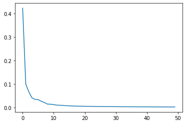

# Chapter 5. 트리 알고리즘 <트리의 앙상블>


## 랜덤 포레스트
- Decision Tree (나무 1개)
  + 여러 개 심음
  + 샘플링
  + feature importances
- 예측해야 할 행의 갯수 --> 100만개
- 컬럼의 갯수 200개 --> 100개로 필터링
  + 나무 100개를 심고 평균을 내자
  + 나무 1개당 컬럼을 10개로
  + T1 mae : 20 / T2 mae : 30 / T3 mae : 10, ....
    + T1 ~ T100 mae :  20
    + feature importances
  + 샘플링 : 부트스트랩 샘플 (복원 추출)


```python
# 라이브러리 불러오기
import numpy as np
import pandas as pd
from sklearn.model_selection import train_test_split, cross_validate
from sklearn.ensemble import RandomForestClassifier

# 데이터 불러오기
wine = pd.read_csv('https://bit.ly/wine_csv_data')

# input, target 분리
data = wine[['alcohol', 'sugar', 'pH']].to_numpy()
target = wine['class'].to_numpy()

# 훈련데이터, 테스트데이터 분리
train_input, test_input, train_target, test_target = train_test_split(
    data, target, test_size = 0.2, random_state = 42
)

# 모델링
rf = RandomForestClassifier(n_jobs = -1, random_state = 42)

# 모형 평가
scores = cross_validate(rf, train_input, train_target,
                        return_train_score = True, n_jobs = -1)
print(np.mean(scores['train_score']), np.mean(scores['test_score']))

# 특성 중요도
rf.fit(train_input, train_target)
print(rf.feature_importances_)

# OOB (부트스트랩 샘플에 포함되지 않고 남는 샘플)를 이용한 결정 트리 평가
rf = RandomForestClassifier(oob_score = True, n_jobs = -1, random_state = 42)
rf.fit(train_input, train_target)
print(rf.oob_score_)
```

    0.9973541965122431 0.8905151032797809
    [0.23167441 0.50039841 0.26792718]
    0.8934000384837406
    


```python
# 엑스트라 트리
from sklearn.ensemble import ExtraTreesClassifier
et = ExtraTreesClassifier(n_jobs = -1, random_state = 42)
scores = cross_validate(et, train_input, train_target,
                        return_train_score = True, n_jobs = -1)
print(np.mean(scores['train_score']), np.mean(scores['test_score']))
```

    0.9974503966084433 0.8887848893166506
    

## 그레이디언트 부스팅
- 경사하강법의 원리를 이용
- T1 ~ TN 증가하면서 오차를 보정 및 정확성을 높임
- 랜덤포레스트와의 차이점
  + 랜덤포레스트 : 각 나무 간 상호 연관성 없음
  + 그레이디언트 부스팅 : 각 나무 간 상호 연관성 있음
- 단점 : 속도가 너무 느림
- 대안 : XGBoost, LightGBM


```python
# 라이브러리 불러오기
from sklearn.ensemble import GradientBoostingClassifier

gb = GradientBoostingClassifier(random_state = 42)
scores = cross_validate(gb, train_input, train_target,
                        return_train_score = True, n_jobs = -1)
print(np.mean(scores['train_score']), np.mean(scores['test_score']))
```

    0.8881086892152563 0.8720430147331015
    


```python
gb = GradientBoostingClassifier(n_estimators = 500, learning_rate = 0.2,
                                random_state = 42)
scores = cross_validate(gb, train_input, train_target,
                        return_train_score = True, n_jobs = -1)
print(np.mean(scores['train_score']), np.mean(scores['test_score']))
```

    0.9464595437171814 0.8780082549788999
    

- 5장 3절의 키포인트 두 가지
  + 랜덤포레스트
  + 부스팅

# Chapter 6. 비지도 학습
- 실무에서의 난이도
  + 비지도 학습 >>> 지도학습
- 비지도학습
  + 분류 --> 수치적으로 분류
  + 뉴스 기사 분류
    + 만 개 이상의 기사 분류
    + 정치 /사회 / 경제 / 세계 / 연예 / 스포츠 / 건강 등
    + 러시아 - 우크라이나 정세
      + 세계뉴스? 경제뉴스? 사회뉴스?

## 주성분 분석
- Feature Engineering 기법
- StandardScaler()
- 좌표계 공간 개념
  + 직교 + 회전
- 공분산 등(통계 관련 내용)
- Feature Engineering 기법
- StandardScaler()
- 현 ML의 문제점 : 컬림의 갯수가 매우 많음
- 차원 축소
  + 특성이 많으면 훈련 데이터에 쉽게 과대적합됨
  + 특성을 줄여서 학습 모델의 성능 향상
  + 모델의 학습 시간을 감소시켜줌
  + 대표적 방법론 : PCA, EFA

- PCA vs EFA
  + EFA(탐색적 요인 분석), Factor Analysis
    + 예) 국어, 수학, 과학, 영어
    + 예) 국어 40/수학 100/과학 100/영어 30 --> 위 학생은 언어영역은 수준이 낮은 편이나 수리영역은 매우 수준이 높습니다.
    + 예) 범주형 & 수치 데이터세트
  + PCA(주성분 분석)
    + 장비1, 장비2, 장비3, 장비4, ...
    + PC1, PC2, PC3, PC4, ..., PCN
    + 원래 가지고 있던 정보를 알 수 없음(정보 손실)
    + 범주형 데이터세트에는 사용할 수 없음
    + 무조건 수치형 데이터세트에만 사용
    + PCA를 실행 전, 반드시 표준화 처리(스케일링 실행)
- p.320


```python
!wget https://bit.ly/fruits_300_data -O fruits_300.npy
```

    --2022-07-05 04:54:41--  https://bit.ly/fruits_300_data
    Resolving bit.ly (bit.ly)... 67.199.248.10, 67.199.248.11
    Connecting to bit.ly (bit.ly)|67.199.248.10|:443... connected.
    HTTP request sent, awaiting response... 301 Moved Permanently
    Location: https://github.com/rickiepark/hg-mldl/raw/master/fruits_300.npy [following]
    --2022-07-05 04:54:41--  https://github.com/rickiepark/hg-mldl/raw/master/fruits_300.npy
    Resolving github.com (github.com)... 140.82.113.4
    Connecting to github.com (github.com)|140.82.113.4|:443... connected.
    HTTP request sent, awaiting response... 302 Found
    Location: https://raw.githubusercontent.com/rickiepark/hg-mldl/master/fruits_300.npy [following]
    --2022-07-05 04:54:42--  https://raw.githubusercontent.com/rickiepark/hg-mldl/master/fruits_300.npy
    Resolving raw.githubusercontent.com (raw.githubusercontent.com)... 185.199.108.133, 185.199.109.133, 185.199.110.133, ...
    Connecting to raw.githubusercontent.com (raw.githubusercontent.com)|185.199.108.133|:443... connected.
    HTTP request sent, awaiting response... 200 OK
    Length: 3000128 (2.9M) [application/octet-stream]
    Saving to: ‘fruits_300.npy’
    
    fruits_300.npy      100%[===================>]   2.86M  --.-KB/s    in 0.07s   
    
    2022-07-05 04:54:42 (42.9 MB/s) - ‘fruits_300.npy’ saved [3000128/3000128]
    
    


```python
import numpy as np
fruits = np.load('/content/fruits_300.npy')
fruits_2d = fruits.reshape(-1, 100 * 100)

# 300개 행, 10000개의 열
fruits_2d.shape
```


    (300, 10000)


- PCA


```python
from sklearn.decomposition import PCA
pca = PCA(n_components = 50)
pca.fit(fruits_2d)
```


    PCA(n_components=50)


```python
print(pca.components_.shape)
# 50개 주성분을 찾았다는 것
# 10000개의 픽셀 특성을 줄이는 것이 아님
```

    (50, 10000)
    


```python
import matplotlib.pyplot as plt

def draw_fruits(arr, ratio=1):
    n = len(arr)    # n은 샘플 개수입니다
    # 한 줄에 10개씩 이미지를 그립니다. 샘플 개수를 10으로 나누어 전체 행 개수를 계산합니다. 
    rows = int(np.ceil(n/10))
    # 행이 1개 이면 열 개수는 샘플 개수입니다. 그렇지 않으면 10개입니다.
    cols = n if rows < 2 else 10
    fig, axs = plt.subplots(rows, cols, 
                            figsize=(cols*ratio, rows*ratio), squeeze=False)
    for i in range(rows):
        for j in range(cols):
            if i*10 + j < n:    # n 개까지만 그립니다.
                axs[i, j].imshow(arr[i*10 + j], cmap='gray_r')
            axs[i, j].axis('off')
    plt.show()
```


```python
draw_fruits(pca.components_.reshape(-1, 100, 100))
```


    

    


```python
# 머신러닝에서 컬럼의 갯수를 10000개에서 50개로 줄임
## 컬럼이 수치 데이터일 때만 가능함
fruits_pca = pca.transform(fruits_2d)
print(fruits_pca.shape)
```

    (300, 50)
    

- 훈련데이터, 테스트데이터 분리


### 설명된 분산
- 주성분이 원본 데이터의 분산을 얼마나 잘 나타내는지 기록한 값


```python
# 92%
# 원본 이미지 압축
print(np.sum(pca.explained_variance_ratio_))
```

    0.9215461847321526
    


```python
plt.plot(pca.explained_variance_ratio_)
plt.show()
```


    

    

