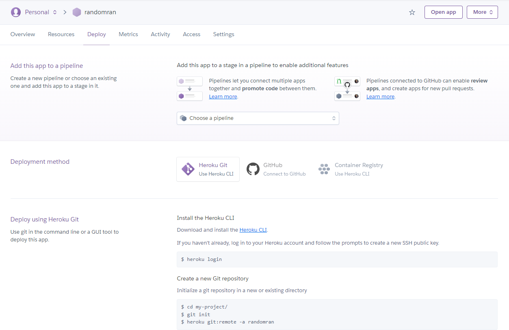

# Heroku 배포

# ※ 순서에 주의할 것!

## 1. Heroku 가입 및 Heroku CLI설치

- heroku에서 레포 생성 시 언더바를 입력하면 안됨(대신 -를 입력)
- 레포명이 중복되면 안됨
- git - repo —> 다운로드(로컬) —> heroku  배포
   : 이름이 동일하면 안 먹을 수 있음
- Heroku 앱 이름 생성 후 —> 다운로드 —> github에 올리는 방식도 가능

## 2. github에서 레포 생성

## 3. heroku-human-(이름) 폴더에서 bash  및 vscode 실행

## 4. 가상환경 접속 및 gunicorn 라이브러리 설치

- 선택 사항: 업데이트 하고 싶으면 블록 처리한 저 코드를 입력하면 됨

## 5. 라이브러리 목록 txt 파일 생성

## 6. 구성 파일을 만들어보자

- app.py
    - Flask의 대소문자 구분 주의
    - 사진의 구분은 잘못된 것으로 import Flask, app = Flask(__name__) 이 정답

- flask run 은 github 블로그에서 hexo server와 비슷한 역할을 하는 명령어

이 아닌 app.run](../images/Heroku_배포/Untitled%2016.png)

- 오타 주의 → [ap.run](http://ap.run)이 아닌 app.run

- Procfile(P는 반드시 대문자!)

- wsgi.py
    - 위에 coding: utf-8 부분 필요없음

- 파이썬 버전 확인(소문자 아님 주의)

- runtime.txt(사진에는 띄어쓰기가 되어있지만 다 붙여 써야 함/띄우면 오류 발생)

## 7. 깃허브 업로드

- git add .
- git commit -m “updated”
- git push

## 8. heroku 로그인하기

- heroku에 레포 생성
    - 경로 오류 안 나도록 주의하기!
    - 사진에는 경로를 잘못 입력했으므로 잘 보고 입력할 것
    
    
    

## 9. 옵션 만들기

## 10. 최종 변경 사항 저장하기

- git add .
- git commit -m “updated”
- git push
- git push heroku main

