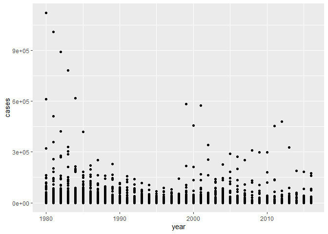

## chapter. 7


### 라이브러리 불러오기

```r
# 코드 청크
library(ggplot2)
library(data.table)
library(readxl)
library(foreign)
library(dplyr)
```

```
## 
## 다음의 패키지를 부착합니다: 'dplyr'
```

```
## The following objects are masked from 'package:data.table':
## 
##     between, first, last
```

```
## The following objects are masked from 'package:stats':
## 
##     filter, lag
```

```
## The following objects are masked from 'package:base':
## 
##     intersect, setdiff, setequal, union
```

### 데이터 불러오기
  - 데이터를 불러와라

```r
exam_na <- read.csv("exam_na.csv")
str(exam_na)
```

```
## 'data.frame':	5 obs. of  5 variables:
##  $ id     : int  1 2 3 4 5
##  $ sex    : chr  "M" "F" "F" "M" ...
##  $ korean : int  87 92 95 NA 87
##  $ english: int  NA 95 92 84 NA
##  $ math   : int  82 93 90 80 88
```

### 결측치 확인 및 빈도 구하기
  - 결측치: 비어 있는 데이터 값
  - 결측치 처리 시 우선 고려해야 하는 점: 전체 데이터 중 결측치의 비율
  - 통계는 실험
  - 결측치 처리 방법 2가지
    - 첫째로 평균값을 넣었을 때, 예측 판매량
    - 둘째로 결측치를 제거할 때, 예측 판매량
    ⇒ 둘 중 어느 것이 맞는지 실험해 보는 것
      , 결측치 처리 방법을 선택하는 것은 분석가의 몫
      
      즉, 절대적인 정답은 없으며 상황에 따라 
      더 좋은 결과를 산출해내는 방법을 선택하라
      

  1) 결측치 확인 : is.na() () 안에검증하려는 데이터세트나 변수이름 입력

```r
# 예시
exam_na <- read.csv("exam_na.csv")
is.na(exam_na)
```

```
##         id   sex korean english  math
## [1,] FALSE FALSE  FALSE    TRUE FALSE
## [2,] FALSE FALSE  FALSE   FALSE FALSE
## [3,] FALSE FALSE  FALSE   FALSE FALSE
## [4,] FALSE FALSE   TRUE   FALSE FALSE
## [5,] FALSE FALSE  FALSE    TRUE FALSE
```
  2) 결측치 빈도 구하기 : table(is.na())
    - table() : 빈도 구하기

```r
table(is.na(exam_na))
```

```
## 
## FALSE  TRUE 
##    22     3
```

```r
table(is.na(exam_na$korean))
```

```
## 
## FALSE  TRUE 
##     4     1
```

```r
summary(is.na(exam_na))   # 데이터세트의 전체 변수별로 결측치 빈도 확인
```

```
##      id             sex            korean         english       
##  Mode :logical   Mode :logical   Mode :logical   Mode :logical  
##  FALSE:5         FALSE:5         FALSE:4         FALSE:3        
##                                  TRUE :1         TRUE :2        
##     math        
##  Mode :logical  
##  FALSE:5        
## 
```

```r
summary(exam_na)   # 데이터세트의 전체 변수별 통계치 확인
```

```
##        id        sex                korean         english           math     
##  Min.   :1   Length:5           Min.   :87.00   Min.   :84.00   Min.   :80.0  
##  1st Qu.:2   Class :character   1st Qu.:87.00   1st Qu.:88.00   1st Qu.:82.0  
##  Median :3   Mode  :character   Median :89.50   Median :92.00   Median :88.0  
##  Mean   :3                      Mean   :90.25   Mean   :90.33   Mean   :86.6  
##  3rd Qu.:4                      3rd Qu.:92.75   3rd Qu.:93.50   3rd Qu.:90.0  
##  Max.   :5                      Max.   :95.00   Max.   :95.00   Max.   :93.0  
##                                 NA's   :1       NA's   :2
```

### 결측치 처리 방법
  - 제거하고 처리
  - 다른 값으로 대체(평균 입력 등)    ->    훨씬 더 중요한 방법
  
  1) 결측치를 제외하고 분석하기
  - p.160, 연산함수에서 결측치 제외 명령어 : na.rm = TRUE

```r
mean(exam_na$korean)
```

```
## [1] NA
```

```r
mean(exam_na$korean, na.rm = TRUE)
```

```
## [1] 90.25
```
  
  - 결측치가 있는 행 모두 제외 함수 : na.omit()
       -> 가급적 쓰지 말것

```r
na.omit(exam_na)
```

```
##   id sex korean english math
## 2  2   F     92      95   93
## 3  3   F     95      92   90
```

     
  - 결측치 없는 행만 추출 : filter()

```r
exam_na %>% filter(is.na(korean))   # 결측치 있는 행만 추출
```

```
##   id sex korean english math
## 1  4   M     NA      84   80
```

```r
exam_na %>% filter(!is.na(korean))   # 결측치 없는 행 모두 추출
```

```
##   id sex korean english math
## 1  1   M     87      NA   82
## 2  2   F     92      95   93
## 3  3   F     95      92   90
## 4  5   F     87      NA   88
```

```r
exam_na %>% filter(is.na(korean) & !is.na(english))
```

```
##   id sex korean english math
## 1  4   M     NA      84   80
```

```r
exam_na %>% filter(!is.na(korean) & !is.na(english))
```

```
##   id sex korean english math
## 1  2   F     92      95   93
## 2  3   F     95      92   90
```

```r
exam_na %>% filter(is.na(korean) | !is.na(english))
```

```
##   id sex korean english math
## 1  2   F     92      95   93
## 2  3   F     95      92   90
## 3  4   M     NA      84   80
```

```r
exam_na %>% filter(is.na(korean) | is.na(english))
```

```
##   id sex korean english math
## 1  1   M     87      NA   82
## 2  4   M     NA      84   80
## 3  5   F     87      NA   88
```


  2) 결측치를 다른 값으로 대체하기
  - 교재에 있는 방법 : ifelse() 함수 이용

```r
exam_na$korean
```

```
## [1] 87 92 95 NA 87
```

```r
mean(exam_na$korean, na.rm = TRUE)
```

```
## [1] 90.25
```

```r
exam_na$korean <- ifelse(is.na(exam_na$korean), 90.25, exam_na$korean)

exam_na$korean
```

```
## [1] 87.00 92.00 95.00 90.25 87.00
```

  
  - imputation 참고자료
  + [A Solution to Missing Data: Imputation Using R](https://www.kdnuggets.com/2017/09/missing-data-imputation-using-r.html)
  + [R 결측값(NA) 제거, 대체 방법](https://velog.io/@lifeisbeautiful/R-%EA%B2%B0%EC%B8%A1%EA%B0%92NA-%EC%A0%9C%EA%B1%B0-%EB%8C%80%EC%B2%B4-%EB%B0%A9%EB%B2%95)
    ※ mlbench 패키지 활용

```r
library(mlbench)
colSums(is.na(exam_na))    # 결측값 확인
```

```
##      id     sex  korean english    math 
##       0       0       0       2       0
```

```r
exam_na2 <- read.csv("exam_na.csv")

exam_na <- exam_na[complete.cases(exam_na2) ,]
# complete.cases() : 해당되는 행의 결측치를 제거하는 함수
colSums(is.na(exam_na))
```

```
##      id     sex  korean english    math 
##       0       0       0       0       0
```

```r
colSums(is.na(exam_na2))
```

```
##      id     sex  korean english    math 
##       0       0       1       2       0
```

```r
exam_na2 <- exam_na2 %>% filter(!is.na(korean) & !is.na(english))
colSums(is.na(exam_na2))
```

```
##      id     sex  korean english    math 
##       0       0       0       0       0
```
  
  
  

### 이상치
  - 데이터의 특정 값이 뭔가 '이상'이 있는 상태
    - case 1 : 정해진 범주에서 벗어난 데이터
      - ex) 2000년 4월 30일 -> 2000년 40월 30일로 입력한 경우 => 9999로 처리
    - case 2 : 숫자 / 아웃라이어(outlier) / 극단값
      - ex) 평균 임금 320만원 / 손흥민의 경우 몇십억원


```r
mpg1_out <- read.csv("mpg1_out.csv")
```

```r
table(mpg1_out$trans)
```

```
## 
##   1   2   3 
## 154  76   4
```
  - ifelse : 만약 ~라면, 내가 무엇을 할 것이다 <가정법>
  - 만약 trans의 값이 3이라면, 결측치로 바꿔주세요. 나머지는 그대로 유지하세요.

```r
mpg1_out$trans <- ifelse(mpg1_out$trans == 3, NA, mpg1_out$trans)

table(is.na(mpg1_out$trans))# 결측치 빈도 확인
```

```
## 
## FALSE  TRUE 
##   230     4
```
  - 결측치 제거

```r
result <- mpg1_out %>% filter(!is.na(trans))

table(is.na(result$trans))
```

```
## 
## FALSE 
##   230
```

```r
mpg1_out_result <- mpg1_out %>% filter(mpg1_out$trans != 3)

table(is.na(mpg1_out_result$trans))
```

```
## 
## FALSE 
##   230
```

```r
table(mpg1_out_result$trans)
```

```
## 
##   1   2 
## 154  76
```


### 극단치 처리
  - 통계적으로 극단치의 경계값을 구함
  - 숫자 데이터 boxplot() 
  - boxplot() 함수를 통해서 극단치가 있는지 없는 확인 가능 

```r
mpg1 <- read.csv("mpg1.csv")

boxplot(mpg1$cty)
boxplot(mpg1$cty)$stats
```


```
##      [,1]
## [1,]    9
## [2,]   14
## [3,]   17
## [4,]   19
## [5,]   26
```
  - 상자그림 보는 법
    - 1사분위수에서 3사분위수의 거리 : IQR (상자그림의 높이)
    - IQR 위쪽 1.5배 지점 : 상위 경계값
    - IQR 아래쪽 1.5배 지점 : 하위 경계값
    - 상자그림 위 아래의 직선 : 상/하위 경계 안 최댓값
    - 상위 경계값 위에 표시된 동그라미 : 극단치


## chapter. 9

### ggplot2 강의
  - 데이터 불러오기

```r
library(ggplot2)
library(readxl)
who_disease <- read_xlsx("who_disease.xlsx")


ggplot(who_disease, aes(x = year, y = cases)) +
# ggplot(객체, aes(x = 변수, y = 변수))
# aes() : 축을 그리는 함수
  # 그래프 종류
  geom_point()
```



  - 옵션 1. 투명도 주기 -> geom_point(alpha = )

```r
ggplot(who_disease, aes(x = year, y = cases)) +
  geom_point(alpha = 0.5, size = 5)
```


```r
  # geom_point(alpha = 0.5, colour = "#2CF23A", shape = 15, size = 1) -> 다양한 옵션 주기(fill은 point에 적용 불가)
```

  - colour 입력 위치
    + geom_point(colour="red")     # 색상값
    
    + aes(x, y, colour = 컬럼명)   # 컬럼명
    

```r
str(iris)
```

```
## 'data.frame':	150 obs. of  5 variables:
##  $ Sepal.Length: num  5.1 4.9 4.7 4.6 5 5.4 4.6 5 4.4 4.9 ...
##  $ Sepal.Width : num  3.5 3 3.2 3.1 3.6 3.9 3.4 3.4 2.9 3.1 ...
##  $ Petal.Length: num  1.4 1.4 1.3 1.5 1.4 1.7 1.4 1.5 1.4 1.5 ...
##  $ Petal.Width : num  0.2 0.2 0.2 0.2 0.2 0.4 0.3 0.2 0.2 0.1 ...
##  $ Species     : Factor w/ 3 levels "setosa","versicolor",..: 1 1 1 1 1 1 1 1 1 1 ...
```

```r
ggplot(iris, aes(x = Sepal.Length,
                 y = Sepal.Width,
                 colour = Species,
                 size = Petal.Length)) +
  geom_point()    # 옵션으로 장난치기
```


  ※  컬럼 별로 색상이 구분됨
  
  
  - 산점도 : x축 수치형, 연속형 데이터 / y축 수치형, 연속형 데이터

```r
ggplot(who_disease, aes(x = year, y = cases)) +
  geom_point(alpha = 0.5)
```


```r
# 데이터 가공 -> 데이터 시각화 -> 데이터 재가공 -> 데이터 시각화 무한 반복
```
  
  - 히스토그램 그리기
  
    - 예시) 질병 데이터 
    
    region = AMR, year = 1980, disease = 백일해(pertussis)
    cases > 0
    

```r
library(dplyr)
str(who_disease)
```

```
## tibble [43,262 × 6] (S3: tbl_df/tbl/data.frame)
##  $ region     : chr [1:43262] "EMR" "EUR" "AFR" "EUR" ...
##  $ countryCode: chr [1:43262] "AFG" "ALB" "DZA" "AND" ...
##  $ country    : chr [1:43262] "Afghanistan" "Albania" "Algeria" "Andorra" ...
##  $ disease    : chr [1:43262] "measles" "measles" "measles" "measles" ...
##  $ year       : num [1:43262] 2016 2016 2016 2016 2016 ...
##  $ cases      : num [1:43262] 638 17 41 0 53 0 0 2 99 27 ...
```

```r
who_disease %>% 
  filter(region == "AMR",
         year == 1980,
         disease == "pertussis",
         cases > 0) -> data2

ggplot(data2, aes(x = cases)) +
  geom_histogram()
```

```
## `stat_bin()` using `bins = 30`. Pick better value with `binwidth`.
```


```r
ggplot(diamonds, aes(x = carat)) +
  geom_histogram()
```

```
## `stat_bin()` using `bins = 30`. Pick better value with `binwidth`.
```


  
  
  - 히스토그램 구간 설정하기(분석용) : histogram(binwidth=1개 구간의 크기)
    
    - 히스토그램은 기본적으로 x축의 구간을 30개로 나눈다
    
    - 구간의 크기를 크거나 작게 하여 그래프의 가독성을 높일 수 있다
    
    - 한 구간의 크기가 너무 작으면 그래프가 중간중간이 비고, 너무 크면 히스토그램이     두리뭉실해짐

```r
# 한 개 구간의 크기 = x축의 전체 범위를 30으로 나누면 알 수 있다
range(diamonds$carat)
```

```
## [1] 0.20 5.01
```

```r
# carat의 한 구간 크기 = (5.01-0.20)/30 = 0.1603333

ggplot(diamonds, aes(x=carat)) +
  geom_histogram(binwidth = 0.8)
```


```r
ggplot(diamonds, aes(x=carat)) +
  geom_histogram(binwidth = 0.009)
```


※ 히스토그램 분석 시에는 어디에 분포가 몰려있는지 봐야 한다

   -> 범주형 변수는 히스토그램을 활용할 수 없음
   
   
  - 막대형 그래프 그리기

```r
ggplot(data2, aes(x = country, y = cases)) +
  geom_col(fill = "#62FDFF") +
  # 옵션 입력
  coord_flip()
```


```r
ggplot(who_disease, aes(disease)) +
  geom_bar()
```


```r
ggplot(who_disease, aes(region)) +
  geom_bar()
```


    


  - 커널 밀도 곡선 : geom_density()
  
    - 계단식 그림을 곡선으로 그리는 것

```r
ggplot(diamonds, aes(x = carat)) +
  geom_density()
```


  
  
  - 데이터 2개에 대한 선그래프를 한 화면에 그리기

```r
ggplot(economics, aes(x = date, y = uempmed)) +
  geom_line(colour = "yellow")
```


```r
ggplot(economics, aes(x = date, y = psavert)) +
  geom_line()
```


```r
ggplot() +
  geom_line(data=economics, aes(x = date, y = uempmed, colour = "red")) +
  geom_line(data=economics, aes(x = date, y = psavert))
```


    
### ggplot() 정교하게 그리기
  - 산점도 그리기

```r
ggplot(data = diamonds, aes(x=carat, 
                           y=price,
                           col = cut)) +    # col = colour
  geom_point()
```


  
  
  - 막대그래프에 2개 범주 내용 반영하기

```r
ggplot(diamonds, aes(x = color,
                     fill = cut)) +
  geom_bar()
```


```r
ggplot(diamonds, aes(x = color,
                     fill = cut)) +
  geom_bar(position="fill")
```


```r
ggplot(diamonds, aes(x = color,
                     fill = cut)) +
  geom_bar(position="dodge")
```


  - p.219
    - 선 그래프에 2개 범주 내용 반영

```r
leisure <- read.csv("leisure.csv")
str(leisure)
```

```
## 'data.frame':	200 obs. of  3 variables:
##  $ age    : int  2 2 3 3 4 4 5 5 6 6 ...
##  $ sex    : chr  "female" "male" "female" "male" ...
##  $ expense: num  25.8 21 30 16.3 25.7 ...
```

```r
ggplot(data=leisure, aes(x=age, y=expense, col = sex)) +
  geom_line(size = 1.4)
```


  - 막대그래프의 순서 변경
    - reorder() : 크기 순으로 정렬

```r
mpg1 <- read.csv("mpg1.csv", stringsAsFactors = F)

# 데이터 가공
drv_hwy <- mpg1 %>% 
  group_by(drv) %>% 
  summarise(mean_hwy = mean(hwy))
```

```r
# 기본 그래프
ggplot(data = drv_hwy, aes(x = drv, y = mean_hwy)) +
  geom_col()
```


```r
# 오름차순
ggplot(data = drv_hwy, aes(x = reorder(drv, mean_hwy), 
                           y = mean_hwy)) +
  geom_col()
```


```r
# 내림차순
ggplot(data = drv_hwy, aes(x = reorder(drv, -mean_hwy), 
                           y = mean_hwy)) +
  geom_col()
```


```r
# 옵션 - 그래프와 축에 타이틀 입력
ggplot(data = drv_hwy, aes(x = reorder(drv, -mean_hwy), 
                           y = mean_hwy)) +
  geom_col() +
  labs(
    title = "제목을 입력하세요",
    subtitle = "소제목을 입력하세요",
    x = "x 변수명을 입력하세요",
    y = "y 변수명을 입력하세요",
    caption = "데이터 출처를 입력하세요"
  )
```


