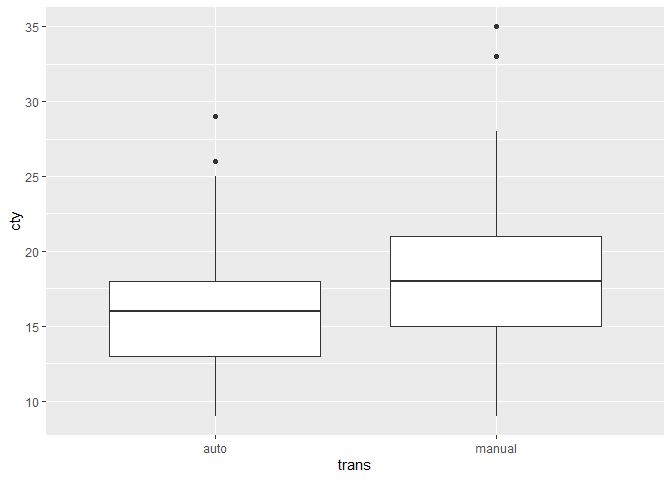
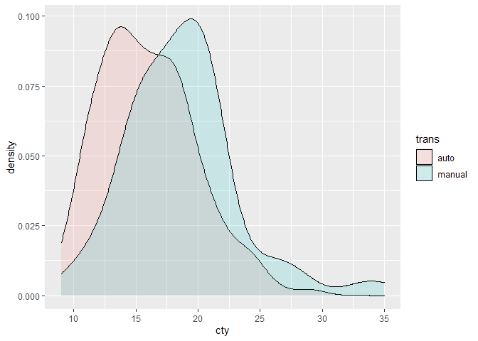

```r
# 코드 청크
library(ggplot2)
library(data.table)
library(readxl)
library(foreign)
library(dplyr)
```

```
## 
## 다음의 패키지를 부착합니다: 'dplyr'
```

```
## The following objects are masked from 'package:data.table':
## 
##     between, first, last
```

```
## The following objects are masked from 'package:stats':
## 
##     filter, lag
```

```
## The following objects are masked from 'package:base':
## 
##     intersect, setdiff, setequal, union
```

## 복습


```r
str(iris)
```

```
## 'data.frame':	150 obs. of  5 variables:
##  $ Sepal.Length: num  5.1 4.9 4.7 4.6 5 5.4 4.6 5 4.4 4.9 ...
##  $ Sepal.Width : num  3.5 3 3.2 3.1 3.6 3.9 3.4 3.4 2.9 3.1 ...
##  $ Petal.Length: num  1.4 1.4 1.3 1.5 1.4 1.7 1.4 1.5 1.4 1.5 ...
##  $ Petal.Width : num  0.2 0.2 0.2 0.2 0.2 0.4 0.3 0.2 0.2 0.1 ...
##  $ Species     : Factor w/ 3 levels "setosa","versicolor",..: 1 1 1 1 1 1 1 1 1 1 ...
```

```r
ggplot(iris, aes(x = Sepal.Length, 
                 y = Sepal.Width,
                 col = Species)) +
  geom_point() +
  labs(
    title = "iris 데이터세트 분석",
    x = "꽃받침 길이",
    y = "꽃받침 너비"
  )
```

<!-- -->

```r
str(iris)
```

```
## 'data.frame':	150 obs. of  5 variables:
##  $ Sepal.Length: num  5.1 4.9 4.7 4.6 5 5.4 4.6 5 4.4 4.9 ...
##  $ Sepal.Width : num  3.5 3 3.2 3.1 3.6 3.9 3.4 3.4 2.9 3.1 ...
##  $ Petal.Length: num  1.4 1.4 1.3 1.5 1.4 1.7 1.4 1.5 1.4 1.5 ...
##  $ Petal.Width : num  0.2 0.2 0.2 0.2 0.2 0.4 0.3 0.2 0.2 0.1 ...
##  $ Species     : Factor w/ 3 levels "setosa","versicolor",..: 1 1 1 1 1 1 1 1 1 1 ...
```

```r
ggplot(iris, aes(x = Sepal.Length, 
                 y = Sepal.Width,
                 col = Species)) +
  geom_point() +
  labs(
    title = "iris 데이터세트 분석",
    x = "꽃받침 길이",
    y = "꽃받침 너비"
  ) +
  scale_color_manual(
    labels = c("setosa", "versicolor", "virginica"),
    values = c("#DBAD22", "#75F011", "#C997FF")
  ) +
  theme_classic()  # 옵션 넣기
```

<!-- -->

## 향후 일정
  - 인공지능 프로그래밍 7월 4일 ~ 7월 19일(4교시까지)
  - 7월 12일 ~ 7월 19일 (캐글 대회, 개인별 실습)
  - 분석가 희망자 -> 사이드 프로젝트(팀 구성)
    - 8월 10일 즈음 마무리
  - 8월 11일 ~ 9월 2일 챗봇 프로젝트(제안)
    - 기존 커리큘럼 일정 : 8월 19일 ~ 9월 2일 4교시까지
      - 챗봇 & 발표자료(-> 면접 자료)
   - 시스템 구축 / 플랫폼 개발 (강의 일정 일부 단축)
  
## chapter. 8

### 통계
  - 기술통계 : 평균, 최솟값, 최댓값, 중간값 -> 사실 확인
  - 추론통계 : 변수 간의 관계를 파악 / 새로운 사실을 발견(= 추정)
    - 평균 차이 검정
      - 수치 데이터 + 범주 데이터(두 그룹으로 된 데이터)
      - 가설검정 : 평균의 차이를 검정
      - 예시) 남자의 평균 키와 여자의 평균 키는 차이가 있을 것이다.
      - 핵심 키워드 : 그룹(남자/여자), 평균, 차이
    - 교차 분석(= 빈도 분석)
      - 범주형 변수로 구성된 집단들의 관련성을 검정
      - 범주 데이터
      - 가설검정 : 각 범주별 빈도(비율)를 활용해서 관계성을 검정
      
      => 평균 차이 검정과 교차 분석의 데이터세트에는 차이가 존재
    - 상관관계분석
      - 두 변수 간의 상관관계를 알아보는 것(인과관계X)
      - 수치 데이터
      - 상관관계 : -1 <= r(상관계수) <= 1
        - +- 0.7 이상 : 높은 관계
        - +- 0.4~+-0.7 미만 : 다소 높은 관계
        - +- 0.2~+-0.4 미만 : 낮은 관계
        - +- 0.2 미만 : 거의 관계 없다
    - 단순회귀분석
      - 회귀분석 : 인과관계를 분석하는 통계적 방법
      - y = ax + b (a는 기울기/회귀계수, b는 상수항)
      - 예시) 기온, 판매량
        - 가설검정 : 기온(독립변수)이 판매량(종속변수)에 긍정적/부정적 영향을 주고 있을 것이다.
        
      => 입문 수준에서는 평균 차이 검정과 회귀분석이 핵심
      

### 통계 검정(p.176)
  - 가설
    - Hypothesis
    ---> 공부 방법 : 선행 연구, 해당 분석 방법의 가설 설정 예시 존재
    - 연구 : 내가 궁금한 것을 찾는 것
    
    - 귀무가설(영가설) 
      - 설정한 가설이 맞을 확률이 극히 적어서 처음부터 기각될 것으로 예상되는 가설
      - 두 그룹간의 평균 차이가 없다
    - 대립가설 
      - 연구자가 검정하고자 하는 가설(궁금한 것)
      - 두 그룹간의 평균 차이가 있다
 
  - 유의수준   
    - 가설검정에서 인정하는 유의수준
      - 5%, 1%, 0.1% 또는 10%
    
    - 통계 결과 분석 시, 유의수준 > 0.05라면?
      -> 평균의 차이가 없다고 보는 심각한 오류
        - 데이터를 더 확보하거나, 가설을 바꾸는 등의 방법을 통해 유의미한 결과를 만들어내야 함
        
```
오차범위 내에 있는가?
ex. A후보 : 44%
    B후보 : 42%
    
이재명 vs 윤형선 -> 이재명

오차범위 내에 있다 : 차이가 크지 않아서 결과가 바뀔 가능성이 있다
오차범위 밖에 있다 : 몇 번의 조사를 해도 결과가 동일하다
```


### 평균 차이 검정 : t.test()
  - 어떻게 데이터를 입력하는지 확인
  - p-value, 유의수준 0.05 이상 : 귀무가설, 0.05 이내 --> 대립가설


```r
mpg1 <- read.csv("mpg1.csv", stringsAsFactors = FALSE)
str(mpg1)
```

```
## 'data.frame':	234 obs. of  5 variables:
##  $ manufacturer: chr  "audi" "audi" "audi" "audi" ...
##  $ trans       : chr  "auto" "manual" "manual" "auto" ...
##  $ drv         : chr  "f" "f" "f" "f" ...
##  $ cty         : int  18 21 20 21 16 18 18 18 16 20 ...
##  $ hwy         : int  29 29 31 30 26 26 27 26 25 28 ...
```

  - 시각화

```r
library(ggplot2)
ggplot(mpg1, aes(x = trans, y = cty)) +
  geom_boxplot()
```

<!-- -->

  
  - t.test 검정
    - 귀무가설 : auto와 manual의 cty 평균은 차이가 없다
    - 대립가설 : auto와 manual의 cty 평균은 차이가 있다

```r
t.test(data=mpg1, cty ~ trans)
```

```
## 
## 	Welch Two Sample t-test
## 
## data:  cty by trans
## t = -4.5375, df = 132.32, p-value = 1.263e-05
## alternative hypothesis: true difference in means between group auto and group manual is not equal to 0
## 95 percent confidence interval:
##  -3.887311 -1.527033
## sample estimates:
##   mean in group auto mean in group manual 
##             15.96815             18.67532
```

```r
                  # 종속변수 ~ 독립변수
                  # 반응변수 ~ 설명변수
                  #  y          x
```
  
  ※ p-value 값이 중요  -> p-value 값이 0.05보다 작으므로 대립가설 채택
  
```  
  # 두 집단의 평균 차이 검정
    - 사전 필수 검증
    - 등분산 검정
      - 두 그룹 간 분산이 비슷하면 --> t.test(모수 검정)
      - 두 그룹 간 분산이 다르면 --> 비모수 검정
    
  # 등분산 검정의 가설
    - 귀무가설 : 두 그룹 간 분산이 비슷하다
        - p.value > 0.05
    - 대립가설 : 두 그룹 간 분산이 다르다
        - p.value < 0.05
```        

```r
var.test(data = mpg1, cty ~ trans)
```

```
## 
## 	F test to compare two variances
## 
## data:  cty by trans
## F = 0.73539, num df = 156, denom df = 76, p-value = 0.1101
## alternative hypothesis: true ratio of variances is not equal to 1
## 95 percent confidence interval:
##  0.4912917 1.0719468
## sample estimates:
## ratio of variances 
##          0.7353887
```


```r
ggplot(mpg1, aes(x = cty, fill = trans)) +
  geom_density(alpha = 0.15)
```

<!-- -->


### 교차 분석
  - 범주형 변수들이 관계가 있다는 것을 검정
  - 비율에 차이가 있는지 검정
  - 교차분석 검정은 R의 chisq.test() 함수로 진행
  - 귀무가설 : trans에 따라 drv(4,f,r)의 (비율) 차이가 없다
  - 대립가설 : trans에 따라 drv(4,f,r)의 (비율) 차이가 있다
  - 빈도표

```r
table(mpg1$trans, mpg1$drv)   # 교차분석
```

```
##         
##           4  f  r
##   auto   75 65 17
##   manual 28 41  8
```
  - 비율

```r
prop.table(table(mpg1$trans, mpg1$drv), 1)
```

```
##         
##                  4         f         r
##   auto   0.4777070 0.4140127 0.1082803
##   manual 0.3636364 0.5324675 0.1038961
```
  - auto 4륜 구동(4) 47.8%
  - manual 전륜구동(f) 53.2%로 가장 많음
  - 실제 통계적으로 봤을 때, 차이가 있는지 검정

  - 귀무가설 : trans에 따라 drv(4,f,r)의 (비율) 차이가 없다
  - 대립가설 : trans에 따라 drv(4,f,r)의 (비율) 차이가 있다
  

```r
chisq.test(mpg1$trans, mpg1$drv)
```

```
## 
## 	Pearson's Chi-squared test
## 
## data:  mpg1$trans and mpg1$drv
## X-squared = 3.1368, df = 2, p-value = 0.2084
```
  ※ p-value 값이 0.05보다 크므로 귀무가설 채택

```r
chisq.test(table(mpg1$trans, mpg1$drv))
```

```
## 
## 	Pearson's Chi-squared test
## 
## data:  table(mpg1$trans, mpg1$drv)
## X-squared = 3.1368, df = 2, p-value = 0.2084
```

```r
summary(table(mpg1$trans, mpg1$drv))
```

```
## Number of cases in table: 234 
## Number of factors: 2 
## Test for independence of all factors:
## 	Chisq = 3.1368, df = 2, p-value = 0.2084
```


### 상관관계분석 : cor.test()
  - 귀무가설 : cty와 hwy는 상관관계가 없다
  - 대립가설 : cty와 hwy는 상관관계가 있다

```r
cor.test(mpg1$cty, mpg1$hwy)
```

```
## 
## 	Pearson's product-moment correlation
## 
## data:  mpg1$cty and mpg1$hwy
## t = 49.585, df = 232, p-value < 2.2e-16
## alternative hypothesis: true correlation is not equal to 0
## 95 percent confidence interval:
##  0.9433129 0.9657663
## sample estimates:
##       cor 
## 0.9559159
```
  ※ p-value 값이 0.05보다 작으므로 대립가설 채택
    
  - 하단의 cor 값은 상관계수 값을 의미 -> cty와 hwy는 유의미하게 매우 높은 상관관계에 있다(p<.05)
  
  
