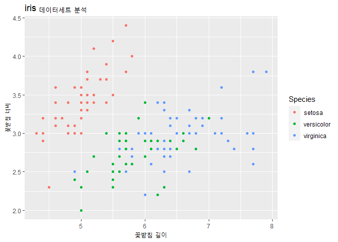
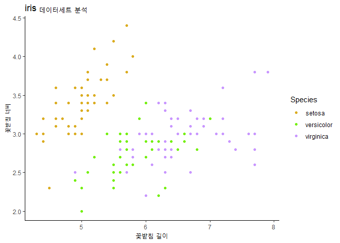

## 라이브러리 불러오기
```r
# 코드 청크
library(ggplot2)
library(data.table)
library(readxl)
library(foreign)
library(dplyr)
```

```
## 
## 다음의 패키지를 부착합니다: 'dplyr'
```

```
## The following objects are masked from 'package:data.table':
## 
##     between, first, last
```

```
## The following objects are masked from 'package:stats':
## 
##     filter, lag
```

```
## The following objects are masked from 'package:base':
## 
##     intersect, setdiff, setequal, union
```

## 복습


```r
str(iris)
```

```
## 'data.frame':	150 obs. of  5 variables:
##  $ Sepal.Length: num  5.1 4.9 4.7 4.6 5 5.4 4.6 5 4.4 4.9 ...
##  $ Sepal.Width : num  3.5 3 3.2 3.1 3.6 3.9 3.4 3.4 2.9 3.1 ...
##  $ Petal.Length: num  1.4 1.4 1.3 1.5 1.4 1.7 1.4 1.5 1.4 1.5 ...
##  $ Petal.Width : num  0.2 0.2 0.2 0.2 0.2 0.4 0.3 0.2 0.2 0.1 ...
##  $ Species     : Factor w/ 3 levels "setosa","versicolor",..: 1 1 1 1 1 1 1 1 1 1 ...
```

```r
ggplot(iris, aes(x = Sepal.Length, 
                 y = Sepal.Width,
                 col = Species)) +
  geom_point() +
  labs(
    title = "iris 데이터세트 분석",
    x = "꽃받침 길이",
    y = "꽃받침 너비"
  )
```



```r
str(iris)
```

```
## 'data.frame':	150 obs. of  5 variables:
##  $ Sepal.Length: num  5.1 4.9 4.7 4.6 5 5.4 4.6 5 4.4 4.9 ...
##  $ Sepal.Width : num  3.5 3 3.2 3.1 3.6 3.9 3.4 3.4 2.9 3.1 ...
##  $ Petal.Length: num  1.4 1.4 1.3 1.5 1.4 1.7 1.4 1.5 1.4 1.5 ...
##  $ Petal.Width : num  0.2 0.2 0.2 0.2 0.2 0.4 0.3 0.2 0.2 0.1 ...
##  $ Species     : Factor w/ 3 levels "setosa","versicolor",..: 1 1 1 1 1 1 1 1 1 1 ...
```

```r
ggplot(iris, aes(x = Sepal.Length, 
                 y = Sepal.Width,
                 col = Species)) +
  geom_point() +
  labs(
    title = "iris 데이터세트 분석",
    x = "꽃받침 길이",
    y = "꽃받침 너비"
  ) +
  scale_color_manual(
    labels = c("setosa", "versicolor", "virginica"),
    values = c("#DBAD22", "#75F011", "#C997FF")
  ) +
  theme_classic()  # 옵션 넣기
```



## 향후 일정
  - 인공지능 프로그래밍 7월 4일 ~ 7월 19일(4교시까지)
  - 7월 12일 ~ 7월 19일 (캐글 대회, 개인별 실습)
  - 분석가 희망자 -> 사이드 프로젝트(팀 구성)
    - 8월 10일 즈음 마무리
  - 8월 11일 ~ 9월 2일 챗봇 프로젝트(제안)
    - 기존 커리큘럼 일정 : 8월 19일 ~ 9월 2일 4교시까지
      - 챗봇 & 발표자료(-> 면접 자료)
   - 시스템 구축 / 플랫폼 개발 (강의 일정 일부 단축)
  

## chapter. 8

### 통계
  - 기술통계 : 평균, 최솟값, 최댓값, 중간값 -> 사실 확인
  - 추론통계 : 변수 간의 관계를 파악 / 새로운 사실을 발견(= 추정)
    - 평균 차이 검정
      - 수치 데이터
      - 가설검정 : 평균의 차이를 검정
      - 예시) 남자의 평균 키와 여자의 평균 키는 차이가 있을 것이다.
      - 핵심 키워드 : 그룹(남자/여자), 평균, 차이
    - 교차 분석(= 빈도 분석)
      - 범주형 변수로 구성된 집단들의 관련성을 검정
      - 범주 데이터
      - 가설검정 : 각 범주별 빈도를 활용해서 관계성을 검정
      
      => 평균 차이 검정과 교차 분석의 데이터세트에는 차이가 존재
    - 상관관계분석
      - 변수 간의 상관관계를 알아보는 것(인과관계X)
      - 수치 데이터
      - 상관관계 : -1 <= r(상관계수) <= 1
        - +- 0.7 이상 : 높은 관계
        - +- 0.4~+-0.7 미만 : 다소 높은 관계
        - +- 0.2~+-0.4 미만 : 낮은 관계
        - +- 0.2 미만 : 거의 관계 없다
    - 단순회귀분석
      - 회귀분석 : 인과관계를 분석하는 통계적 방법
      - y = ax + b (a는 기울기/회귀계수, b는 상수항)
      - 예시) 기온, 판매량
        - 가설검정 : 기온(독립변수)이 판매량(종속변수)에 긍정적/부정적 영향을 주고 있을 것이다.
        
      => 입문 수준에서는 평균 차이 검정과 회귀분석이 핵심
