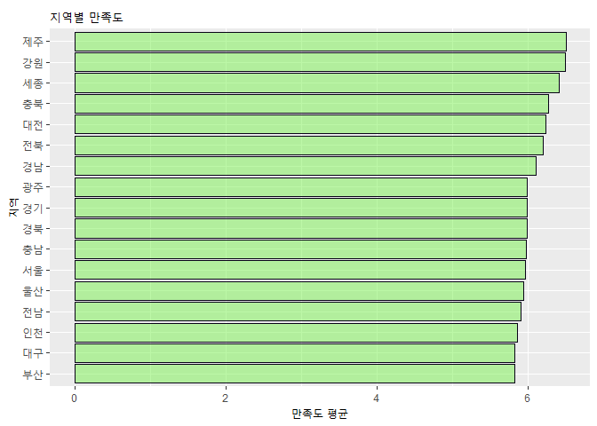

```r
# 코드 청크
library(ggplot2)
library(data.table)
library(readxl)
library(foreign)
library(dplyr)
```

```
## 
## 다음의 패키지를 부착합니다: 'dplyr'
```

```
## The following objects are masked from 'package:data.table':
## 
##     between, first, last
```

```
## The following objects are masked from 'package:stats':
## 
##     filter, lag
```

```
## The following objects are masked from 'package:base':
## 
##     intersect, setdiff, setequal, union
```


## 복습
  - 통계 검정
    - 평균 차이 검정 : 수치 데이터 + 범주 데이터(두 그룹)
      - 분산분석(중급 이상) : 세 그룹 이상 평균 차이 검정
  
    - 비율 차이 검정 : 범주 데이터
    - 상관 관계 : 수치 데이터
    - 회귀분석
    
  - 통계 검정 사전 준비
    - 분석을 위한 데이터가 적절한지 검정
    - 등분산 검정, 수치 데이터가 정규분포를 이루는가?(정규성 검정)
    
  - 귀무가설, 대립가설 적절하게 설정
    - 서울의 평균 임금과 부산의 평균 임금이 차이가 있을 것이다
    - 선행연구 (논문 찾아서 응용)
    
  - 테스트
    - t.test, chisq.test, cor.test
    - p.value
      - p.value > 0.05 --> 귀무가설 지지
      - p.value < 0.05 --> 대립가설 지지
    
    

## 회귀의 중요성
  - 기초통계: 특정한 결과에 영향을 주는 주 요인이 무엇인가를 찾는 것이 회귀
  - 회귀분석과 종류
    - 1세대 회귀 방법론 : 다항회귀분석, 다중회귀분석,포아송 회귀분석 etc.
    - 2세대 회귀 방법론 : 구조방정식
    
  - 귀무가설 & 대립가설 존재
    - 귀무가설 : x(= 독립변수)가 y(= 종속변수)에 영향을 주지 않는다
    - 대립가설 : x가 y에 영향을 준다
    
### 단순회귀분석  
  - lm(종속변수~독립변수, 데이터세트)
    - p.value
    

```r
RA <- lm(data = mtcars, mpg~disp)

summary(RA)
```

```
## 
## Call:
## lm(formula = mpg ~ disp, data = mtcars)
## 
## Residuals:
##     Min      1Q  Median      3Q     Max 
## -4.8922 -2.2022 -0.9631  1.6272  7.2305 
## 
## Coefficients:
##              Estimate Std. Error t value Pr(>|t|)    
## (Intercept) 29.599855   1.229720  24.070  < 2e-16 ***
## disp        -0.041215   0.004712  -8.747 9.38e-10 ***
## ---
## Signif. codes:  0 '***' 0.001 '**' 0.01 '*' 0.05 '.' 0.1 ' ' 1
## 
## Residual standard error: 3.251 on 30 degrees of freedom
## Multiple R-squared:  0.7183,	Adjusted R-squared:  0.709 
## F-statistic: 76.51 on 1 and 30 DF,  p-value: 9.38e-10
```
  - (intercept)의 Estimate 값 : 절편, 변수의 Estimate 값 : 회귀계수, Pr(>|t|) : 유의수준
    - 회귀식 : mpg =  + 29.59985-0.04122 x disp
  - R-squared (결정계수) = 설명력 = 0 ~ 1
    - 1로 수렴할수록 설명력이 좋다
  - Signif. codes:  0 ‘***’ 0.001 ‘**’ 0.01 ‘*’ 0.05 ‘.’ 0.1 ‘ ’ 1
    - 유의수준 기호 : 유의수준 충족도를 알 수 있는 기호

```
# 예시

Coefficients:
            Estimate Std. Error t value Pr(>|t|)    
(Intercept) 29.599855   1.229720  24.070  < 2e-16 ***
  disp        -0.041215   0.004712  -8.747 9.38e-10 ***
  var1                                     5.42e-9
  var2                                     0.10
  var3                                     9.38e-10
  
  Residual standard error: 3.251 on 30 degrees of freedom
  Multiple R-squared:  0.7183,	Adjusted R-squared:  0.709 
  F-statistic: 76.51 on 1 and 30 DF,  p-value: 9.38e-10
  
  ANOVA(분산분석)
  식1 : y = disp + var1 + var2 + var3
  식2 : y = disp + var1 + var2
  
  컬럼 갯수가 100개
  - 전진소거법(전진선택법), 후진소거법
```
  - 전진소거법(전진선택법)
    - 절편만 있는 상수모형으로부터 시작해 중요하다고 생각되는 독립변수부터 차례로 모형에 추가하는 방법
    - 장점 : 이해하기 쉽고 변수의 개수가 많은 경우에도 사용 가능
    - 단점 : 변수값의 작은 변동에도 결과가 크게 달라져 안정성 부족
  
  - 후진소거법
    - 모든 독립변수를 포함한 모형에서 출발
    - 가장 적은 영향을 주는 변수부터 하나씩 제거하며 더 이상 제거할 변수가 없을 때까지 진행
    - 장점 : 전체 변수들의 정보를 이용할 수 있음
    - 단점 : 변수의 개수가 많으면 사용하기 어려움
  
  - 단계선택법
    - 전진선택법에 의해 변수를 추가하면서 새롭게 추가된 변수에 기반
    - 기존 변수의 중요도 약화 시 해당변수를 제거
    - 단계별로 추가 또는제거되는 변수의 여부를 검토하여 더 이상 변경사항이 없을 때까지 진행
    
  - 참고 : [YSY 데이터 분석 블로그 : 회귀분석 실습(3) - 변수선택법(R)](https://ysyblog.tistory.com/121)


  - 회귀분석 시 고려해야 하는 4가지 사항
    - p-value 값 : 회귀모형이 적합한가?
    - 각 변수의 pr(>|t|) 값 : 각 변수들이 어떤 가설을 채택할 수 있는가?
    - 회귀식
    - 결정계수
  
  
  - 머신러닝, 인공지능
    - 주 목적 : 예측
    - y = ax + b
    

### 다중회귀분석
  - 종속변수에 영향을 주는 독립변수가 복수일 때 분석하는 방식
  - 복수의 독립변수들은 서로 영향을 주면서 종속변수에 영향을 준다
    - 따라서, 한 독립변수가 종속변수에 미치는 영향력이 단순회기분석을 했을 때와 다중회귀분석을 했을 때 달라진다
  - 다중회귀분석 : 독립변수들을 '+'로 연결


```r
lm(mpg~disp+hp+wt, data = mtcars)
```

```
## 
## Call:
## lm(formula = mpg ~ disp + hp + wt, data = mtcars)
## 
## Coefficients:
## (Intercept)         disp           hp           wt  
##   37.105505    -0.000937    -0.031157    -3.800891
```

```r
RA <- lm(mpg~disp+hp+wt, data = mtcars)
summary(RA)
```

```
## 
## Call:
## lm(formula = mpg ~ disp + hp + wt, data = mtcars)
## 
## Residuals:
##    Min     1Q Median     3Q    Max 
## -3.891 -1.640 -0.172  1.061  5.861 
## 
## Coefficients:
##              Estimate Std. Error t value Pr(>|t|)    
## (Intercept) 37.105505   2.110815  17.579  < 2e-16 ***
## disp        -0.000937   0.010350  -0.091  0.92851    
## hp          -0.031157   0.011436  -2.724  0.01097 *  
## wt          -3.800891   1.066191  -3.565  0.00133 ** 
## ---
## Signif. codes:  0 '***' 0.001 '**' 0.01 '*' 0.05 '.' 0.1 ' ' 1
## 
## Residual standard error: 2.639 on 28 degrees of freedom
## Multiple R-squared:  0.8268,	Adjusted R-squared:  0.8083 
## F-statistic: 44.57 on 3 and 28 DF,  p-value: 8.65e-11
```


## chapter.10

  
### 공공데이터를 활용한 실제 분석
  - 분석 전 명심해야 할 5가지 사항
    - 첫째, 데이터 전처리가 데이터 분석의 7할 이상을 차지한다
    - 둘째, 분석의 신뢰도를 높이기 위해 통계 분석은 필수다
    - 셋째, 데이터 분석 방법의 왕도는 없다
      - 다양한 방식을 적용해보며 자신의 분석 방식을 찾아 적용할 것
    - 넷째, 관심거리를 찾는 능력이 중요하다
    - 다섯째, 데이터 분석은 R 수행 전에 머릿속에서 논리로 분석해야 한다
      - 데이터 분석 역량은 논리적 사고에 있다
      - 데이터 분석 : 데이터 속에 숨겨진 사실을 찾아내 이야기를 만드는 것
  
  
### 사례 분석

  - 한국인의 정신건강 분석

```r
library(dplyr)
library(ggplot2)  
library(foreign)

mental_health <- read.spss("한국행정연구원_사회통합실태조사_데이터_2019.sav")
```

```
## re-encoding from CP51949
```

```r
class(mental_health)
```

```
## [1] "list"
```

```r
mental_health <- as.data.frame(mental_health)

class(mental_health)
```

```
## [1] "data.frame"
```

```r
str(mental_health)
```

```
## 'data.frame':	8000 obs. of  276 variables:
##  $ id      : num  1 2 3 4 5 6 7 8 9 10 ...
##  $ ara     : Factor w/ 17 levels "서울","부산",..: 1 1 1 1 1 1 1 1 1 1 ...
##  $ wt1     : num  12216 12216 8455 7421 6474 ...
##  $ wt2     : num  2.58 2.58 1.79 1.57 1.37 ...
##  $ q1_1    : Factor w/ 12 levels "0점 전혀 행복하지 않았다",..: 8 6 7 5 7 8 8 8 7 5 ...
##  $ q1_2    : Factor w/ 12 levels "0점 전혀 하지 않았다",..: 5 5 5 4 4 4 6 6 4 6 ...
##  $ q1_3    : Factor w/ 12 levels "0점 전혀 우울하지 않았다",..: 6 4 6 5 4 5 5 7 5 5 ...
##  $ q1_4    : Factor w/ 12 levels "0점 전혀 만족하지 않는다",..: 5 5 5 4 7 5 6 6 5 5 ...
##  $ q1_5    : Factor w/ 12 levels "0점 전혀 가치 없다",..: 6 4 5 4 8 7 7 6 5 4 ...
##  $ q2_1    : Factor w/ 11 levels "0점 전혀 안전하지 않다",..: 5 6 7 5 7 8 6 7 6 6 ...
##  $ q2_2    : Factor w/ 11 levels "0점 전혀 안전하지 않다",..: 4 7 6 4 7 7 7 5 4 5 ...
##  $ q2_3    : Factor w/ 11 levels "0점 전혀 안전하지 않다",..: 4 7 6 5 7 5 6 4 4 6 ...
##  $ q3      : Factor w/ 11 levels "0점 전혀 자유롭지 않다",..: 4 6 4 3 8 6 6 5 4 5 ...
##  $ q4      : Factor w/ 12 levels "0점 매우 낮다",..: 4 6 5 4 6 7 6 4 4 6 ...
##  $ q5_1    : Factor w/ 5 levels "전혀 그렇지 않다",..: 3 3 2 3 3 3 2 2 2 2 ...
##  $ q5_2    : Factor w/ 5 levels "전혀 그렇지 않다",..: 2 3 3 2 2 3 3 2 1 2 ...
##  $ q5_2_1  : Factor w/ 5 levels "전혀 그렇지 않다",..: 2 3 2 3 2 3 2 2 2 2 ...
##  $ q5_2_2  : Factor w/ 5 levels "전혀 그렇지 않다",..: 2 4 2 2 2 2 2 2 1 2 ...
##  $ q5_3    : Factor w/ 5 levels "전혀 그렇지 않다",..: 3 3 3 3 3 3 2 2 1 2 ...
##  $ q5_4    : Factor w/ 5 levels "전혀 그렇지 않다",..: 2 3 2 2 3 2 2 1 1 1 ...
##  $ q6      : Factor w/ 11 levels "0점 전혀 만족하지 않는다",..: 7 7 6 6 7 8 7 5 7 4 ...
##  $ q7      : Factor w/ 11 levels "0점 매우 나빠질 것이다",..: 7 6 6 5 6 7 8 6 5 4 ...
##  $ q8      : Factor w/ 11 levels "0점 전혀 만족하지 않는다",..: 6 6 6 7 6 6 7 5 5 3 ...
##  $ q9      : Factor w/ 11 levels "0점 매우 나빠질 것이다",..: 5 6 5 7 6 6 7 5 5 3 ...
##  $ q10     : Factor w/ 11 levels "0점 전혀 만족하지 않는다",..: 6 9 7 8 7 9 7 6 5 6 ...
##  $ q11     : Factor w/ 11 levels "0점 매우 나빠질 것이다",..: 4 9 6 5 5 7 6 6 5 8 ...
##  $ q12     : Factor w/ 11 levels "북한은 우리의 적이다",..: 4 4 7 6 6 7 7 7 3 7 ...
##  $ q13     : Factor w/ 11 levels "성장이 더 중요하다",..: 4 5 6 5 7 6 6 6 3 5 ...
##  $ q14     : Factor w/ 11 levels "공동체의 이익이 더 중요하다",..: 4 4 6 4 7 7 7 6 3 5 ...
##  $ q15_1   : Factor w/ 4 levels "고도의 경제성장",..: 1 1 1 1 3 2 2 2 4 3 ...
##  $ q15_2   : Factor w/ 4 levels "고도의 경제성장",..: 2 3 4 4 2 1 1 4 1 4 ...
##  $ q16_1   : Factor w/ 4 levels "국가의 질서 유지",..: 2 2 2 2 1 2 2 2 4 2 ...
##  $ q16_2   : Factor w/ 4 levels "국가의 질서 유지",..: 3 4 4 3 4 3 3 4 1 3 ...
##  $ q17_1   : Factor w/ 4 levels "경제 안정","범죄와의 전쟁",..: 2 3 3 2 2 1 2 2 4 1 ...
##  $ q17_2   : Factor w/ 4 levels "경제 안정","범죄와의 전쟁",..: 4 2 1 3 3 4 3 3 2 4 ...
##  $ q18_1   : Factor w/ 4 levels "전혀 동의하지 않는다",..: 2 2 2 3 2 3 3 2 3 2 ...
##  $ q18_2   : Factor w/ 4 levels "전혀 동의하지 않는다",..: 2 3 3 2 3 2 3 3 2 3 ...
##  $ q18_3   : Factor w/ 4 levels "전혀 동의하지 않는다",..: 2 2 3 2 2 2 3 2 2 2 ...
##  $ q19_1   : Factor w/ 6 levels "소속된 적이 없다",..: 1 2 1 1 1 1 1 1 3 1 ...
##  $ q19_2   : Factor w/ 6 levels "소속된 적이 없다",..: 1 1 1 1 1 1 1 1 1 1 ...
##  $ q19_3   : Factor w/ 6 levels "소속된 적이 없다",..: 1 1 1 3 1 1 1 1 1 1 ...
##  $ q19_4   : Factor w/ 6 levels "소속된 적이 없다",..: 3 1 1 3 2 3 3 3 3 1 ...
##  $ q19_5   : Factor w/ 6 levels "소속된 적이 없다",..: 1 2 1 1 1 2 1 1 1 1 ...
##  $ q19_6   : Factor w/ 6 levels "소속된 적이 없다",..: 3 1 1 1 1 1 2 1 1 1 ...
##  $ q19_7   : Factor w/ 6 levels "소속된 적이 없다",..: 3 1 1 1 3 1 2 3 2 1 ...
##  $ q19_8   : Factor w/ 6 levels "소속된 적이 없다",..: 1 1 2 1 2 1 1 1 1 1 ...
##  $ q19_9   : Factor w/ 6 levels "소속된 적이 없다",..: 1 1 1 1 2 1 1 2 1 1 ...
##  $ q20_1   : Factor w/ 8 levels "1점 전혀 중요하지 않다",..: 4 4 2 4 6 2 5 4 6 5 ...
##  $ q20_2   : Factor w/ 8 levels "1점 전혀 중요하지 않다",..: 5 3 3 5 6 3 4 5 6 4 ...
##  $ q20_3   : Factor w/ 8 levels "1점 전혀 중요하지 않다",..: 6 3 4 4 5 2 4 4 5 5 ...
##  $ q20_4   : Factor w/ 8 levels "1점 전혀 중요하지 않다",..: 5 4 5 3 6 2 4 5 5 4 ...
##  $ q20_5   : Factor w/ 8 levels "1점 전혀 중요하지 않다",..: 5 2 4 4 6 2 5 5 5 4 ...
##  $ q20_6   : Factor w/ 8 levels "1점 전혀 중요하지 않다",..: 5 2 5 3 6 3 3 5 7 4 ...
##  $ q20_7   : Factor w/ 8 levels "1점 전혀 중요하지 않다",..: 5 3 5 3 6 2 3 5 6 3 ...
##  $ q20_8   : Factor w/ 8 levels "1점 전혀 중요하지 않다",..: 5 3 5 3 7 2 3 5 6 3 ...
##  $ q21_1   : Factor w/ 5 levels "전혀 동의하지 않는다",..: 4 3 3 3 4 4 4 3 4 3 ...
##  $ q21_2   : Factor w/ 5 levels "전혀 동의하지 않는다",..: 3 3 2 3 3 4 4 4 3 2 ...
##  $ q21_3   : Factor w/ 5 levels "전혀 동의하지 않는다",..: 3 4 3 4 3 5 4 3 4 2 ...
##  $ q21_4   : Factor w/ 5 levels "전혀 동의하지 않는다",..: 3 3 2 3 3 4 4 3 3 2 ...
##  $ q22_1   : Factor w/ 4 levels "지난 1년 동안 한 적이 있다",..: 4 3 1 3 1 3 1 3 4 2 ...
##  $ q22_2   : Factor w/ 4 levels "지난 1년 동안 한 적이 있다",..: 4 2 2 3 1 3 1 2 4 2 ...
##  $ q22_3   : Factor w/ 4 levels "지난 1년 동안 한 적이 있다",..: 4 3 2 3 3 3 3 3 4 3 ...
##  $ q22_4   : Factor w/ 4 levels "지난 1년 동안 한 적이 있다",..: 4 3 1 2 1 3 3 3 4 2 ...
##  $ q22_5   : Factor w/ 4 levels "지난 1년 동안 한 적이 있다",..: 4 3 3 3 1 3 3 3 4 2 ...
##  $ q22_6   : Factor w/ 4 levels "지난 1년 동안 한 적이 있다",..: 4 4 3 3 1 3 3 4 4 3 ...
##  $ q22_7   : Factor w/ 4 levels "지난 1년 동안 한 적이 있다",..: 4 2 3 3 1 3 2 3 4 2 ...
##  $ q22_8   : Factor w/ 4 levels "지난 1년 동안 한 적이 있다",..: 4 2 3 3 1 1 2 3 1 2 ...
##  $ q23     : Factor w/ 2 levels "참여했다","참여하지 않았다": 1 1 1 1 1 1 2 1 1 1 ...
##  $ q24     : Factor w/ 2 levels "참여했다","참여하지 않았다": 1 1 1 1 1 1 2 1 1 1 ...
##  $ q25     : Factor w/ 2 levels "참여했다","참여하지 않았다": 1 1 1 2 1 1 2 1 1 1 ...
##  $ q26     : Factor w/ 2 levels "있다","없다": 1 1 1 1 2 1 2 1 1 2 ...
##  $ q27     : Factor w/ 6 levels "매우 보수적",..: 1 2 2 3 4 4 3 1 2 3 ...
##  $ q28_1   : Factor w/ 4 levels "전혀 이루어지지 않고 있다",..: 2 3 2 1 3 3 3 3 3 1 ...
##  $ q28_2   : Factor w/ 4 levels "전혀 이루어지지 않고 있다",..: 2 3 3 2 2 3 3 3 2 1 ...
##  $ q28_3   : Factor w/ 4 levels "전혀 이루어지지 않고 있다",..: 2 3 2 2 3 2 4 2 2 1 ...
##  $ q28_4   : Factor w/ 4 levels "전혀 이루어지지 않고 있다",..: 2 3 2 2 2 1 3 2 2 1 ...
##  $ q29_1   : Factor w/ 4 levels "전혀 이루어지지 않고 있다",..: 3 2 2 3 2 2 2 1 4 3 ...
##  $ q29_2   : Factor w/ 4 levels "전혀 이루어지지 않고 있다",..: 3 3 3 2 2 1 2 1 3 2 ...
##  $ q29_3   : Factor w/ 4 levels "전혀 이루어지지 않고 있다",..: 3 3 2 2 3 1 2 1 3 2 ...
##  $ q29_4   : Factor w/ 4 levels "전혀 이루어지지 않고 있다",..: 3 3 2 2 3 1 2 1 3 2 ...
##  $ q30_1   : Factor w/ 5 levels "없다","1~2명",..: 2 3 2 3 2 2 2 2 2 1 ...
##  $ q30_1_1 : Factor w/ 7 levels "전화","우편",..: 4 4 4 4 4 4 4 4 4 NA ...
##  $ q30_1_2 : Factor w/ 6 levels "이메일","SNS(페이스북, 트위터, 인스타그램 등)",..: NA NA NA NA NA NA NA NA NA NA ...
##  $ q30_2   : Factor w/ 7 levels "없다","1~2명",..: 3 4 3 3 4 2 2 3 4 2 ...
##  $ q30_2_1 : Factor w/ 7 levels "전화","우편",..: 1 4 4 4 3 4 1 4 1 5 ...
##  $ q30_2_2 : Factor w/ 6 levels "이메일","SNS(페이스북, 트위터, 인스타그램 등)",..: NA NA NA NA 1 NA NA NA NA NA ...
##  $ q31_1   : Factor w/ 5 levels "없다","1~2명",..: 4 3 1 3 3 2 1 4 3 3 ...
##  $ q31_2   : Factor w/ 5 levels "없다","1~2명",..: 3 2 1 2 3 2 1 3 2 2 ...
##  $ q31_3   : Factor w/ 5 levels "없다","1~2명",..: 4 3 1 2 3 2 1 4 2 2 ...
##  $ q32_1   : Factor w/ 4 levels "전혀 그렇지 않다",..: 2 2 2 2 1 2 3 3 1 2 ...
##  $ q32_2   : Factor w/ 4 levels "전혀 그렇지 않다",..: 2 2 2 1 1 2 3 3 1 2 ...
##  $ q32_3   : Factor w/ 4 levels "전혀 그렇지 않다",..: 2 2 2 2 1 2 3 3 1 2 ...
##  $ q33     : Factor w/ 5 levels "전혀 믿을 수 없다",..: 2 3 2 2 3 2 2 3 3 3 ...
##  $ q34_1   : Factor w/ 4 levels "전혀 신뢰하지 않는다",..: 3 3 2 2 4 2 2 2 4 3 ...
##  $ q34_2   : Factor w/ 4 levels "전혀 신뢰하지 않는다",..: 2 3 2 3 3 2 2 3 3 2 ...
##  $ q34_3   : Factor w/ 4 levels "전혀 신뢰하지 않는다",..: 2 2 2 3 2 2 1 2 3 3 ...
##  $ q34_4   : Factor w/ 4 levels "전혀 신뢰하지 않는다",..: 2 2 2 2 1 1 2 2 2 2 ...
##  $ q34_5   : Factor w/ 4 levels "전혀 신뢰하지 않는다",..: 2 2 2 2 2 1 2 2 2 2 ...
##  $ q35_1   : Factor w/ 4 levels "전혀 믿지 않는다",..: 3 3 2 2 2 2 1 2 3 3 ...
##   [list output truncated]
```

```r
mental_health <- mental_health %>% 
  select(q32_2, q1_4, q32_1, q34_1, q52, d17, d1, d2, ara) %>% 
  rename(suicide       = q32_2,
         satisfaction  = q1_4,
         loneliness    = q32_1,
         family_belief = q34_1,
         wealth        = q52,
         health        = d17,
         sex           = d1,
         age           = d2,
         area          = ara)

str(mental_health)
```

```
## 'data.frame':	8000 obs. of  9 variables:
##  $ suicide      : Factor w/ 4 levels "전혀 그렇지 않다",..: 2 2 2 1 1 2 3 3 1 2 ...
##  $ satisfaction : Factor w/ 12 levels "0점 전혀 만족하지 않는다",..: 5 5 5 4 7 5 6 6 5 5 ...
##  $ loneliness   : Factor w/ 4 levels "전혀 그렇지 않다",..: 2 2 2 2 1 2 3 3 1 2 ...
##  $ family_belief: Factor w/ 4 levels "전혀 신뢰하지 않는다",..: 3 3 2 2 4 2 2 2 4 3 ...
##  $ wealth       : Factor w/ 11 levels "0점 전혀 안정적이지 않다",..: 4 7 6 6 7 7 6 5 4 6 ...
##  $ health       : Factor w/ 5 levels "매우 나쁘다",..: 4 3 4 4 4 4 4 4 4 4 ...
##  $ sex          : Factor w/ 2 levels "남성","여성": 2 2 1 2 1 2 2 1 2 1 ...
##  $ age          : Factor w/ 5 levels "19~29세","30대",..: 5 5 4 4 3 3 1 5 5 3 ...
##  $ area         : Factor w/ 17 levels "서울","부산",..: 1 1 1 1 1 1 1 1 1 1 ...
```

```r
table(mental_health$suicide)
```

```
## 
## 전혀 그렇지 않다 별로 그렇지 않다      약간 그렇다      매우 그렇다 
##             5592             1862              479               67
```

```r
table(mental_health$satisfaction)
```

```
## 
## 0점 전혀 만족하지 않는다                      1점                      2점 
##                       49                       79                      170 
##                      3점                      4점                 5점 보통 
##                      302                      440                     2053 
##                      6점                      7점                      8점 
##                     1611                     1761                     1040 
##                      9점       10점 매우 만족한다              모름/무응답 
##                      321                      174                        0
```

```r
# 범주이름 변환
##변수 간 관계를 분석하기 위해 문자에서 숫자로 이름 변환
mental_health$suicide <- as.integer(mental_health$suicide)
mental_health$satisfaction<- as.integer(mental_health$satisfaction)
mental_health$loneliness <- as.integer(mental_health$loneliness)
mental_health$family_belief <- as.integer(mental_health$family_belief)
mental_health$wealth <- as.integer(mental_health$wealth)
mental_health$health <- as.integer(mental_health$health)

table(mental_health$suicide)
```

```
## 
##    1    2    3    4 
## 5592 1862  479   67
```

```r
table(mental_health$wealth)
```

```
## 
##    1    2    3    4    5    6    7    8    9   10   11 
##  116  183  388  746  974 2756 1438  926  386   60   27
```

```r
table(mental_health$satisfaction)
```

```
## 
##    1    2    3    4    5    6    7    8    9   10   11 
##   49   79  170  302  440 2053 1611 1761 1040  321  174
```

```r
# satisfaction,wealth 변수는 조사 시에 0~10점으로 조사되었으나 빈도를  확인해보면 1~11로 구성되어 있음

# 정수형 변수로 변환되면서 첫 번째 문항을 1로 시작했기 때문

# 이대로 분석하면 응답내용이 실제보다 1점씩 부풀려지는 오류 발생

# 변수의 범주 숫자에서 1점씩을 빼는 보정작업 진행

mental_health$satisfaction <- mental_health$satisfaction-1
mental_health$wealth <- mental_health$wealth-1

table(mental_health$wealth)
```

```
## 
##    0    1    2    3    4    5    6    7    8    9   10 
##  116  183  388  746  974 2756 1438  926  386   60   27
```

```r
table(mental_health$satisfaction)
```

```
## 
##    0    1    2    3    4    5    6    7    8    9   10 
##   49   79  170  302  440 2053 1611 1761 1040  321  174
```

```r
# 범주이름 변환
## 범주형으로 분석하면 오류가 발생할 수 있어 범주형에서 문자형으로 변환

mental_health$age <- as.character(mental_health$age)
mental_health$sex <- as.character(mental_health$sex)
mental_health$area <- as.character(mental_health$area)

table(mental_health$age)
```

```
## 
## 19~29세    30대    40대    50대 60~69세 
##    1542    1516    1769    1821    1352
```

```r
table(mental_health$sex)
```

```
## 
## 남성 여성 
## 4011 3989
```

```r
table(mental_health$area)
```

```
## 
## 강원 경기 경남 경북 광주 대구 대전 부산 서울 세종 울산 인천 전남 전북 제주 충남 
##  388 1103  527  466  353  464  356  539  965  162  324  522  395  381  267  425 
## 충북 
##  363
```

```r
mental_health$age <- ifelse(mental_health$age == "19~29세", "20대",
      ifelse(mental_health$age == "60~69세", "60대", mental_health$age))

# 결측치 확인
summary(mental_health)
```

```
##     suicide       satisfaction      loneliness    family_belief  
##  Min.   :1.000   Min.   : 0.000   Min.   :1.000   Min.   :1.000  
##  1st Qu.:1.000   1st Qu.: 5.000   1st Qu.:1.000   1st Qu.:3.000  
##  Median :1.000   Median : 6.000   Median :2.000   Median :4.000  
##  Mean   :1.378   Mean   : 6.037   Mean   :1.795   Mean   :3.576  
##  3rd Qu.:2.000   3rd Qu.: 7.000   3rd Qu.:2.000   3rd Qu.:4.000  
##  Max.   :4.000   Max.   :10.000   Max.   :4.000   Max.   :4.000  
##      wealth           health          sex                age           
##  Min.   : 0.000   Min.   :1.000   Length:8000        Length:8000       
##  1st Qu.: 4.000   1st Qu.:3.000   Class :character   Class :character  
##  Median : 5.000   Median :4.000   Mode  :character   Mode  :character  
##  Mean   : 4.985   Mean   :3.696                                        
##  3rd Qu.: 6.000   3rd Qu.:4.000                                        
##  Max.   :10.000   Max.   :5.000                                        
##      area          
##  Length:8000       
##  Class :character  
##  Mode  :character  
##                    
##                    
## 
```

```r
table(mental_health$satisfaction)
```

```
## 
##    0    1    2    3    4    5    6    7    8    9   10 
##   49   79  170  302  440 2053 1611 1761 1040  321  174
```

```r
# 빈도분석
mental_health %>% 
  group_by(sex) %>% 
  summarise(n=n()) %>%   # sex 변수의 범주별 빈도 구하기
  mutate(total = sum(n),   # sex 변수의 빈도총계 구하기
         pct = round(n/total*100,1))   # sex 변수의 범주별비율 구하기
```

```
## # A tibble: 2 × 4
##   sex       n total   pct
##   <chr> <int> <int> <dbl>
## 1 남성   4011  8000  50.1
## 2 여성   3989  8000  49.9
```

```r
# 교차 분석
## 성과 연령대의 교차 빈도 구하기
table(mental_health$sex, mental_health$age)
```

```
##       
##        20대 30대 40대 50대 60대
##   남성  822  745  900  891  653
##   여성  720  771  869  930  699
```

```r
## 교차 백분율 구하기
round(prop.table(table(mental_health$sex, mental_health$age),1),1)
```

```
##       
##        20대 30대 40대 50대 60대
##   남성  0.2  0.2  0.2  0.2  0.2
##   여성  0.2  0.2  0.2  0.2  0.2
```

```r
round(prop.table(table(mental_health$sex, mental_health$age),1)*100, 1)
```

```
##       
##        20대 30대 40대 50대 60대
##   남성 20.5 18.6 22.4 22.2 16.3
##   여성 18.0 19.3 21.8 23.3 17.5
```

```r
## 교차분석 검정
chisq.test(mental_health$sex, mental_health$age)
```

```
## 
## 	Pearson's Chi-squared test
## 
## data:  mental_health$sex and mental_health$age
## X-squared = 10.076, df = 4, p-value = 0.03916
```

```r
# 평균분석
mental_health %>% 
  summarise(m1=mean(suicide), 
            m2=mean(satisfaction),
            m3=mean(loneliness),
            m4=mean(family_belief),
            m5=mean(wealth),
            m6=mean(health))
```

```
##         m1     m2    m3       m4       m5       m6
## 1 1.377625 6.0365 1.795 3.576375 4.985125 3.696125
```

```r
# 삶의 만족도와 외로움이 자살충동에 미치는 영향
RA <- lm(suicide~satisfaction+loneliness, data=mental_health)
summary(RA)
```

```
## 
## Call:
## lm(formula = suicide ~ satisfaction + loneliness, data = mental_health)
## 
## Residuals:
##      Min       1Q   Median       3Q      Max 
## -1.50517 -0.40228 -0.03487  0.17773  3.07029 
## 
## Coefficients:
##               Estimate Std. Error t value Pr(>|t|)    
## (Intercept)   1.035551   0.029823   34.72   <2e-16 ***
## satisfaction -0.052583   0.003614  -14.55   <2e-16 ***
## loneliness    0.367405   0.007987   46.00   <2e-16 ***
## ---
## Signif. codes:  0 '***' 0.001 '**' 0.01 '*' 0.05 '.' 0.1 ' ' 1
## 
## Residual standard error: 0.5451 on 7997 degrees of freedom
## Multiple R-squared:  0.2668,	Adjusted R-squared:  0.2666 
## F-statistic:  1455 on 2 and 7997 DF,  p-value: < 2.2e-16
```

```r
# 삶의 만족도와 외로움의 상관관계
cor.test(mental_health$satisfaction, mental_health$loneliness)
```

```
## 
## 	Pearson's product-moment correlation
## 
## data:  mental_health$satisfaction and mental_health$loneliness
## t = -25.374, df = 7998, p-value < 2.2e-16
## alternative hypothesis: true correlation is not equal to 0
## 95 percent confidence interval:
##  -0.2931116 -0.2525481
## sample estimates:
##        cor 
## -0.2729512
```

```r
# 가족신뢰도, 경제안정도, 건강상태가 삶의 만족도와 외로움에 미치는 영향
RA <- lm(satisfaction~family_belief+wealth+health, data=mental_health)
summary(RA)
```

```
## 
## Call:
## lm(formula = satisfaction ~ family_belief + wealth + health, 
##     data = mental_health)
## 
## Residuals:
##     Min      1Q  Median      3Q     Max 
## -6.8274 -0.9431 -0.0425  1.0569  6.1986 
## 
## Coefficients:
##               Estimate Std. Error t value Pr(>|t|)    
## (Intercept)    2.07613    0.13765   15.08   <2e-16 ***
## family_belief  0.36851    0.03196   11.53   <2e-16 ***
## wealth         0.26016    0.01089   23.88   <2e-16 ***
## health         0.36403    0.02206   16.50   <2e-16 ***
## ---
## Signif. codes:  0 '***' 0.001 '**' 0.01 '*' 0.05 '.' 0.1 ' ' 1
## 
## Residual standard error: 1.627 on 7996 degrees of freedom
## Multiple R-squared:  0.1386,	Adjusted R-squared:  0.1383 
## F-statistic: 428.8 on 3 and 7996 DF,  p-value: < 2.2e-16
```

```r
RA <- lm(loneliness~family_belief+wealth+health, data=mental_health)
summary(RA)
```

```
## 
## Call:
## lm(formula = loneliness ~ family_belief + wealth + health, data = mental_health)
## 
## Residuals:
##      Min       1Q   Median       3Q      Max 
## -2.24066 -0.64247  0.01863  0.43022  2.83959 
## 
## Coefficients:
##                Estimate Std. Error t value Pr(>|t|)    
## (Intercept)    3.652247   0.063109   57.87   <2e-16 ***
## family_belief -0.220274   0.014654  -15.03   <2e-16 ***
## wealth        -0.072686   0.004995  -14.55   <2e-16 ***
## health        -0.191313   0.010116  -18.91   <2e-16 ***
## ---
## Signif. codes:  0 '***' 0.001 '**' 0.01 '*' 0.05 '.' 0.1 ' ' 1
## 
## Residual standard error: 0.746 on 7996 degrees of freedom
## Multiple R-squared:  0.1157,	Adjusted R-squared:  0.1154 
## F-statistic: 348.9 on 3 and 7996 DF,  p-value: < 2.2e-16
```

```r
# 성, 연령, 지역별 삶의 만족도 차이
## 성별 삶의 만족도 차이 -> 독립표본 t 검정
t.test(satisfaction~sex, data=mental_health)
```

```
## 
## 	Welch Two Sample t-test
## 
## data:  satisfaction by sex
## t = -3.7719, df = 7997.6, p-value = 0.0001632
## alternative hypothesis: true difference in means between group 남성 and group 여성 is not equal to 0
## 95 percent confidence interval:
##  -0.22446298 -0.07094075
## sample estimates:
## mean in group 남성 mean in group 여성 
##           5.962852           6.110554
```

```r
var.test(satisfaction~sex, data=mental_health)
```

```
## 
## 	F test to compare two variances
## 
## data:  satisfaction by sex
## F = 1.0249, num df = 4010, denom df = 3988, p-value = 0.4366
## alternative hypothesis: true ratio of variances is not equal to 1
## 95 percent confidence interval:
##  0.9632963 1.0904586
## sample estimates:
## ratio of variances 
##            1.02491
```

```r
## 연령대별 삶의 만족도 차이 -> 그룹이 5개 -> 평균만 알아보고 비교
mental_health %>% 
  group_by(age) %>% 
  summarise(m=mean(satisfaction)) %>% 
  arrange(desc(m))   # 평균값을 내림차순으로 정렬
```

```
## # A tibble: 5 × 2
##   age       m
##   <chr> <dbl>
## 1 30대   6.13
## 2 50대   6.08
## 3 40대   6.05
## 4 20대   6.04
## 5 60대   5.84
```

```r
## 지역별 삶의 만족도 분석과 그래프 그리기
area_mean <- mental_health %>% 
                group_by(area) %>% 
                summarize(m=mean(satisfaction)) %>% 
                arrange(desc(m))

ggplot(area_mean, aes(x=reorder(area,m), y=m)) +
  geom_col(colour = "#080317",
           alpha = 0.5,
           size = 0.01,
           fill = "#79F04F") +
  coord_flip() +
  labs(
    x = "지역",
    y = "만족도 평균",
    title = "지역별 만족도"
  )
```

<!-- -->
