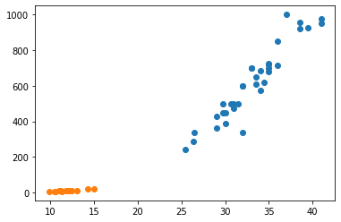

```python
#@title
# 라이브러리 청크
import pandas as pd
import numpy as np
print("pandas version : ", pd.__version__)
print("numpy version : ", np.__version__)
```

    pandas version :  1.3.5
    numpy version :  1.21.6
    


```python
dict_data = {
    'x' : 1,
    'y' : 2,
    'z' : 3
}
series_data = pd.Series(dict_data)
```


```python
print(type(series_data))
print('\n')    # '\n' : 줄바꿈
print(series_data)

a = "Doosan\nBears"
print(a)

b = "Doosan\tBears"    # '\t' : tap키
print(b)
```

    <class 'pandas.core.series.Series'>
    
    
    x    1
    y    2
    z    3
    dtype: int64
    Doosan
    Bears
    Doosan	Bears
    


```python
print(series_data.index)     # 인덱스 확인
print(series_data.values)    # 값 확인
```

    Index(['x', 'y', 'z'], dtype='object')
    [1 2 3]
    


```python
from google.colab import drive
drive.mount('/content/drive')
```

    Drive already mounted at /content/drive; to attempt to forcibly remount, call drive.mount("/content/drive", force_remount=True).
    


```python
DATA_PATH = "/content/drive/MyDrive/Colab Notebooks/human_ai/Basic/Chapter 3. pandas/data/"
lemonade = pd.read_csv(DATA_PATH + "Lemonade2016.csv")
lemonade.info()
```

    <class 'pandas.core.frame.DataFrame'>
    RangeIndex: 32 entries, 0 to 31
    Data columns (total 7 columns):
     #   Column       Non-Null Count  Dtype  
    ---  ------       --------------  -----  
     0   Date         31 non-null     object 
     1   Location     32 non-null     object 
     2   Lemon        32 non-null     int64  
     3   Orange       32 non-null     int64  
     4   Temperature  32 non-null     int64  
     5   Leaflets     31 non-null     float64
     6   Price        32 non-null     float64
    dtypes: float64(2), int64(3), object(2)
    memory usage: 1.9+ KB
    


```python
print(lemonade[['Lemon', 'Orange', 'Temperature']].describe())
```

                Lemon      Orange  Temperature
    count   32.000000   32.000000    32.000000
    mean   116.156250   80.000000    78.968750
    std     25.823357   21.863211     4.067847
    min     71.000000   42.000000    70.000000
    25%     98.000000   66.750000    77.000000
    50%    113.500000   76.500000    80.500000
    75%    131.750000   95.000000    82.000000
    max    176.000000  129.000000    84.000000
    


```python
df = pd.DataFrame({'num_legs': [2, 4, 4, 6],
                   'num_wings': [2, 0, 0, 0]},
                  index=['falcon', 'dog', 'cat', 'ant'])
print(df)
```

            num_legs  num_wings
    falcon         2          2
    dog            4          0
    cat            4          0
    ant            6          0
    


```python
df.value_counts()
```


    num_legs  num_wings
    4         0            2
    2         2            1
    6         0            1
    dtype: int64


```python
print(lemonade[['Location', 'Date']].value_counts())
```

    Location  Date     
    Beach     7/6/2016     2
              7/10/2016    1
    Park      7/18/2016    1
              7/29/2016    1
              7/28/2016    1
              7/27/2016    1
              7/26/2016    1
              7/25/2016    1
              7/24/2016    1
              7/23/2016    1
              7/22/2016    1
              7/21/2016    1
              7/20/2016    1
              7/2/2016     1
              7/19/2016    1
              7/1/2016     1
    Beach     7/11/2016    1
              7/9/2016     1
              7/7/2016     1
              7/5/2016     1
              7/4/2016     1
              7/31/2016    1
              7/30/2016    1
              7/17/2016    1
              7/16/2016    1
              7/15/2016    1
              7/14/2016    1
              7/13/2016    1
              7/12/2016    1
    Park      7/3/2016     1
    dtype: int64
    


```python
lemonade['Sold'] = lemonade['Orange'] + lemonade['Lemon']
print(lemonade.head(4))
```

           Date Location  Lemon  Orange  Temperature  Leaflets  Price  Sold
    0  7/1/2016     Park     97      67           70      90.0   0.25   164
    1  7/2/2016     Park     98      67           72      90.0   0.25   165
    2  7/3/2016     Park    110      77           71     104.0   0.25   187
    3  7/4/2016    Beach    134      99           76      98.0   0.25   233
    


```python
lemonade['Revenue'] = lemonade['Sold'] * lemonade['Price']
print(lemonade.head(5))
```

           Date Location  Lemon  Orange  Temperature  Leaflets  Price  Sold  \
    0  7/1/2016     Park     97      67           70      90.0   0.25   164   
    1  7/2/2016     Park     98      67           72      90.0   0.25   165   
    2  7/3/2016     Park    110      77           71     104.0   0.25   187   
    3  7/4/2016    Beach    134      99           76      98.0   0.25   233   
    4  7/5/2016    Beach    159     118           78     135.0   0.25   277   
    
       Revenue  
    0    41.00  
    1    41.25  
    2    46.75  
    3    58.25  
    4    69.25  
    


```python
print(lemonade[['Revenue', 'Sold']].head(10))
```

       Revenue  Sold
    0    41.00   164
    1    41.25   165
    2    46.75   187
    3    58.25   233
    4    69.25   277
    5    43.00   172
    6    43.00   172
    7    61.00   244
    8    52.25   209
    9    57.25   229
    


```python
# 차이 확인
print(type(lemonade['Revenue']))
print(type(lemonade[['Revenue']]))
```

    <class 'pandas.core.series.Series'>
    <class 'pandas.core.frame.DataFrame'>
    


```python
col_drop = lemonade.drop('Revenue', axis = 1)
print(col_drop.head(3))
```

           Date Location  Lemon  Orange  Temperature  Leaflets  Price  Sold
    0  7/1/2016     Park     97      67           70      90.0   0.25   164
    1  7/2/2016     Park     98      67           72      90.0   0.25   165
    2  7/3/2016     Park    110      77           71     104.0   0.25   187
    


```python
row_drop = lemonade.drop([0, 2, 5], axis = 0)
print(row_drop.head(8))
```

             Date Location  Lemon  Orange  Temperature  Leaflets  Price  Sold  \
    1    7/2/2016     Park     98      67           72      90.0   0.25   165   
    3    7/4/2016    Beach    134      99           76      98.0   0.25   233   
    4    7/5/2016    Beach    159     118           78     135.0   0.25   277   
    6    7/6/2016    Beach    103      69           82      90.0   0.25   172   
    7    7/7/2016    Beach    143     101           81     135.0   0.25   244   
    8         NaN    Beach    123      86           82     113.0   0.25   209   
    9    7/9/2016    Beach    134      95           80     126.0   0.25   229   
    10  7/10/2016    Beach    140      98           82     131.0   0.25   238   
    
        Revenue  
    1     41.25  
    3     58.25  
    4     69.25  
    6     43.00  
    7     61.00  
    8     52.25  
    9     57.25  
    10    59.50  
    


```python
print(lemonade[2:11])
```

             Date Location  Lemon  Orange  Temperature  Leaflets  Price  Sold  \
    2    7/3/2016     Park    110      77           71     104.0   0.25   187   
    3    7/4/2016    Beach    134      99           76      98.0   0.25   233   
    4    7/5/2016    Beach    159     118           78     135.0   0.25   277   
    5    7/6/2016    Beach    103      69           82      90.0   0.25   172   
    6    7/6/2016    Beach    103      69           82      90.0   0.25   172   
    7    7/7/2016    Beach    143     101           81     135.0   0.25   244   
    8         NaN    Beach    123      86           82     113.0   0.25   209   
    9    7/9/2016    Beach    134      95           80     126.0   0.25   229   
    10  7/10/2016    Beach    140      98           82     131.0   0.25   238   
    
        Revenue  
    2     46.75  
    3     58.25  
    4     69.25  
    5     43.00  
    6     43.00  
    7     61.00  
    8     52.25  
    9     57.25  
    10    59.50  
    


```python
print(lemonade[lemonade['Location'] == 'Park'])
```

             Date Location  Lemon  Orange  Temperature  Leaflets  Price  Sold  \
    0    7/1/2016     Park     97      67           70      90.0   0.25   164   
    1    7/2/2016     Park     98      67           72      90.0   0.25   165   
    2    7/3/2016     Park    110      77           71     104.0   0.25   187   
    18  7/18/2016     Park    131      92           81     122.0   0.50   223   
    19  7/19/2016     Park    122      85           78     113.0   0.50   207   
    20  7/20/2016     Park     71      42           70       NaN   0.50   113   
    21  7/21/2016     Park     83      50           77      90.0   0.50   133   
    22  7/22/2016     Park    112      75           80     108.0   0.50   187   
    23  7/23/2016     Park    120      82           81     117.0   0.50   202   
    24  7/24/2016     Park    121      82           82     117.0   0.50   203   
    25  7/25/2016     Park    156     113           84     135.0   0.50   269   
    26  7/26/2016     Park    176     129           83     158.0   0.35   305   
    27  7/27/2016     Park    104      68           80      99.0   0.35   172   
    28  7/28/2016     Park     96      63           82      90.0   0.35   159   
    29  7/29/2016     Park    100      66           81      95.0   0.35   166   
    
        Revenue  
    0     41.00  
    1     41.25  
    2     46.75  
    18   111.50  
    19   103.50  
    20    56.50  
    21    66.50  
    22    93.50  
    23   101.00  
    24   101.50  
    25   134.50  
    26   106.75  
    27    60.20  
    28    55.65  
    29    58.10  
    


```python
lemonade['Sold'] >= 180
```


    0     False
    1     False
    2      True
    3      True
    4      True
    5     False
    6     False
    7      True
    8      True
    9      True
    10     True
    11     True
    12     True
    13     True
    14     True
    15    False
    16    False
    17     True
    18     True
    19     True
    20    False
    21    False
    22     True
    23     True
    24     True
    25     True
    26     True
    27    False
    28    False
    29    False
    30    False
    31    False
    Name: Sold, dtype: bool


```python
lemonade[lemonade['Sold'] >= 180]
```


```python
lemonade[(lemonade['Sold'] >= 180) & (lemonade['Temperature'] > 75) & (lemonade['Lemon'] >= 130)]
```


```python
print(lemonade.loc[lemonade['Temperature'] >= 80, ['Sold', 'Revenue']])
```

        Sold  Revenue
    5    172    43.00
    6    172    43.00
    7    244    61.00
    8    209    52.25
    9    229    57.25
    10   238    59.50
    11   282    70.50
    12   225    56.25
    18   223   111.50
    22   187    93.50
    23   202   101.00
    24   203   101.50
    25   269   134.50
    26   305   106.75
    27   172    60.20
    28   159    55.65
    29   166    58.10
    30   145    50.75
    31   123    43.05
    


```python
print(lemonade.loc[(lemonade['Temperature'] >= 80) & (lemonade['Location'] == 'Beach'), ['Sold', 'Revenue']])
```

        Sold  Revenue
    5    172    43.00
    6    172    43.00
    7    244    61.00
    8    209    52.25
    9    229    57.25
    10   238    59.50
    11   282    70.50
    12   225    56.25
    30   145    50.75
    31   123    43.05
    


```python
print(lemonade.iloc[0:10, 0:5])      # 숫자만 들어감
```

           Date Location  Lemon  Orange  Temperature
    0  7/1/2016     Park     97      67           70
    1  7/2/2016     Park     98      67           72
    2  7/3/2016     Park    110      77           71
    3  7/4/2016    Beach    134      99           76
    4  7/5/2016    Beach    159     118           78
    5  7/6/2016    Beach    103      69           82
    6  7/6/2016    Beach    103      69           82
    7  7/7/2016    Beach    143     101           81
    8       NaN    Beach    123      86           82
    9  7/9/2016    Beach    134      95           80
    


```python
print(lemonade.loc[[0 ,4, 7, 10], ['Sold', 'Revenue']])
```

        Sold  Revenue
    0    164    41.00
    4    277    69.25
    7    244    61.00
    10   238    59.50
    


```python
print(lemonade.sort_values(by = ['Sold']).head(8))
```

             Date Location  Lemon  Orange  Temperature  Leaflets  Price  Sold  \
    20  7/20/2016     Park     71      42           70       NaN   0.50   113   
    31  7/31/2016    Beach     76      47           82      68.0   0.35   123   
    16  7/16/2016    Beach     81      50           74      90.0   0.50   131   
    21  7/21/2016     Park     83      50           77      90.0   0.50   133   
    30  7/30/2016    Beach     88      57           82      81.0   0.35   145   
    28  7/28/2016     Park     96      63           82      90.0   0.35   159   
    15  7/15/2016    Beach     98      62           75     108.0   0.50   160   
    0    7/1/2016     Park     97      67           70      90.0   0.25   164   
    
        Revenue  
    20    56.50  
    31    43.05  
    16    65.50  
    21    66.50  
    30    50.75  
    28    55.65  
    15    80.00  
    0     41.00  
    


```python
print(lemonade.sort_values(by = ['Temperature', 'Sold', 'Revenue'], ascending = [False, True, True]).head(15))
```


```python
print(lemonade[['Date', 'Temperature', 'Sold', 'Revenue']].sort_values(by = ['Temperature', 'Sold', 'Revenue'], 
                                                                       ascending = [False, True, True]).head(15))
```


```python
print(lemonade[['Date', 'Temperature', 'Revenue', 'Price']].sort_values(by=['Temperature', 'Price', 'Revenue'], ascending = [True, True, True] ).head(25))
```


```python
df = lemonade.groupby(by = ['Location']).count()
print(df)
```

              Date  Lemon  Orange  Temperature  Leaflets  Price  Sold  Revenue
    Location                                                                  
    Beach       16     17      17           17        17     17    17       17
    Park        15     15      15           15        14     15    15       15
    


```python
df1 = lemonade.groupby(by = ['Location', 'Date']).count()
print(df1)
```


```python
df[['Lemon', 'Orange', 'Temperature']]
print(df.iloc[0:2, 0:1])
print(df.loc['Park', ['Lemon', 'Orange']])
print(type(df.iloc[0:2, 0:1]))
print(type(df.loc['Park', ['Lemon', 'Orange']]))
```

              Date
    Location      
    Beach       16
    Park        15
    Lemon     15
    Orange    15
    Name: Park, dtype: int64
    <class 'pandas.core.frame.DataFrame'>
    <class 'pandas.core.series.Series'>
    


```python
lemonade.groupby(by = 'Location')[['Revenue', 'Sold', 'Leaflets']].agg([max, min, sum, np.mean])
```


  <div id="df-100a4032-f649-4f3b-aabf-6c1f6b5b4ff1">
    <div class="colab-df-container">
      <div>
<style scoped>
    .dataframe tbody tr th:only-of-type {
        vertical-align: middle;
    }

    .dataframe tbody tr th {
        vertical-align: top;
    }

    .dataframe thead tr th {
        text-align: left;
    }

    .dataframe thead tr:last-of-type th {
        text-align: right;
    }
</style>
<table border="1" class="dataframe">
  <thead>
    <tr>
      <th></th>
      <th colspan="4" halign="left">Revenue</th>
      <th colspan="4" halign="left">Sold</th>
      <th colspan="4" halign="left">Leaflets</th>
    </tr>
    <tr>
      <th></th>
      <th>max</th>
      <th>min</th>
      <th>sum</th>
      <th>mean</th>
      <th>max</th>
      <th>min</th>
      <th>sum</th>
      <th>mean</th>
      <th>max</th>
      <th>min</th>
      <th>sum</th>
      <th>mean</th>
    </tr>
    <tr>
      <th>Location</th>
      <th></th>
      <th></th>
      <th></th>
      <th></th>
      <th></th>
      <th></th>
      <th></th>
      <th></th>
      <th></th>
      <th></th>
      <th></th>
      <th></th>
    </tr>
  </thead>
  <tbody>
    <tr>
      <th>Beach</th>
      <td>95.5</td>
      <td>43.0</td>
      <td>1002.8</td>
      <td>58.988235</td>
      <td>282</td>
      <td>123</td>
      <td>3422</td>
      <td>201.294118</td>
      <td>135.0</td>
      <td>68.0</td>
      <td>1837.0</td>
      <td>108.058824</td>
    </tr>
    <tr>
      <th>Park</th>
      <td>134.5</td>
      <td>41.0</td>
      <td>1178.2</td>
      <td>78.546667</td>
      <td>305</td>
      <td>113</td>
      <td>2855</td>
      <td>190.333333</td>
      <td>158.0</td>
      <td>90.0</td>
      <td>1528.0</td>
      <td>109.142857</td>
    </tr>
  </tbody>
</table>
</div>
      <button class="colab-df-convert" onclick="convertToInteractive('df-100a4032-f649-4f3b-aabf-6c1f6b5b4ff1')"
              title="Convert this dataframe to an interactive table."
              style="display:none;">

  <svg xmlns="http://www.w3.org/2000/svg" height="24px"viewBox="0 0 24 24"
       width="24px">
    <path d="M0 0h24v24H0V0z" fill="none"/>
    <path d="M18.56 5.44l.94 2.06.94-2.06 2.06-.94-2.06-.94-.94-2.06-.94 2.06-2.06.94zm-11 1L8.5 8.5l.94-2.06 2.06-.94-2.06-.94L8.5 2.5l-.94 2.06-2.06.94zm10 10l.94 2.06.94-2.06 2.06-.94-2.06-.94-.94-2.06-.94 2.06-2.06.94z"/><path d="M17.41 7.96l-1.37-1.37c-.4-.4-.92-.59-1.43-.59-.52 0-1.04.2-1.43.59L10.3 9.45l-7.72 7.72c-.78.78-.78 2.05 0 2.83L4 21.41c.39.39.9.59 1.41.59.51 0 1.02-.2 1.41-.59l7.78-7.78 2.81-2.81c.8-.78.8-2.07 0-2.86zM5.41 20L4 18.59l7.72-7.72 1.47 1.35L5.41 20z"/>
  </svg>
      </button>

  <style>
    .colab-df-container {
      display:flex;
      flex-wrap:wrap;
      gap: 12px;
    }

    .colab-df-convert {
      background-color: #E8F0FE;
      border: none;
      border-radius: 50%;
      cursor: pointer;
      display: none;
      fill: #1967D2;
      height: 32px;
      padding: 0 0 0 0;
      width: 32px;
    }

    .colab-df-convert:hover {
      background-color: #E2EBFA;
      box-shadow: 0px 1px 2px rgba(60, 64, 67, 0.3), 0px 1px 3px 1px rgba(60, 64, 67, 0.15);
      fill: #174EA6;
    }

    [theme=dark] .colab-df-convert {
      background-color: #3B4455;
      fill: #D2E3FC;
    }

    [theme=dark] .colab-df-convert:hover {
      background-color: #434B5C;
      box-shadow: 0px 1px 3px 1px rgba(0, 0, 0, 0.15);
      filter: drop-shadow(0px 1px 2px rgba(0, 0, 0, 0.3));
      fill: #FFFFFF;
    }
  </style>

      <script>
        const buttonEl =
          document.querySelector('#df-100a4032-f649-4f3b-aabf-6c1f6b5b4ff1 button.colab-df-convert');
        buttonEl.style.display =
          google.colab.kernel.accessAllowed ? 'block' : 'none';

        async function convertToInteractive(key) {
          const element = document.querySelector('#df-100a4032-f649-4f3b-aabf-6c1f6b5b4ff1');
          const dataTable =
            await google.colab.kernel.invokeFunction('convertToInteractive',
                                                     [key], {});
          if (!dataTable) return;

          const docLinkHtml = 'Like what you see? Visit the ' +
            '<a target="_blank" href=https://colab.research.google.com/notebooks/data_table.ipynb>data table notebook</a>'
            + ' to learn more about interactive tables.';
          element.innerHTML = '';
          dataTable['output_type'] = 'display_data';
          await google.colab.output.renderOutput(dataTable, element);
          const docLink = document.createElement('div');
          docLink.innerHTML = docLinkHtml;
          element.appendChild(docLink);
        }
      </script>
    </div>
  </div>


```python
bream_length = [25.4, 26.3, 26.5, 29.0, 29.0, 29.7, 29.7, 30.0, 30.0, 30.7, 31.0, 31.0, 31.5, 32.0, 32.0, 32.0, 33.0, 33.0, 33.5, 33.5, 34.0, 34.0, 34.5, 35.0, 35.0, 35.0, 35.0, 36.0, 36.0, 37.0, 38.5, 38.5, 39.5, 41.0, 41.0]
bream_weight = [242.0, 290.0, 340.0, 363.0, 430.0, 450.0, 500.0, 390.0, 450.0, 500.0, 475.0, 500.0, 500.0, 340.0, 600.0, 600.0, 700.0, 700.0, 610.0, 650.0, 575.0, 685.0, 620.0, 680.0, 700.0, 725.0, 720.0, 714.0, 850.0, 1000.0, 920.0, 955.0, 925.0, 975.0, 950.0]
smelt_length = [9.8, 10.5, 10.6, 11.0, 11.2, 11.3, 11.8, 11.8, 12.0, 12.2, 12.4, 13.0, 14.3, 15.0]
smelt_weight = [6.7, 7.5, 7.0, 9.7, 9.8, 8.7, 10.0, 9.9, 9.8, 12.2, 13.4, 12.2, 19.7, 19.9]
```


```python
import matplotlib.pyplot as plt

fig, ax = plt.subplots()
ax.scatter(bream_length, bream_weight)
ax.scatter(smelt_length, smelt_weight)
ax.set_xlabel = ['length']
ax.set_ylabel = ['weight']
plt.show()
```


    


```python
length = bream_length + smelt_length
weight = bream_weight + smelt_weight
```


```python
fish_data = [[len, wei] for len, wei in zip(length, weight)]
fish_data[0:10]
```


    [[25.4, 242.0],
     [26.3, 290.0],
     [26.5, 340.0],
     [29.0, 363.0],
     [29.0, 430.0],
     [29.7, 450.0],
     [29.7, 500.0],
     [30.0, 390.0],
     [30.0, 450.0],
     [30.7, 500.0]]


```python
fish_target = [1] * 35 + [0] * 14
print(fish_target)
```

    [1, 1, 1, 1, 1, 1, 1, 1, 1, 1, 1, 1, 1, 1, 1, 1, 1, 1, 1, 1, 1, 1, 1, 1, 1, 1, 1, 1, 1, 1, 1, 1, 1, 1, 1, 0, 0, 0, 0, 0, 0, 0, 0, 0, 0, 0, 0, 0, 0]
    


```python
from sklearn.neighbors import KNeighborsClassifier

kn = KNeighborsClassifier()

kn.fit(fish_data, fish_target)
```


    KNeighborsClassifier()


```python
kn.score(fish_data, fish_target)
```


    1.0


```python
kn.predict([[10, 400]])
```


    array([1])


```python
x_length = int(input("물고기 길이는?"))
y_weight = int(input("물고기 무게는?"))

preds = int(kn.predict([[x_length, y_weight]]))
print(preds)

if predicts == 1 : 
  print("도미")
else :
  print("빙어")
```

    물고기 길이는?5
    물고기 무게는?20
    0
    도미
    
