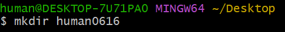

# Git Bash 실행

- 폴더 생성: mkdir 폴더명



- 폴더로 진입: cd 두 글자 입력 후 TAB키, 폴더 우클릭 후 git bash here 클릭
    1. 제대로 진입했을 경우


        2. 제대로 진입하지 않은 경우 ← cd만 입력한 경우


                          → 위치가 Desktop에서 최상위폴더인 사용자로 변경

         3. 상위폴더로 진입하고 싶은 경우 ← cd ..


## 기본 코드

```
echo "# blog" >> README.md
git init
git add README.md
git commit -m "first commit"
git branch -M main
git remote add origin https://github.com/hongseungzz/blog.gitgit push -u origin main
```

- echo “텍스트” >> [README.md](http://README.md) ← README.md 파일에 해당 텍스트를 출력하라


- [README.md](http://README.md) 파일 열기 → 파일 우클릭 → 연결 프로그램 클릭
    
    
    
    
    

- git init ← 새로운 git 저장소 생성


- git add 파일명 ← 파일 하나 업로드


- git add. (x)

      git add . (o) ← 모든 파일 업로드

- git commit -m “메시지 내용(ex. “FIX : ?? file bugs fixed”, 파일 이름 아님)”
    - 사용자 메일과 이름 세팅 X


- git config --global user.emali, git config --global [user.name](http://user.name) ← 메일과 이름 세팅(한 번만 입력하면 OK)


- git commit -m “메시지 내용(ex. “FIX : ?? file bugs fixed”)”
    - 사용자 메일과 이름 세팅 O
    
    
    

- git branch -M main ← 메인 브랜치 만들기(main이 브랜치명)


- git remote add origin 링크 주소 ← 원격 저장소 추가(origin이 저장소명)


- git push -u origin main


## 파일 업로드(업데이트) 방법

- git add .
- git commit -m “메시지” 또는 git commit -m “UPDATED : [README.md](http://README.md) .”
- git push
    1. git commit -m “메시지”를 입력한 경우


1. git commit -m “UPDATED : 파일명. 확장자 .”를 입력한 경우


## 폴더 복구 방법

- git clone 링크 주소(폴더가 없을 경우에 한해서, 폴더 이름x, git clone만 입력하는 것도x)


## 파일 동기화(다운로드) 방법

★ 무조건 가장 먼저 해야 할 아주 중요한 명령 → git pull(폴더가 저장되어 있다면 할 필요 X) 

## 파일 리스트 확인 방법

- ls 입력


