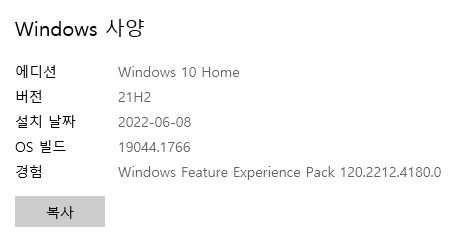

# 리눅스 환경 세팅

### 1. PC 정보 확인

- 버전이 20H1, 20H2, 21H1, 21H2 이하면 X

### 2. Powershell을 관리자 권한으로 실행

- 아래의 코드를 복사 붙여넣기
    - `dism.exe /online /enable-feature /featurename:Microsoft-Windows-Subsystem-Linux /all /norestart`
    - `dism.exe /online /enable-feature /featurename:VirtualMachinePlatform /all /norestart`
    
    
    

### 3. wsl_update_x64.msi 실행

### 4. Microsoft store에서 ubuntu 20.04.4 LTS 설치

### 5. ubuntu 실행 시 enabled 메시지가 뜬다면?

- powershell에서 
`Enable-WindowsOptionalFeature -Online -FeatureName Microsoft-Hyper-V -All`
코드 입력 시 에러가 뜬다.

### 6. windows 기능 켜기/끄기 실행

- windows 하이퍼바이저 플랫폼 체크 후 확인 및 재부팅

### 7. Powershell 재실행 및 코드 입력

- `Enable-WindowsOptionalFeature -Online -FeatureName Microsoft-Hyper-V -All`

### 8. ubuntu 20.04.4 LTS 재실행

- 위와 같은 화면이 뜬다면 설치 성공!

### 9. Powershell 재실행 후 버전 확인

- 버전이 2여야 하는데 1이라면….?

### 10. ubuntu 삭제 후 재설치

- 재설치 후 위 과정 반복

### 11. Powershell에서 버전 재확인

- 버전 수정이 된 것을 알 수 있다.

### ※  주의사항 : Powershell을 실행할 때는 ubuntu 창을,
                      ubuntu를 실행할 때는 Powershell 창을 끄는 것이 좋다.

# 리눅스 / vs code 연동

## 1. 환경 변수 확인

- 빅데이터 플랫폼 구축
- 웹사이트 구축
    - configuration : 각 설치 프로그램끼리 환경 변수로 유기적으로 연결

## 2. vs code에서 Remote - WSL 설치

## 3. Ubuntu에서 경로 입력 및 vs code 연동 실행

- 관리자 권한 실행을 하지 않을 것(하려면 환경 변수를 제대로 맞춰 놔야 함)

## 4. vs code에서 가상환경 설치 및 접속

- which python3
- sudo apt-get update
- sudo apt install python3-pip
- sudo pip3 install virtualenv
- virtualenv venv
- source venv/bin/activate

## 5.  환경 변수 설정

- vi ~/.bashrc

- export AIRFLOW_HOME=/mnt/c/dataEngineering
- ESC 후 shift + ; + wq! + Enter: 저장
- source ~/.bashrc : 시스템에 반영
- echo $AIRFLOW_HOME입력해서 출력된 경로와 내 경로가 같은지 확인