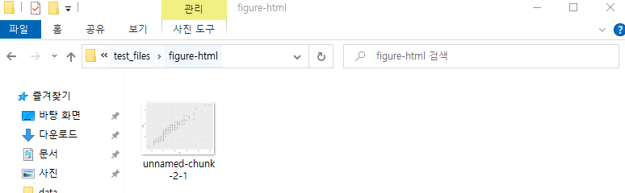

- 시각화 작업을 하고 나면 위와 같이 figure-html 폴더에 이미지가 생성됨

- 블로그 폴더 - source 폴더에 이미지 폴더를 생성하고 알아보기 쉽도록 하위 폴더를 생성

- 해당 하위 폴더에 생성된 시각화 자료를 복사

- md 파일 역시 source → _post에 복사

- 초기 생성된 링크를 파일 경로에 있는 링크로 맞춰줘야 함
- 삽입할 이미지가 많은 경우(ctrl + R → Replace All)

- 이미지 폴더의 경우 공백을 모두 ‘_’ 로 채워줘야 함 → 오류가 발생할 수 있기 때문
    
    
    

- 파일의 경로를 복사하기 위한 작업들

- 수정할 부분을 드래그 후, ctrl + R을 누르면 상단과 같이 위/아래가 구분된 입력창이 나옴
→ 위에는 오류가 나는 원 주소를, 아래에는 source를 제외한 파일의 나머지 링크를 입력
→ 이때, 맨 오른쪽의 파일명을 건드리지 않아야 함
- 링크 입력 후, Replace All을 누르면 모든 파일이 변함